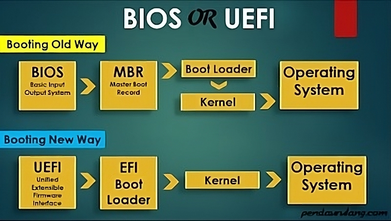

  <h1 style="text-align: center;font-weight: bold">PRAKTIKUM 2 SISTEM OPERASI</h1>
  <h4 style="text-align: center;">Dosen Pengampu : Dr. Ferry Astika Saputra, S.T., M.Sc.</h4>

 

  
  <h3 style="text-align: center;">Disusun Oleh : </h3>
  

    <strong>Ale Perdana Putra Darmawan (3123500027) </strong> 
  

<h3 style="text-align: center;line-height: 1.5">Politeknik Elektronika Negeri Surabaya Departemen Teknik Informatika Dan Komputer Program Studi Teknik Informatika 2023/2024</h3>
  

## Daftar Isi
- [Daftar Isi](#daftar-isi)
- [Dasar teori](#dasar-teori)
- [Soal](#soal)
- [Referensi](#referensi)

## Dasar teori
Pengertian Legacy BIOS: 
<strong>Legacy BIOS</strong> adalah proses boot yang digunakan oleh firmware BIOS. Legacy ini akan menyimpan daftar perangkat penyimpanan yang dapat di boot meliputi Floopy Disk Drives, Hard Disk Drives, Optical Disk Drives, dan sebagainya. Ketika Anda menyalakan komputer, BIOS akan melakukan Power On Self-Test (POST), kemudian sebuah speaker dari sistem internal mengeluarkan bunyi bip pendek sekali untuk menunjukkan bahwa booting berjalan normal. Bunyi bip ini membantu untuk mengidentifikasi kode dan dapat bertindak untuk memecahkan masalah lanjutan.

Setelah proses POST selesai, firmware akan memuat sektor pertama dari setiap target perangkat penyimpanan ke dalam memori. Firmware di sini juga memindai MBR (Master Boot Record) yang valid. Setelah ditemukan MBR yang valid, maka firmware akan melanjutkan eksekusi ke bootloader untuk pemilihan partisi tempat booting. Ketika salah satu bagian valid tidak ditemukan, firmware akan meneruskan ke perangkat berikutnya sesuai prioritas urutan yang dapat di boot.

Pengertian UEFI: 
<strong>UEFI (Unified Extensible Firmware Interface)</strong> adalah proses boot yang digunakan oleh firmware UEFI. Firmware UEFI akan menyimpan daftar volume boot yang valid atau disebut dengan Partisi Layanan EFI. Firmware UEFI merupakan penerus dari BIOS. UEFI menggunakan GUID Partition Table (GPT) sedangkan BIOS menggunakan skema partisi Master BOOT Record (MBR). Kedua format MBR dan GPT ini akan menentukan informasi partisi fisik pada Hard Disk.

Adapun saat prosedur POST (Power On Self-Test), firmware UEFI akan memindai semua perangkat penyimpanan yang dapat di boot dan terhubung ke sistem untuk menemukan GUID Partition Table (GPT) yang valid. Berbeda dengan MBR di Legacy, GPT di sini tidak berisi bootloader, firmware ini sendiri akan memeriksa GPT untuk menemukan Partisi Layanan EFI untuk boot.

## Soal
1. Perbedaan legacy dan UEFI 
   Berikut merupakan perbedaan antara Legacy BIOS dengan UEFI
   
Spesifikasi | Legacy | UEFI
--- | --- | ---
*Skema Pemeriksaan* | Partisi	Master Boot Record (MBR) |	GUID Partition Table (GPT)
*Proses Booting*	| Proses booting komputer menggunakan firmware BIOS. |	Proses booting pada komputer modern yang menyediakan kemampuan lebih canggih daripada BIOS.
Jumlah maksimum partisi | primer	4 | partisi	Tidak terbatas (tergantung pada sistem operasi; pada Windows dapat digunakan hingga 128 partisi).
Ukuran hard drive maksimum |	2 terabyte (2.000 Gigabyte)	| 18 exabyte (18 miliar Gigabyte)
Keramahan Pengguna	| Kurang ramah pengguna |	UEFI lebih ramah pengguna daripada Legacy Boot.

Flowchart perbedaan legacy dan UEFI: 

2. Komposisi motherboard
- Power Connector 
 
Power Connectors atau konektor daya pada Motherboard memiliki fungsi utama untuk menghubungkan komputer ke sumber daya listrik eksternal, sehingga komputer dapat menyala dan dioperasikan.

- Slot Memory 
 
Slot memory memiliki bentuk memanjang yang berfungsi sebagai tempat untuk memasangkan RAM. Pada umumnya posisi slot memory ini bersebelahan dengan socket prosessor, dan biasanya jumlahnya lebih dari satu slot.

- Socket Processor / CPU 
 
CPU adalah komponen utama yang bertanggung jawab atas tugas pemrosesan data dan menjalankan instruksi-instruksi program. CPU tersedia dalam berbagai model dan. masing-masing memerlukan slot tertentu pada Motherboard.

- Slot AGP dan PCI Express x16 
 
Fungsi dari Slot AGP dan PCI Express x16 yaitu sebagai tempat untuk memasangkan VGA Card atau Graphic Card. AGP adalah jenis lama dan sudah jarang ditemukan di motherboard jenis baru. Kebanyakan motherboard sudah pada menggunakan slot PCI Express untuk penghubung dengan kartu grafis.

- Slot IDE dan SATA 
 
Slot IDE (terletak pada bagian bawah kanan) dan Slot SATA (terletak pada bagian atas kiri) memiliki bentuk yang berbeda namun memiliki fungsi yag sama yaitu digunakan untuk menghubungkan Hardisk atau CD-ROM ke motherboard. Ciri fisik dan slot IDE adalah bentuknya yang agak memanjang, menyesuaikan dengan kondisi fisik kabel data IDE. Sedangkan untuk slot sata, bentuk fisiknya lebih kecil, dan tidak terlalu memakan tempat, karena kabel data SATA juga bentuknya relatif kecil.

- BIOS 
 
BIOS merupakan program perangkat lunak yang dapat memberikan instruksi dasar pada komputer saat diaktifkan, termasuk proses booting. BIOS bertanggung jawab untuk mendeteksi komponen-komponen perangkat keras dan memuat sistem operasi komputer.

- Battery CMOS 
 
CMOS (Complementary Metal Oxide Semiconductor) adalah baterai kecil yang terdapat di motherboard setiap komputer. Baterai ini memberikan daya pada chip CMOS. Chip CMOS menyimpan informasi BIOS dan pengaturan komputer, bahkan saat komputer dimatikan.

- Storage Drive Connector 
 
Storage Drive Connector digunakan sebagai penghubung antara perangkat penyimpanan data eperti Harddisk Drive, Optical Drive, SSD, dan perangkat penyimpanan external. Biasanya Storage Drive Connector disebut dengan kaberl S-ATA (Serial Advanced Technology Attachment) atau ATA.

- Pin Kabel Front Panel 
 
Front Panel Connectors merupakan konektor yang menghubungkan lampu LED di panel bagian depan pada casing komputer ke Hard Drive, tombol power, tombol reset, dan speaker internal, untuk mengetahui aktivitasnya.

- I/O Ports 
 
Input/Output Port merupakan port yang digunakan untuk menghubungkan berbagai perangkat eksternal input ataupun output ke komputer, seperti keyboard, mouse, printer, dan perangkat USB lainnya

- Cooling Fan 
 
kipas pendingin berfungsi untuk menjaga suhu di dalam komputer. Ini merupakan salah satu komponen yang wajib ada di dalam PC karena tugasnya adalah menghasilkan sirkulasi udara. Kipas pendingin bertugas memasukkan udara dingin dari luar casing PC dan membuang udara yang hangat dari dalam.

- Heat Sink 
 
Fungsi utama heat sink yaitu untuk mengendalikan atau mendinginkan temperatur pada komponen komputer dan laptop yang melakukan aktivitas berat menghasilkan banyak energi panas. Tugas utama digunakannya heatsink ini yaitu untuk menjaga temperatur CPU dan VGA.

## Referensi
Sumber 1: https://dianisa.com/perbedaan-legacy-bios-dan-uefi/#Perbedaan_Legacy_BIOS_dan_UEFI

Sumber 2: https://www.pro.co.id/komponen-komponen-motherboard-lengkap-dengan-gambar-dan-penjelasan/

Sumber 3: https://tekno.kompas.com/read/2023/11/13/17150067/komponen-komponen-motherboard-dan-fungsinya-yang-perlu-diketahui?page=all#:~:text=Komponen%20Motherboard%201%201.%20CPU%20CPU%20adalah%20komponen,Ports%20...%208%208.%20CMOS%20...%20More%20items

sumber 4: https://www.pelajaran.co.id/komponen-motherboard-dan-fungsi/
