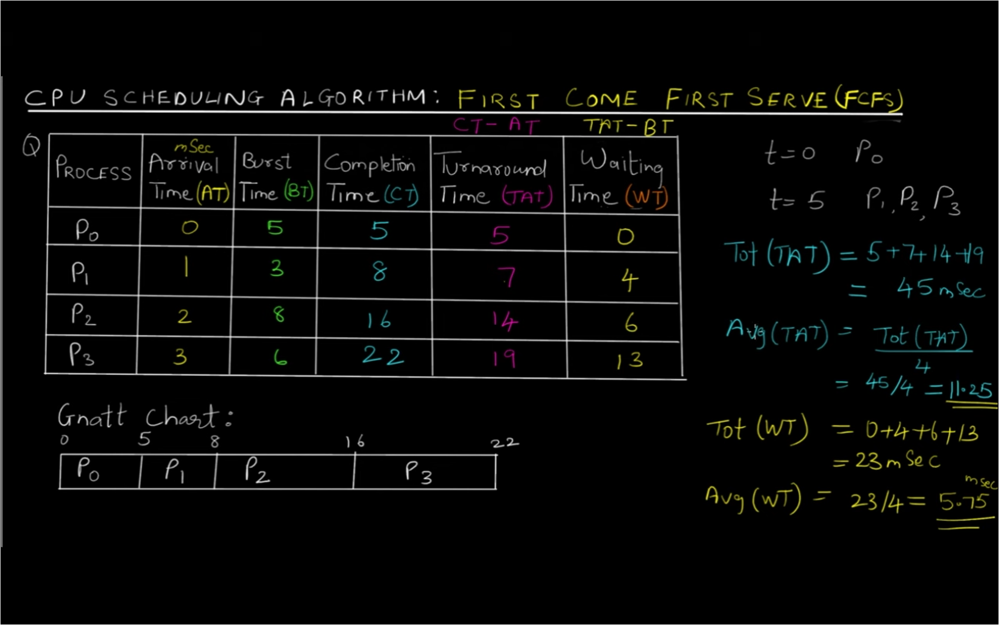
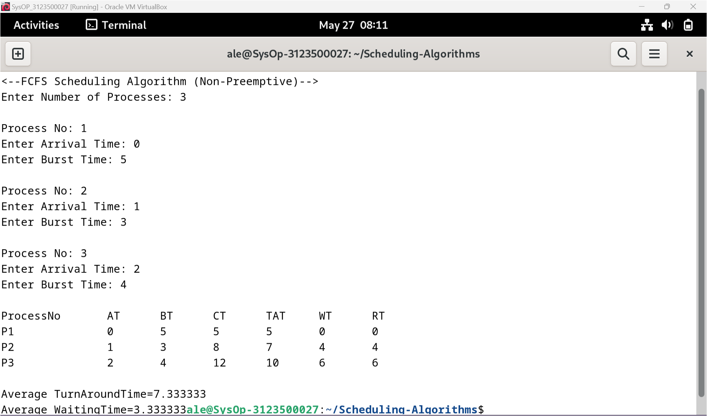
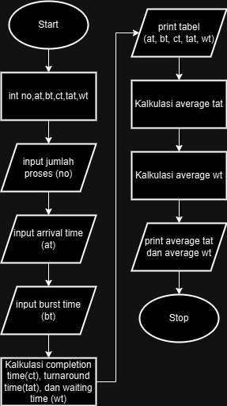
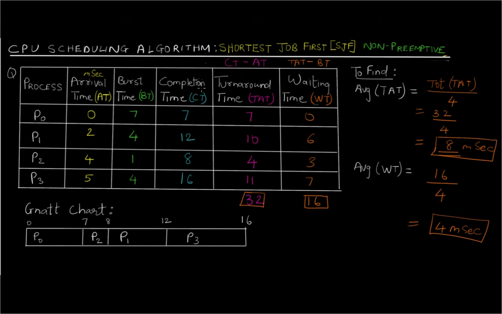
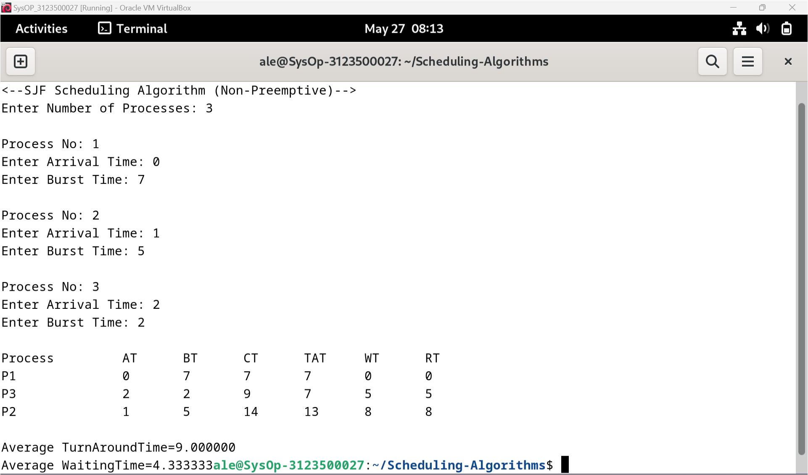
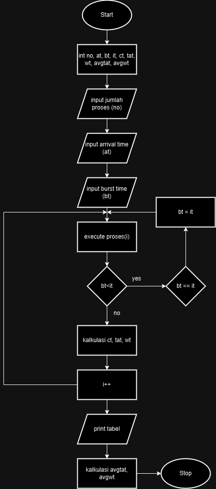
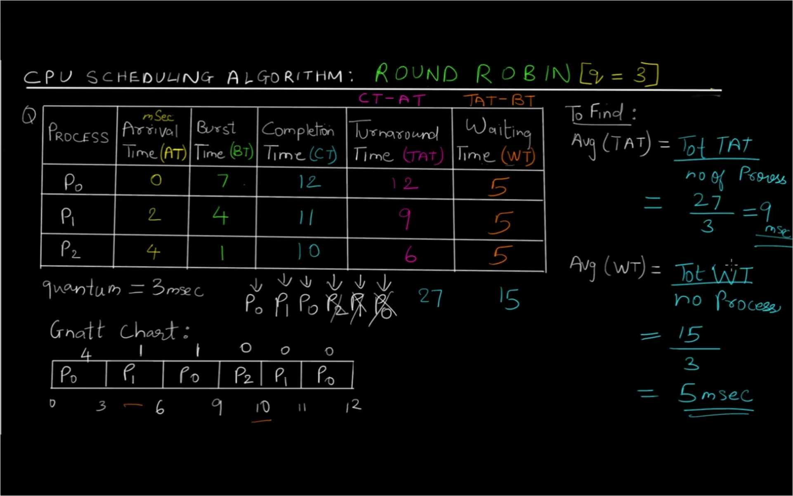
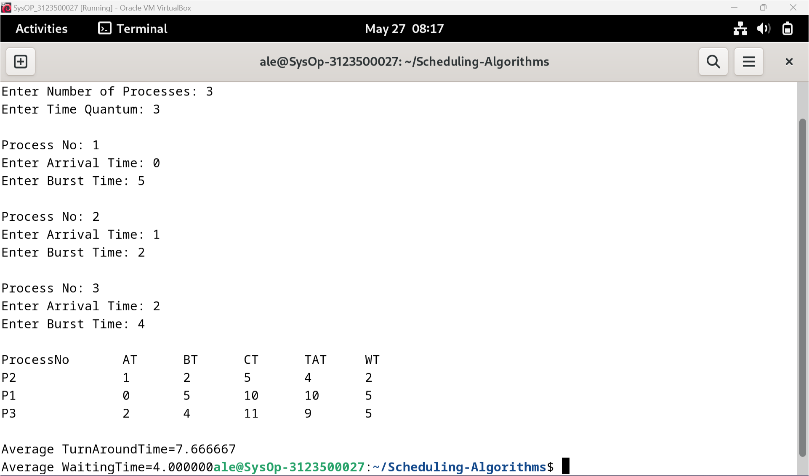
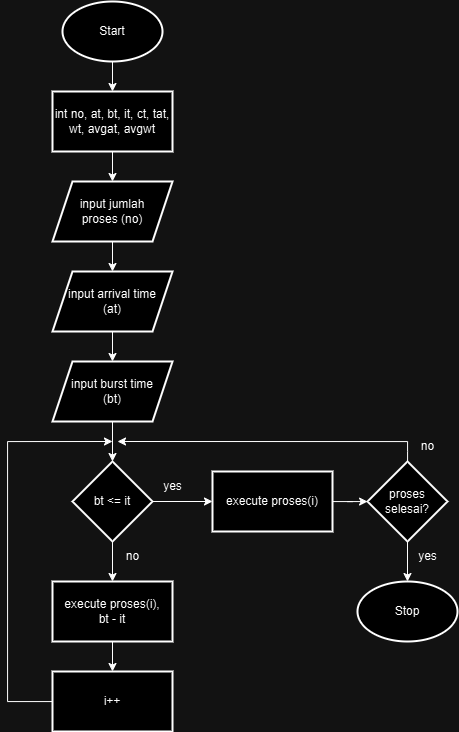

<div align="center">
  <h1 style="text-align: center;font-weight: bold">PRAKTIKUM 11<br>SISTEM OPERASI</h1>
  <h4 style="text-align: center;">Dosen Pengampu : Dr. Ferry Astika Saputra, S.T., M.Sc.</h4>
</div>
<br />
<div align="center">
  
  <h3 style="text-align: center;">Disusun Oleh : </h3>
  <p style="text-align: center;">
    <strong>Marieta Nona Alfani (312350026) </strong><br>
    <strong>Ale Perdana Putra Darmawan (3123500027) </strong><br>
    <strong>Kanisius Keru Okok Dinggon(3123500028)</strong>
  </p>
<h3 style="text-align: center;line-height: 1.5">Politeknik Elektronika Negeri Surabaya<br>Departemen Teknik Informatika Dan Komputer<br>Program Studi Teknik Informatika<br>2023/2024</h3>
  <hr><hr>
</div>

## Daftar Isi
- [Daftar Isi](#daftar-isi)
- [Dasar Teori](#dasar-teori)
  - [CPU Scheduling](#cpu-scheduling)
  - [First Come First Serve (FCFS)](#first-come-first-serve-fcfs)
  - [Shortest Job First (SJF)](#shortest-job-first-sjf)
  - [Round Robin](#round-robin)
- [CPU Scheduling Algorithm](#cpu-scheduling-algorithm)
  - [First Come First Serve (FCFS)](#first-come-first-serve-fcfs-1)
  - [Shortest Job First (SJF)](#shortest-job-first-sjf-1)
  - [Round Robin (RR)](#round-robin-rr)
- [Kesimpulan](#kesimpulan)
- [Referensi](#referensi)

## Dasar Teori
### CPU Scheduling
Penjadwalan CPU adalah proses yang memungkinkan satu proses menggunakan CPU sementara proses lainnya tertunda (dalam keadaan standby) karena tidak tersedianya sumber daya apa pun seperti I/O dll, sehingga CPU dapat digunakan secara penuh. Tujuan Penjadwalan CPU adalah untuk membuat sistem lebih efisien, cepat, dan adil.

### First Come First Serve (FCFS)
FCFS dianggap yang paling sederhana dari semua algoritma penjadwalan sistem operasi. Algoritma penjadwalan first come first serve menyatakan bahwa proses yang meminta CPU terlebih dahulu dialokasikan CPU terlebih dahulu dan diimplementasikan dengan menggunakan antrian First In First Out (FIFO)

### Shortest Job First (SJF)
SJF merupakan proses penjadwalan yang memilih proses tunggu dengan waktu eksekusi terkecil untuk dieksekusi selanjutnya. Metode penjadwalan ini mungkin bersifat preemptive atau tidak. Secara signifikan mengurangi waktu tunggu rata-rata untuk proses lain yang menunggu untuk dieksekusi. Bentuk lengkap SJF adalah Pekerjaan Terpendek Pertama.

### Round Robin
Round Robin adalah algoritma penjadwalan CPU di mana setiap siklus proses diberi slot waktu tetap (Quantum Time). Ini adalah versi preemptif dari algoritma Penjadwalan CPU First come First Serve. Algoritma CPU Round Robin umumnya berfokus pada teknik Time Sharing. 

## CPU Scheduling Algorithm
### First Come First Serve (FCFS)
Contoh penyelesaian FCFS:</br>


Program FCFS:
```c
#include<stdio.h>
struct proc
{
    int no,at,bt,ct,tat,wt;
};
struct proc read(int i)
{
    struct proc p;
    printf("\nProcess No: %d\n",i);
    p.no=i;
    printf("Enter Arrival Time: ");
    scanf("%d",&p.at);
    printf("Enter Burst Time: ");
    scanf("%d",&p.bt);
    return p;
}
int main()
{
    struct proc p[10],tmp;
    float avgtat=0,avgwt=0;
    int n,ct=0;
    printf("<--FCFS Scheduling Algorithm (Non-Preemptive)-->\n");
    printf("Enter Number of Processes: ");
    scanf("%d",&n);
    for(int i=0;i<n;i++)
        p[i]=read(i+1);
    for(int i=0;i<n-1;i++)
        for(int j=0;j<n-i-1;j++)    
            if(p[j].at>p[j+1].at)
            {
            tmp=p[j];
            p[j]=p[j+1];
            p[j+1]=tmp;
            }
    printf("\nProcessNo\tAT\tBT\tCT\tTAT\tWT\tRT\n");
    for(int i=0;i<n;i++)
    {
        ct+=p[i].bt;
		p[i].ct=ct;
        p[i].tat=p[i].ct-p[i].at;
        avgtat+=p[i].tat;
        p[i].wt=p[i].tat-p[i].bt;
        avgwt+=p[i].wt;
        printf("P%d\t\t%d\t%d\t%d\t%d\t%d\t%d\n",p[i].no,p[i].at,p[i].bt,p[i].ct,p[i].tat,p[i].wt,p[i].wt);
    }
    avgtat/=n,avgwt/=n;
    printf("\nAverage TurnAroundTime=%f\nAverage WaitingTime=%f",avgtat,avgwt);
}
```

Output Program:</br>


Flowchart:</br>


Analisa:
Program FCFS diatas bekerja sesuai dengan rumus penyelesaian FCFS yang dimana proses yang mempunyai arrival time awal, maka proses itu akan dikerjakan sampai proses selesai lalu melanjutkan proses selanjutnya.

### Shortest Job First (SJF)
Cpntoh penyelesaian SJF:</br>


Program SJF:
```c
#include<stdio.h>
struct proc
{
    int no,at,bt,it,ct,tat,wt;
};
struct proc read(int i)
{
    struct proc p;
    printf("\nProcess No: %d\n",i);
    p.no=i;
    printf("Enter Arrival Time: ");
    scanf("%d",&p.at);
    printf("Enter Burst Time: ");
    scanf("%d",&p.bt);
    return p;
}
int main()
{
    int  n,j,min=0;
    float avgtat=0,avgwt=0;
    struct proc p[10],temp;
    printf("<--SJF Scheduling Algorithm (Non-Preemptive)-->\n");
    printf("Enter Number of Processes: ");
    scanf("%d",&n);
    for(int i=0;i<n;i++)
        p[i]=read(i+1);
    for(int i=0;i<n-1;i++)
        for(j=0;j<n-i-1;j++)    
            if(p[j].at>p[j+1].at)
            {
            temp=p[j];
            p[j]=p[j+1];
            p[j+1]=temp;
            }
    for(j=1;j<n&&p[j].at==p[0].at;j++)
        if(p[j].bt<p[min].bt)
            min=j;
    temp=p[0];
    p[0]=p[min];
    p[min]=temp;
    p[0].it=p[0].at;
    p[0].ct=p[0].it+p[0].bt;
    for(int i=1;i<n;i++)
    {
        for(j=i+1,min=i;j<n&&p[j].at<=p[i-1].ct;j++)
            if(p[j].bt<p[min].bt)
                min=j;
        temp=p[i];
        p[i]=p[min];
        p[min]=temp;
        if(p[i].at<=p[i-1].ct)
            p[i].it=p[i-1].ct;
        else
            p[i].it=p[i].at;
        p[i].ct=p[i].it+p[i].bt;
    }
    printf("\nProcess\t\tAT\tBT\tCT\tTAT\tWT\tRT\n");
    for(int i=0;i<n;i++)
    {
        p[i].tat=p[i].ct-p[i].at;
        avgtat+=p[i].tat;
        p[i].wt=p[i].tat-p[i].bt;
        avgwt+=p[i].wt;
        printf("P%d\t\t%d\t%d\t%d\t%d\t%d\t%d\n",p[i].no,p[i].at,p[i].bt,p[i].ct,p[i].tat,p[i].wt,p[i].wt);
    }
    avgtat/=n,avgwt/=n;
    printf("\nAverage TurnAroundTime=%f\nAverage WaitingTime=%f",avgtat,avgwt);
}
```

Output Program:</br>


Flowchart:</br>


Analisa:
Program SJF diatas bekerja sesuai dengan rumus penyelesaian SJF yang dimana proses yang mempunyai burst time paling kecil/cepat, proses tersebut akan diselesaikan terlebih dahulu lalu melanjutkan proses selanjutnya.

### Round Robin (RR)
Contoh penyelesaian RR:</br>


Program RR:
```c
#include<stdio.h>
struct proc
{
    int no,at,bt,ct,tat,wt,rt;
};
struct proc read(int i)
{
    struct proc p;
    printf("\nProcess No: %d\n",i);
    p.no=i;
    printf("Enter Arrival Time: ");
    scanf("%d",&p.at);
    printf("Enter Burst Time: ");
    scanf("%d",&p.bt);
    p.rt=p.bt;
    return p;
}
int main()
{
    struct proc p[10],tmp;
    float avgtat=0,avgwt=0;
    int n,tq,ct=0,flag=0,remaining;
    printf("<--Round Robin Scheduling Algorithm-->\n");
    printf("Enter Number of Processes: ");
    scanf("%d",&n);
    printf("Enter Time Quantum: ");
    scanf("%d",&tq);
    for(int i=0;i<n;i++)
        p[i]=read(i+1);
    for(int i=0;i<n-1;i++)
        for(int j=0;j<n-i-1;j++)    
            if(p[j].at>p[j+1].at)
            {
            tmp=p[j];
            p[j]=p[j+1];
            p[j+1]=tmp;
            }
	remaining=n; 
    printf("\nProcessNo\tAT\tBT\tCT\tTAT\tWT\n");
    for(int i=0;remaining!=0;)
    {
        if(p[i].rt<=tq&&p[i].rt>0)
        {
			ct+=p[i].rt;
			p[i].rt=0;
			flag=1;
        }
        else if(p[i].rt>0)
        {
			p[i].rt-=tq;
			ct+=tq;
        }
        if(p[i].rt==0&&flag==1)
        {
			flag = 0;
			remaining--;
			p[i].ct=ct;
			p[i].tat=p[i].ct-p[i].at;
			avgtat+=p[i].tat;
            p[i].wt=p[i].tat-p[i].bt;
            avgwt+=p[i].wt;
			printf("P%d\t\t%d\t%d\t%d\t%d\t%d\n",p[i].no,p[i].at,p[i].bt,p[i].ct,p[i].tat,p[i].wt);
        }
        if(i!=n-1&&p[i+1].at<=ct)
			i++;
        else
			i=0;
    }
    avgtat/=n,avgwt/=n;
    printf("\nAverage TurnAroundTime=%f\nAverage WaitingTime=%f",avgtat,avgwt);
}
```

Output Program:</br>


Flowchart:</br>


Analisa:
Program RR diatas bekerja sesuai dengan rumus penyelesaian RR yang dimana proses akan dijalankan setiap quantum time. Jika burst time lebih besar dibandingkan quantum time, maka burst time akan diberhentikan dan dikurangi quantum time. Sedangkan jika burst time lebih kecil dibandingkan quantum time, maka proses burst time akan diselesaikan.

## Kesimpulan
Kesimpulannya, algoritma CPU Scheduling berfungsi untuk membuat proses dalam sistem lebih efisien dan lebih cepat.

## Referensi
Sumber 1: https://www.geeksforgeeks.org/cpu-scheduling-in-operating-systems/?ref=header_search#scheduling
Sumber 2: https://www.youtube.com/watch?v=AiVKIdGheEU&list=PLIY8eNdw5tW_lHyageTADFKBt9weJXndE&index=1
