<div align="center">
  <h1 style="text-align: center;font-weight: bold">PRAKTIKUM 7<br>SISTEM OPERASI</h1>
  <h4 style="text-align: center;">Dosen Pengampu : Dr. Ferry Astika Saputra, S.T., M.Sc.</h4>
</div>
<br />
<div align="center">
  
  <h3 style="text-align: center;">Disusun Oleh : </h3>
  <p style="text-align: center;">
    <strong>Marieta Nona Alfani (312350026) </strong><br>
    <strong>Ale Perdana Putra Darmawan (3123500027) </strong><br>
    <strong>Kanisius Keru Okok Dinggon(3123500028)</strong>
  </p>
<h3 style="text-align: center;line-height: 1.5">Politeknik Elektronika Negeri Surabaya<br>Departemen Teknik Informatika Dan Komputer<br>Program Studi Teknik Informatika<br>2023/2024</h3>
  <hr><hr>
</div>

## Daftar Isi
1. [Dasar Teori](#Dasar-teori)
2. [Soal](#Soal)
3. [Tugas](#Tugas)
4. [Kesimpulan](#Kesimpulan)
5. [Referensi](#Referensi)

## Dasar teori
### Process - Fork - Multithread
Setiap program atau bagian dari program yang sedang dieksekusi oleh CPU disebut dengan proses. Proses dapat berjalan secara foreground atau background. Untuk melihat seluruh proses yang sedang berjalan gunakan perintah ```$ ps -e``` . Bisa juga menggunakan perintah ```$pstree | more``` untuk melihat secara detil proses yang sefan berjalan dengan format tree.

Setiap proses akan memilik PID Process ID). Apabila dibutuhkan Sebuah proses bisa memiliki proses anakan. Dalam hubungan tersebut proses dapat diibaratkan seperti orang tua (parent) dengan anak (child) yang turun temurun.</br>
- Setiap proses memiliki parent dan child.
- Setiap proses memiliki ID (pid) dan parent ID (ppid), kecuali proses init atau systemd.
- ppid dari sebuah proses adalah ID dari parent proses tersebut.

fork digunakan untuk menduplikasi proses. Proses yang baru disebut dengan child proses, sedangkan proses pemanggil disebut dengan parent proses.

Exec adalah function yang digunakan untuk menjalankan program baru dan mengganti program yang sedang berlangsung. exec adalah program family yang memiliki berbagai fungsi variasi, yaitu execvp, execlp, execv, dan lain lain.

wait adalah function yang digunakan untuk mendapatkan informasi ketika child proses berganti state-nya. Pergantian state dapat berupa termination, resume, atau stop.

## Soal
- Buat tulisan tentang konsep fork dan implementasinya dengan menggunakan bahasa pemrograman C! (minimal 2 paragraf disertai dengan gambar)</br>
Jawab:</br>
Konsep fork dalam sistem operasi adalah mekanisme untuk menduplikasi proses yang sedang berjalan. Proses yang dihasilkan disebut sebagai child process, yang merupakan salinan dari parent process. Proses ini memiliki PID (Process ID) yang unik dan PPID (Parent Process ID) yang merujuk pada PID dari parent process. Fork memungkinkan eksekusi program secara paralel dan independen.

Dalam implementasi fork, setiap proses memiliki hubungan hierarki seperti orang tua dan anak. Misalnya, jika sebuah main process melakukan fork, maka akan tercipta parent process dan child process. Child process ini akan memiliki PPID yang sama dengan PID dari parent process. Fungsi ini sering digunakan dalam pemrograman untuk menciptakan proses baru dan memanfaatkan multithreading.

### Contoh implementasi c</br>
#### Source Code:</br>
Ale - 3123500027:</br>
</br>
alfani - 3123500026:</br>
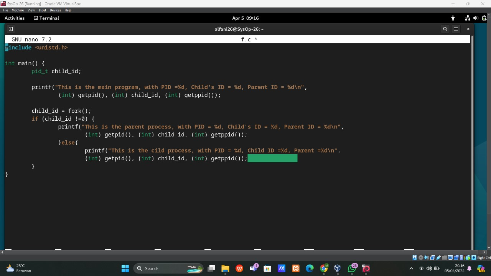</br>

#### Output:</br>
Ale - 3123500027:</br>
</br>
alfani - 3123500026:</br>
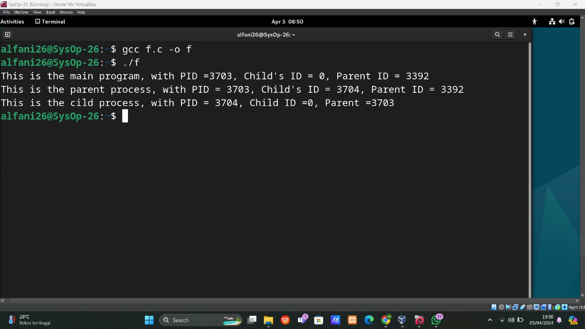</br>

#### Peta Logika:</br>
Ale - 3123500027:</br>
</br>
alfani - 3123500026:</br>
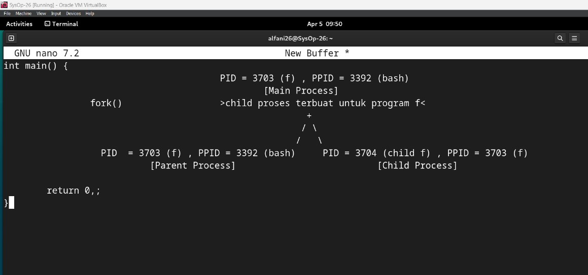</br>

Analisa: Saat pembuatan fork, proses yang ditunjuk akan menunjukkan PID unik sendiri sedangkan PPID menunjukkan terminal yang menjalankan proses tersebut. Untuk child process, PID unik yang didapatkan akan hampir sama dengan parent process dan untuk PPID akan menunjuk ke parent process yang telah di fork. Contohnya seperti program diatas yang dijalankan untuk mengambil PID dan PPID, saat menjalankan testc2.2 untuk fork testc, dapat dilihat bahwa PID testc memiliki PID unik dan PPID menunjuk ke terminal bash pada main process. Saat setelah di fork, PID dan PPID testc tetap sama seperti main process dan untuk child process, proses akan memiliki PID unik sendiri yang hampir mendekati parent process sedangkan untuk PPID akan menunjuk ke parent process yaitu testc.

- Akses dan cloning repo : https://github.com/ferryastika/operatingsystem.git
Ale - 3123500027:</br>
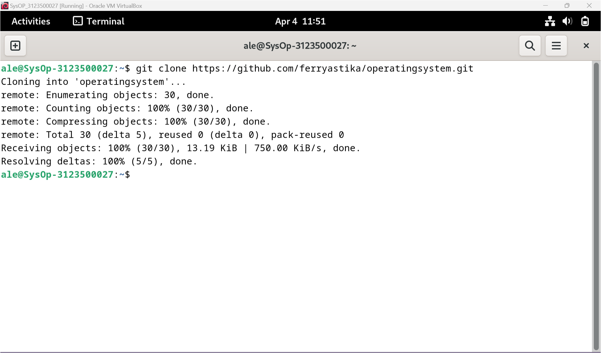</br>
alfani - 3123500026:</br>
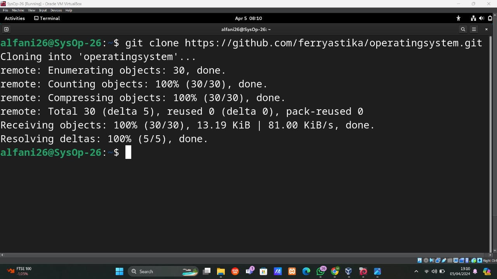</br>

- Deskripsikan dan visualisasikan pohon proses hasil eksekusi dari kode program fork01.c, fork02.c, fork03.c, fork04.c, fork05.cdan fork06.c.</br>
Jawab:</br>
- fork01.cpp
Program:
```
using namespace std;

#include <iostream>
#include <sys/types.h>
#include <unistd.h>


/* getpid() adalah system call yg dideklarasikan pada unistd.h.
Menghasilkan suatu nilai dengan type pid_t.
pid_t adalah type khusus untuk process id yg ekuivalen dg int
*/
int main(void) {
	pid_t mypid;
	uid_t myuid;
	for (int i = 0; i < 3; i++) {
		mypid = getpid();
		cout << "I am process " << mypid << endl;
		cout << "My parent process ID is " << getppid() << endl;
		cout << "The owner of this process has uid " << getuid()
	<< endl;
/* sleep adalah system call atau fungsi library
yang menghentikan proses ini dalam detik
*/
	sleep(3);
	}
return 0;
}
```
Output:</br>
Ale - 3123500027:</br>
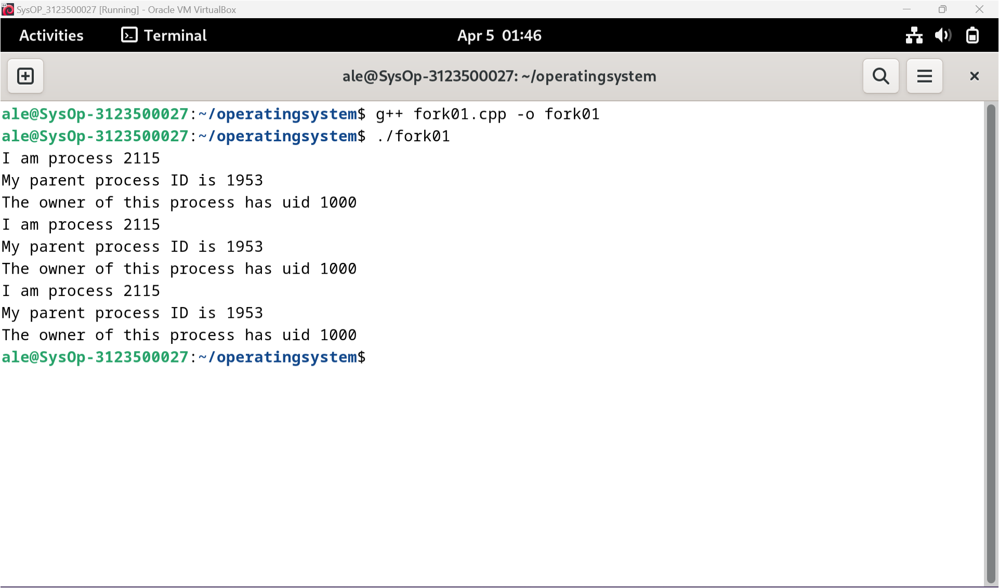</br>
alfani - 3123500026:</br>
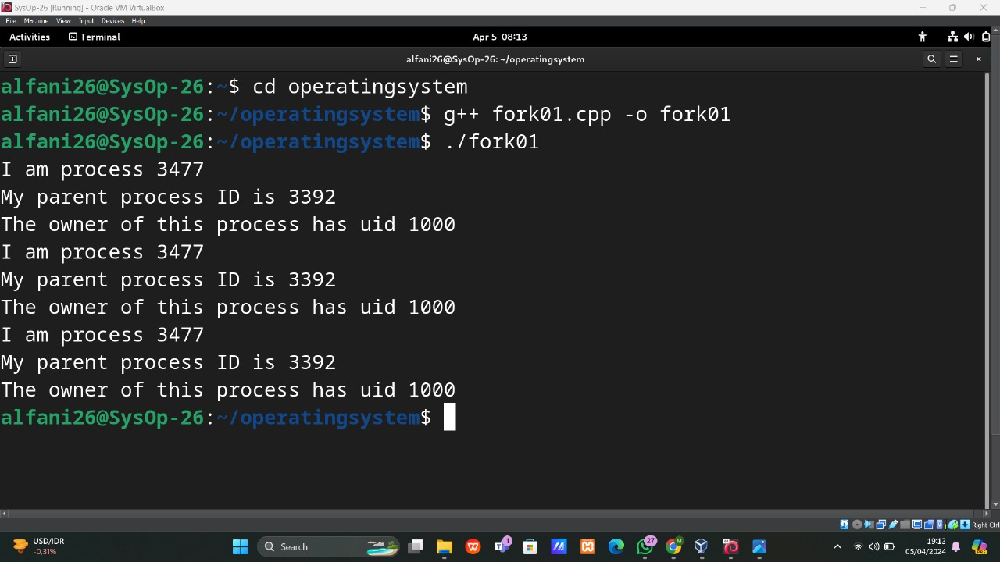</br>

1. Deskripsi Kode Program:</br>
    - Fungsi getpid() mengambilkan ID proses saat ini.
    - Fungsi getppid() mengambilkan ID proses induk (parent process).
    - Fungsi getuid() mengambil ID pengguna (user ID) yang memiliki kepemilikan atas proses ini.
    - Fungsi sleep(3) menghentikan proses selama 3 detik.

2. Visualisasi Pohon Proses:</br>
```
 	   Process (PID)
		|
	      Sleep
		|
	       loop
		|
  	   Process (PID)
		|
	      Sleep
		|
	       loop

```

- fork02.cpp
Program:
```
#include <iostream>
#include <sys/types.h>
#include <unistd.h>
using namespace std;


/* getpid() dan fork() adalah system call yg dideklarasikan
pada unistd.h.
Menghasilkan suatu nilai dengan type pid_t.
pid_t adalah type khusus untuk process id yg ekuivalen dg int
*/
int main(void) {
	pid_t childpid;
	int x = 5;
	childpid = fork();

	while (1) {
		cout << "This is process ID" << getpid() << endl;
		cout << "In this process the value of x becomes " << x << endl;	
		sleep(2);
		x++;
	}
	return 0;
}
```
Output:</br>
Ale - 3123500027:</br>
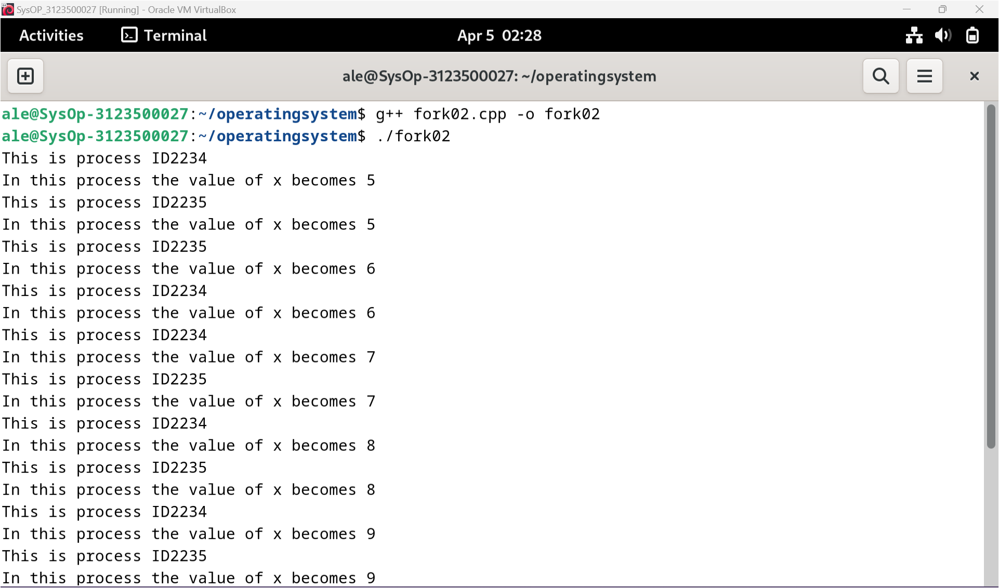</br>
alfani - 3123500026:</br>
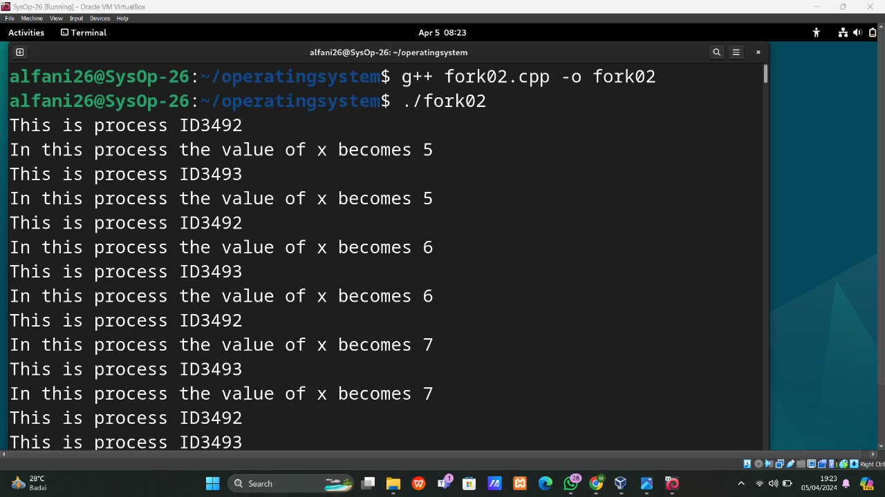</br>

1. Deskripsi Kode Program:</br>
    - Program ini menggunakan fungsi fork() untuk menciptakan proses anak.
    - Fungsi fork() menghasilkan dua proses: proses induk (parent process) dan proses anak (child process).
    - Proses anak adalah duplikat dari proses induk, dan keduanya melanjutkan eksekusi dari titik di mana fork() dieksekusi.
    - Dalam program ini memiliki variabel x yang ditambahkan nilainya setiap 2 detik.

2. Visualisasi Pohon Proses:
```
	  Proses utama
		|
fork();		+
	       / \
   Proses utama   Proses anak
	 |		|
	cout	       cout
	 |		|
       sleep	      sleep
	 |		|
	x++	       x++
	 |		|
	loop	       loop
```

- fork03.cpp
Program:
```
#include <iostream>
using namespace std;
#include <sys/types.h>
#include <unistd.h>


/* getpid() dan fork() adalah system call yg dideklarasikan
pada unistd.h.
Menghasilkan suatu nilai dengan type pid_t.
pid_t adalah type khusus untuk process id yg ekuivalen dg int
*/
int main(void) {
	pid_t childpid;
	childpid = fork();
	for (int i = 0; i < 5; i++) {
		cout << "This is process " << getpid() << endl;
		sleep(2);
	}
	return 0;
}
```
Output:</br>
Ale - 3123500027:</br>
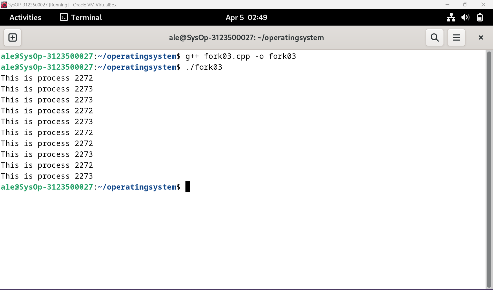</br>
alfani - 3123500026:</br>
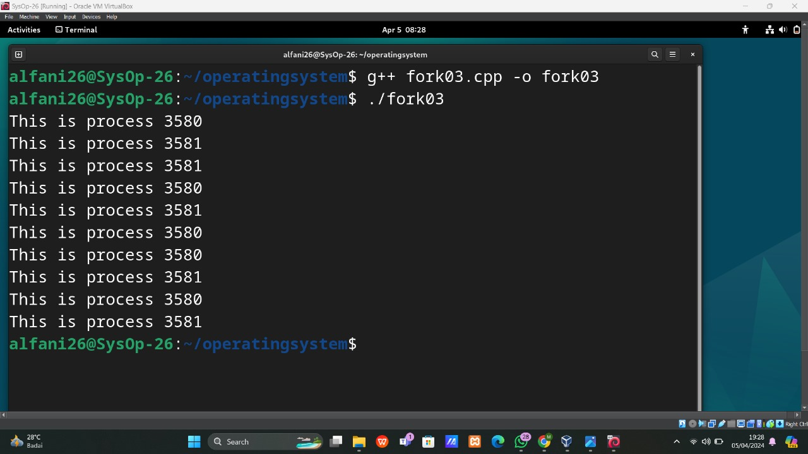</br>

1. Deskripsi Kode Program:
    - Program ini menciptakan dua proses: proses induk (parent process) dan proses anak (child process) menggunakan fungsi fork().
    - Proses anak adalah duplikat dari proses induk, dan keduanya melanjutkan eksekusi dari titik di mana fork() dieksekusi.
    - Dalam program ini memiliki variabel childpid yang menyimpan nilai hasil dari fork().

2. Visualisasi Pohon Proses:
```
	  Proses utama
		|
fork();		+
	       / \
   Proses utama   Proses anak
	 |		|
	cout	       cout
	 |		|
       sleep	      sleep
	 |		|
	loop	       loop
```

- fork04.cpp
Program:
```
#include <iostream>
using namespace std;
#include <sys/types.h>
#include <unistd.h>
#include <sys/wait.h>
/* pid_t fork() dideklarasikan pada unistd.h.
pid_t adalah type khusus untuk process id yg ekuivalen dg int
*/

int main(void) {
	pid_t child_pid;
	int status;
	pid_t wait_result;
	child_pid = fork();
	if (child_pid == 0) {
		/* kode ini hanya dieksekusi proses child */
		cout << "I am a child and my pid = " << getpid() << endl;
		cout << "My parent is " << getppid() << endl;
		/* keluar if akan menghentikan hanya proses child */
	}
	else if (child_pid > 0) {
		/* kode ini hanya mengeksekusi proses parent */
		cout << "I am the parent and my pid = " << getpid() << endl;
		cout << "My child has pid = " << child_pid << endl;
	}
	else {
		cout << "The fork system call failed to create a new process" << endl;
		exit(1);
	}
		/* kode ini dieksekusi baik oleh proses parent dan child */
		cout << "I am a happy, healthy process and my pid = " << getpid() << endl;
		if (child_pid == 0) {
		/* kode ini hanya dieksekusi oleh proses child */
		cout << "I am a child and I am quitting work now!"<< endl;
	}
	else {
		/* kode ini hanya dieksekusi oleh proses parent */
		cout << "I am a parent and I am going to wait for my child" << endl;
	do {
		/* parent menunggu sinyal SIGCHLD mengirim tanda bahwa proses child diterminasi */
		wait_result = wait(&status);
	} while (wait_result != child_pid);
		cout << "I am a parent and I am quitting." << endl;
	}
	return 0;
}
```
Output:
Ale - 3123500027:</br>
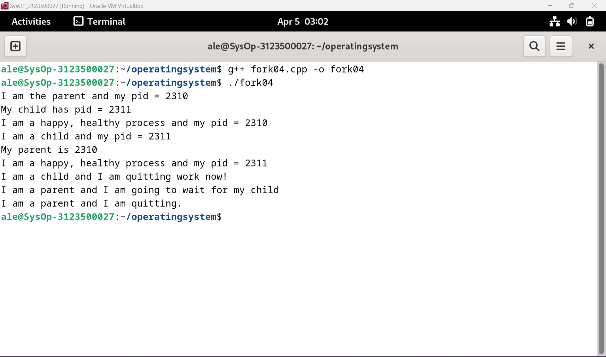</br>
alfani - 3123500026:</br>
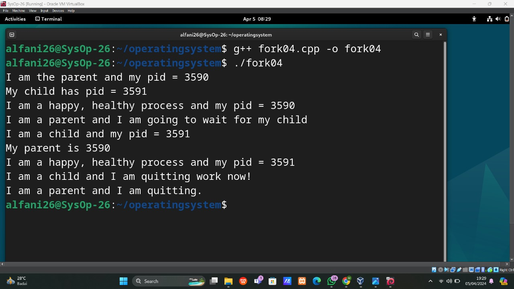</br>

1. Deskripsi Kode Program:</br>
    - Program ini menciptakan dua proses: proses induk (parent process) dan proses anak (child process) menggunakan fungsi fork().
    - Fungsi fork() menghasilkan dua proses yang memiliki ruang memori yang terpisah.
    - Proses anak adalah duplikat dari proses induk, dan keduanya melanjutkan eksekusi dari titik di mana fork() dieksekusi.
    - Dalam program ini menggunakan sistem panggilan wait() untuk menunggu hingga proses anak selesai.

2. Visualisasi Pohon Proses:</br>
```
	  Proses utama
		|
fork();		+
	       / \
   Proses utama   Proses anak
	 |		|
	cout	       cout
	 |		|
	wait	       cout
	 |		|
	wait	   exit/terminated
	 |
	cout
	 |
	stop	 					
```

- fork05.cpp
Program:
```
#include <iostream>
using namespace std;
#include <sys/types.h>
#include <unistd.h>
#include <sys/wait.h>
/* pid_t fork() dideklarasikan pada unistd.h.
pid_t adalah type khusus untuk process id yg ekuivalen dg int
*/

int main(void) {
  pid_t child_pid;
  int status; 
  pid_t wait_result;
  child_pid = fork();
  if (child_pid == 0) {
    /* kode ini hanya dieksekusi proses child */
    cout << "I am a child and my pid = " << getpid() << endl;
    execl("/bin/ls", "ls", "-l", "/home", NULL);
    /* jika execl berhasil kode ini tidak pernah digunakan */
    cout << "Could not execl file /bin/ls" << endl;
    exit(1);
    /* exit menghentikan hanya proses child */
   }
  else if (child_pid > 0) {
    /* kode ini hanya mengeksekusi proses parent */
   cout << "I am the parent and my pid = " << getpid() << endl;
   cout << "My child has pid = " << child_pid << endl;
  }
  else {
   cout << "The fork system call failed to create a new process" << endl;
   exit(1);
  }
  /* kode ini hanya dieksekusi oleh proses parent karena
  child mengeksekusi dari “/bin/ls” atau keluar */
   cout << "I am a happy, healthy process and my pid = " << getpid() << endl;
   if (child_pid == 0) {
  /* kode ini tidak pernah dieksekusi */
   printf("This code will never be executed!\n");
  }
  else {
   /* kode ini hanya dieksekusi oleh proses parent */
    cout << "I am a parent and I am going to wait for my child" << endl;
    do {
      /* parent menunggu sinyal SIGCHLD mengirim tanda bila proses child diterminasi */
      wait_result = wait(&status);
    } while (wait_result != child_pid);
    cout << "I am a parent and I am quitting." << endl;
  }
  return 0;
}
```
Output:
Ale - 3123500027:</br>
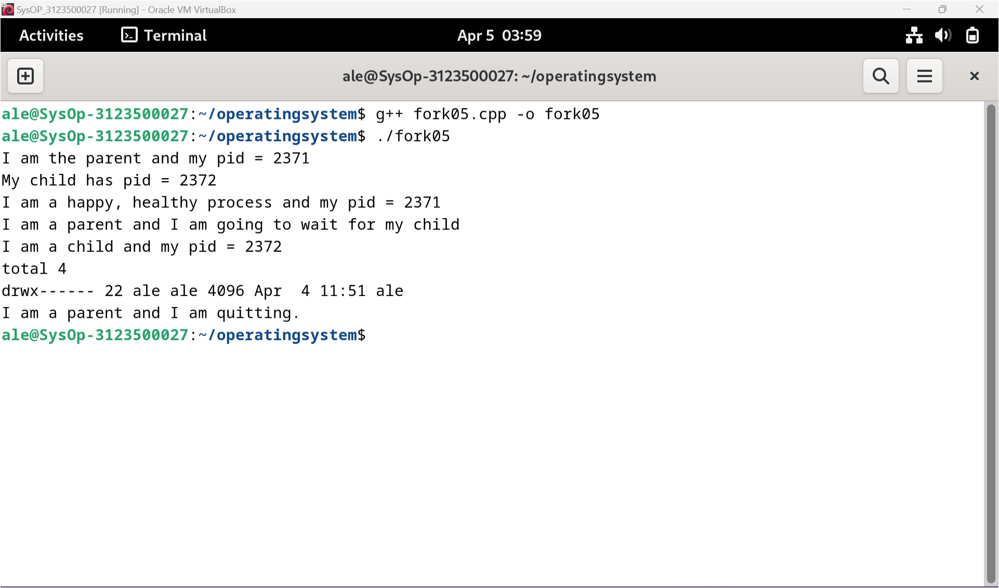</br>
alfani - 3123500026:</br>
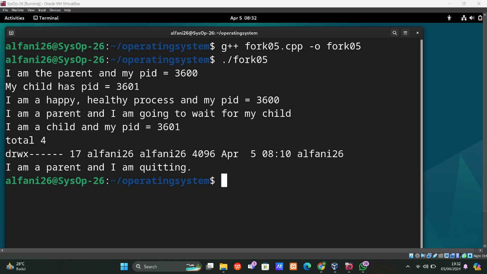</br>

1. Deskripsi Kode Program:
    - Program ini menciptakan dua proses: proses induk (parent process) dan proses anak (child process) menggunakan fungsi fork().
    - Fungsi fork() menghasilkan dua proses yang memiliki ruang memori yang terpisah.
    - Proses anak adalah duplikat dari proses induk, dan keduanya melanjutkan eksekusi dari titik di mana fork() dieksekusi.
    - Dalam program ini menggunakan sistem panggilan execl() untuk menjalankan perintah /bin/ls.

2. Visualisasi Pohon Proses:
```
	  Proses utama
		|
fork();		+
	       / \
   Proses utama   Proses anak
	 |		|
	cout	       cout
	 |		|
	wait	     run /bin/ls
	 |		|
	wait	   exit/terminated
	 |		
	stop
```

- fork06.cpp
Program:
```
#include <iostream>
using namespace std;
#include <sys/types.h>
#include <unistd.h>
#include <sys/wait.h>
/* pid_t fork() dideklarasikan pada unistd.h.
pid_t adalah type khusus untuk process id yg ekuivalen dg int
*/

int main(void) {
	pid_t child_pid;
	int status;
	pid_t wait_result;
	child_pid = fork();


	if (child_pid == 0) {
		/* kode ini hanya dieksekusi proses child */
		cout << "I am a child and my pid = " << getpid() << endl;
		execl("fork03", "goose", NULL);
		/* jika execl berhasil kode ini tidak pernah digunakan */
		cout << "Could not execl file fork3" << endl;
		exit(1);
		/* exit menghentikan hanya proses child */
	}
	else if (child_pid > 0) {
		/* kode ini hanya mengeksekusi proses parent */
		cout << "I am the parent and my pid = " << getpid()<< endl;
		cout << "My child has pid = " << child_pid << endl;
	}
	else {
		cout << "The fork system call failed to create a new process" << endl;
		exit(1);
	}
	/* kode ini hanya dieksekusi oleh proses parent karena
	child mengeksekusi dari “fork3” atau keluar */
		cout << "I am a happy, healthy process and my pid = " << getpid() << endl;
		if (child_pid == 0) {
	/* kode ini tidak pernah dieksekusi */
		printf("This code will never be executed!\n");
	}
	else {
	/* kode ini hanya dieksekusi oleh proses parent */
		cout << "I am a parent and I am going to wait for my child" << endl;
		do {
		/* parent menunggu sinyal SIGCHLD mengirim tanda
		bila proses child diterminasi */
			wait_result = wait(&status);
		} while (wait_result != child_pid);
		cout << "I am a parent and I am quitting." << endl;
	}
	return 0;
}
```
Output:
Ale - 3123500027:</br>
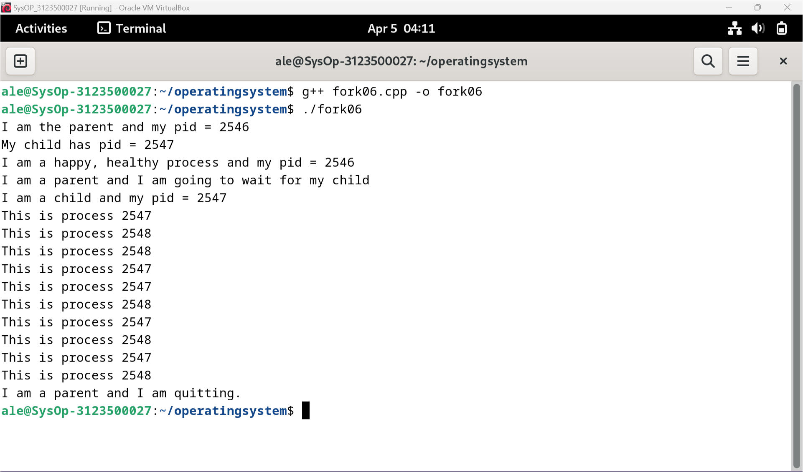</br>
alfani - 3123500026:</br>
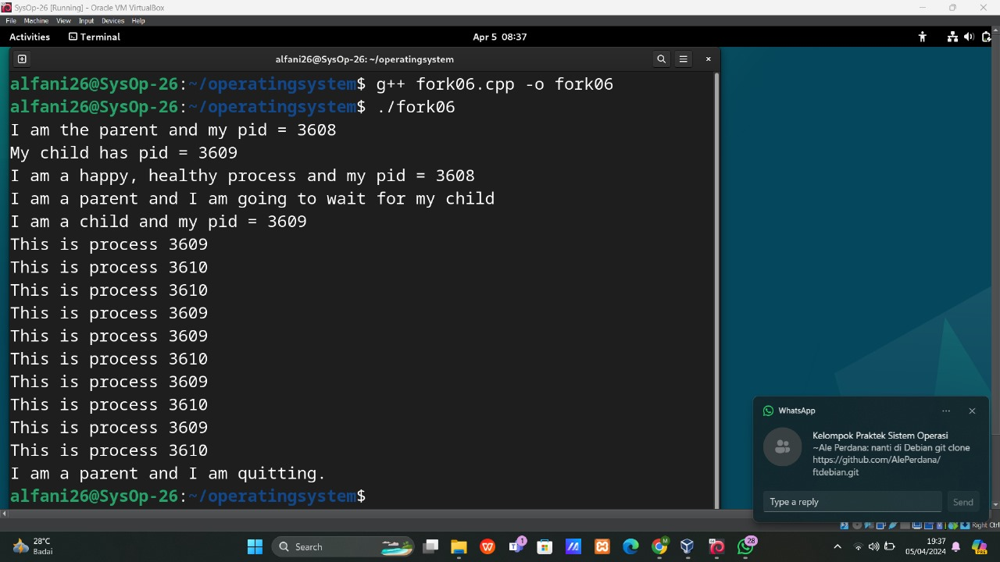</br>

1. Deskripsi Kode Program:
    - Program ini menciptakan dua proses: proses induk (parent process) dan proses anak (child process) menggunakan fungsi fork().
    - Fungsi fork() menghasilkan dua proses yang memiliki ruang memori yang terpisah.
    - Proses anak adalah duplikat dari proses induk, dan keduanya melanjutkan eksekusi dari titik di mana fork() dieksekusi.
    - Dalam program ini menggunakan sistem panggilan execl() untuk menjalankan perintah dari file "fork03".

2. Visualisasi Pohon Proses:
```
	  Proses utama
		|
fork();		+
	       / \
   Proses utama   Proses anak
	 |		|
	cout	       cout
	 |		|
	wait	     run fork03
	 |		|
	wait	   running fork03
	 |		|
	wait	      done
	 |	
	stop	 
```


## Tugas
Buatlah program perkalian 2 matriks [4 x 4] dalam bahasa C yang memanfaatkan fork().</br>
Jawab: </br>
Program:
```
#include <stdio.h>
#include <stdlib.h>
#include <sys/types.h>
#include <unistd.h>
#include <sys/wait.h>

#define SIZE 4

// Fungsi untuk menampilkan matriks
void tampilan_matriks(int matrix[SIZE][SIZE], const char* matrix_name) {
    printf("%s:\n", matrix_name);
    for (int i = 0; i < SIZE; i++) {
        for (int j = 0; j < SIZE; j++) {
            printf("%d ", matrix[i][j]);
        }
        printf("\n");
    }
}

// Fungsi untuk melakukan perkalian matriks
void perkalian_matriks(int mat1[SIZE][SIZE], int mat2[SIZE][SIZE], int result[SIZE][SIZE]) {
    for (int i = 0; i < SIZE; i++) {
        for (int j = 0; j < SIZE; j++) {
            result[i][j] = 0;
            for (int k = 0; k < SIZE; k++) {
                result[i][j] += mat1[i][k] * mat2[k][j];
            }
        }
    }
}

int main(void) {
    pid_t child_pid;
    int status;
    pid_t wait_result;

    // Inisialisasi matriks
    int mat1[SIZE][SIZE] = {
        {1, 2, 3, 4},
        {5, 6, 7, 8},
        {9, 10, 11, 12},
        {13, 14, 15, 16}
    };

    int mat2[SIZE][SIZE] = {
        {16, 15, 14, 13},
        {12, 11, 10, 9},
        {8, 7, 6, 5},
        {4, 3, 2, 1}
    };

    int result[SIZE][SIZE];

    // Menampilkan matriks 1 dan matriks 2
    tampilan_matriks(mat1, "Matriks 1");
    tampilan_matriks(mat2, "Matriks 2");

    // Membuat proses anak
    child_pid = fork();

    if (child_pid == 0) { // Proses anak
        // Melakukan perkalian matriks
        perkalian_matriks(mat1, mat2, result);
        printf("Hasil perkalian matriks:\n");
        for (int i = 0; i < SIZE; i++) {
            for (int j = 0; j < SIZE; j++) {
                printf("%d ", result[i][j]);
            }
            printf("\n");
        }
        exit(0); // Keluar dari proses anak
    } else if (child_pid > 0) { // Proses induk
        // Menunggu proses anak selesai
        wait_result = wait(&status);
    } else { // Jika fork gagal
        printf("Gagal membuat proses anak\n");
        return 1;
    }

    return 0;
}

```
Output:</br>
Ale - 3123500027:</br>
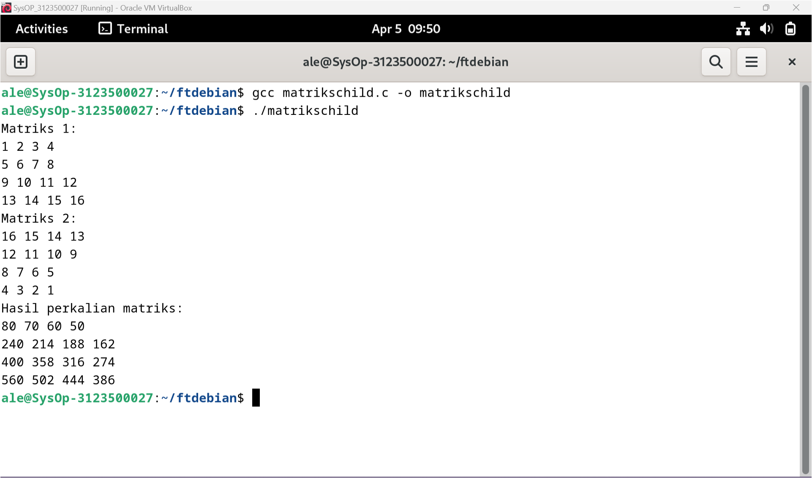</br>
alfani - 3123500026:</br>
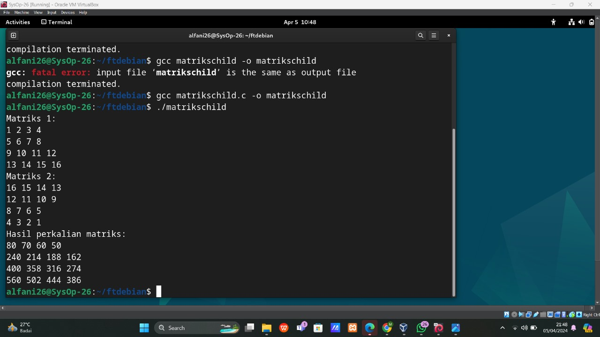</br>

Deskripsi Kode Program:
- Program ini menciptakan dua proses: proses induk (parent process) dan proses anak (child process) menggunakan fungsi `fork()`. </br>
- Fungsi `fork()` digunakan untuk menciptakan proses baru yang merupakan salinan identik dari proses pemanggil.
- Setelah pemanggilan `fork()`, kedua proses (induk dan anak) memiliki ruang memori yang terpisah.</br>
- Proses anak adalah duplikat dari proses induk, dan keduanya melanjutkan eksekusi dari titik di mana `fork()` dieksekusi.</br>
- Dalam program ini dilakukan perkalian matriks antara `matrix1` dan `matrix2` menggunakan fungsi `perkalian_matriks()`. Proses anak bertanggung jawab untuk melakukan perkalian matriks dan mencetak hasilnya, sementara proses induk menunggu proses anak selesai dan mencetak hasil matriks setelahnya.</br>
 
Urutan jalannya program:</br>
- Proses utama (A) pertama kali dieksekusi.</br>
- Kemudian, proses anak (B) dibuat oleh fork().</br>
- Proses anak (B) mencetak hasil matriks sebagai child process.</br>
- Proses induk (A) melakukan perkalian matriks.</br>
- Proses induk menunggu hingga proses anak selesai (menggunakan wait()).</br>
- Setelah proses anak selesai, proses induk mencetak hasil matriks dan program berakhir.</br>

## Kesimpulan
Fork dalam sistem operasi memungkinkan untuk pembentukan hierarki proses dengan menciptakan parent process dan child process, yang saling berinteraksi seperti hubungan antara orang tua dan anak. Fork memungkinkan duplikasi proses yang sedang berjalan, memungkinkan eksekusi paralel dari tugas-tugas yang berbeda. Dengan memahami dan menggunakan konsep fork, pengembang dapat meningkatkan kinerja dan skalabilitas aplikasi, serta memanfaatkan sumber daya CPU dengan lebih efisien.

## Referensi
Sumber 1: https://man7.org/linux/man-pages/man2/fork.2.html </br>
Sumber 2: https://man7.org/linux/man-pages/man2/waitid.2.html </br>
Sumber 3: https://man7.org/linux/man-pages/man3/exec.3.html
