<div align="center">
  <h1 style="text-align: center;font-weight: bold">PRAKTIKUM 8<br>SISTEM OPERASI</h1>
  <h4 style="text-align: center;">Dosen Pengampu : Dr. Ferry Astika Saputra, S.T., M.Sc.</h4>
</div>
<br />
<div align="center">
  
  <h3 style="text-align: center;">Disusun Oleh : </h3>
  <p style="text-align: center;">
    <strong>Marieta Nona Alfani (312350026) </strong><br>
    <strong>Ale Perdana Putra Darmawan (3123500027) </strong><br>
    <strong>Kanisius Keru Okok Dinggon(3123500028)</strong>
  </p>
<h3 style="text-align: center;line-height: 1.5">Politeknik Elektronika Negeri Surabaya<br>Departemen Teknik Informatika Dan Komputer<br>Program Studi Teknik Informatika<br>2023/2024</h3>
  <hr><hr>
</div>

## Daftar Isi
1. [Dasar Teori](#Dasar-teori)
2. [Bash - Variable](#Bash---Variable)
3. [Bash - Loop File](#Bash---Loop-File)
4. [Bash - Comments](#Bash---Comments)
5. [Bash - Array](#Bash---Array)
6. [Bash - Expansion](#Bash---Expansion)
7. [Bash - Conditional Expression](#Bash---Conditional-Expression)
8. [Bash - Case Statements](#Bash---Case-Statements)
9. [Bash - Special Characters](#Bash---Special-Characters)
10. [Bash - if elif else](#Bash---if-elif-else)
11. [Bash - Loop](#Bash---Loop)
12. [Bash - Append String A](#Bash---Append-String-A)
13. [Bash - Functions](#Bash---Functions)
14. [Bash - Append String B](#Bash---Append-String-B)
15. [Bash - Operators](#Bash---Operators)
16. [Bash - Numbers Comparison](#Bash---Numbers-Comparison)
17. [Bash - Check Directory](#Bash---Check-Directory)
18. [Bash - File Name](#Bash---File-Name)
19. [Bash - Split String](#Bash---Split-String)
20. [Bash - String Length](#Bash---String-Length)
21. [Bash - bashrc](#Bash---bashrc)
22. [Bash - Ternary Operator](#Bash---Ternary-Operator)
23. [Bash - Lowercase](#Bash---Lowercase)
24. [Bash - Uppercase](#Bash---Uppercase)
25. [Bash - Substring](#Bash---Substring)
26. [Bash - variable set](#Bash---variable-set)
27. [Bash - Iterate Nos](#Bash---Iterate-Nos)
28. [Kesimpulan](#Kesimpulan)
29. [Referensi](#Referensi)

## Dasar Teori
- Shell
adalah penerjemah baris perintah, Ini adalah aplikasi untuk memberikan perintah ke berbagai sistem operasi seperti Linux, Unix, dan Mac.

- Bash
adalah versi shell yang disempurnakan, lapisan antara panggilan fungsi pengguna dan sistem operasi. 

Pengguna mengetikkan perintah melalui baris perintah atau kumpulan perintah yang juga disebut skrip. 

<h3>Persyaratan</h3>

Untuk mengikuti kursus ini, Anda harus memiliki pemahaman dasar tentang bahasa komputer, dan hal-hal berikut diperlukan:
- Sistem operasi rasa Linux
- Pengetahuan dasar tentang bahasa pemrograman apa pun 

<h3>Apa itu Bash?</h3>

Bash, kependekan dari Bourne Again Shell, adalah penerjemah shell baris perintah dan bahasa skrip sumber terbuka. Ini menafsirkan perintah yang dimasukkan pengguna, baik secara interaktif atau dari file skrip. 

Ini berfungsi sebagai antarmuka untuk memanggil perintah, memungkinkan panggilan fungsi sistem.

Ada dua jenis mode bash:
- Mode interaktif: Juga disebut penerjemah perintah, memungkinkan eksekusi perintah di terminal. Ini mengeksekusi perintah secara berurutan jika ada beberapa perintah.
- Mode non-interaktif: Ini merujuk pada skrip, memungkinkan Anda menulis sintaksis Bash yang berisi rangkaian beberapa perintah untuk eksekusi skrip.

<h3>Apa perbedaan antara Bash dan shell</h3>
Shell, alias Bourne Shell, adalah penerjemah baris perintah untuk OS Unix dan Linux. Bash, alias Bourne Again Shell, adalah versi yang disempurnakan.

<h3>Untuk apa skrip bash digunakan?</h3>

Skrip Bash memiliki banyak kasus penggunaan, termasuk:
- Menulis skrip untuk mengotomatiskan tugas pemrograman.
- Menyinkronkan tugas untuk menyalin file.
- Menjalankan tugas cron untuk penjadwalan.

<h3>Bagaimana cara menulis kode di bash?</h3>

Untuk menulis kode dalam skrip Bash, ikuti langkah-langkah berikut:
- Di terminal, buat file menggunakan ```vi test.sh```.
- Menambahkan ```#!/bin/bash``` di bagian atas file.
- Tambahkan beberapa cuplikan kode shell.
- Simpan file shell dengan ```.sh``` ekstensi.
- Jalankan skrip shell menggunakan ```./test.sh``` perintah di terminal.

<h3>Apakah Bash merupakan bahasa koding?</h3>
Bash menjalankan perintah dari terminal atau file. Ini adalah bahasa pemrograman yang beroperasi pada sistem operasi kernel Unix/Linux, berisi semua fitur untuk menulis kode lengkap.

Bash adalah tipe shell khusus yang menerima masukan dari perintah, menjalankan kode, dan memproses masukan, serta mengembalikan hasilnya. 

<h3>Jenis Shell</h3>
Ada berbagai jenis shell di OS Unix.

| Tipe Shell | Alias | Baris pertama |
|---|---|---|
| SH | Bourne Shell |	#!/bin/sh |
| Bash | Bourne Again Shell | #!/bin/bash |
| cshell | C shell | #!/bin/csh | 
| tcsh | TENEX C shell | #!/bin/tcsh |
| ksh | Korn shell | #!/bin/ksh |

<h3>Perbedaan antara Command Line dan Script di bash</h3>

Mari kita lihat perbedaan antara baris perintah dan skrip
Opsi baris perintah
- Baris perintah memiliki prompt yang menerima masukan dari pengguna.
- Perintah tidak disimpan ke file.
- Ini hanya mendukung satu perintah pada satu waktu. 

File skrip
- Mendukung banyak perintah dalam satu file.
- Prompt masih dapat ditulis dalam file skrip.
- Hanya satu baris dalam sebuah file yang dijalankan secara berurutan.

## Bash - Variable
<h3>Variabel Bash Shell</h3>

Variabel merupakan elemen dasar dari bahasa pemrograman apa pun. Pemrograman skrip shell dan bash menawarkan variabel, seperti bahasa lainnya.

Variabel berfungsi sebagai wadah yang digunakan untuk menyimpan data dalam pemrograman. Ini mencakup penunjuk ke lokasi memori data.

Deklarasikan variabel : Untuk membuat variabel, Anda harus memberikan nilai padanya. 

```bash
variableName=VariableValue
```

```VariableName``` Ini adalah nama variabel, yang dapat berisi kombinasi huruf apa saja (a sampai z, A sampai Z), angka (0 sampai 9), dan garis bawah (_).

```VariableValue``` adalah nilai yang disimpan dalam variabel, dan dapat berupa string angka atau boolean. Simbol sama dengan (=) digunakan untuk memberikan nilai pada suatu variabel.

Misalnya:

```bash
AGE=25
```

Sebuah variabel bernama AGEdibuat dan diberi nilai 25.

<h3>Cara Mengakses Variabel di Bash</h3>
Setelah mendeklarasikan dan menetapkan nilai ke variabel, Anda dapat mengaksesnya menggunakan simbol dolar ( $) diikuti dengan nama variabel. 

```bash
AGE=25
echo $AGE
```

Kode di atas mendeklarasikan variabel bernama ```AGE``` dengan nilai ```25``` dan kemudian menggunakan ```echo``` untuk menampilkan nilai ```AGE``` variabel. Itu ```dollar``` simbol sebelum nama variabel sangat penting untuk mengakses nilainya.

<h3>Variabel readonly Bash Shell</h3> 
Setelah variabel diberi nilai, Anda dapat mengubahnya ke nilai baru menggunakan operator penugasan =. 

```bash
AGE=25
echo $AGE
AGE=35
echo $AGE
```

Output:

```bash
25
35
```

Percobaan 1:
- [Alfani - Variable 1](#Alfani---Variable-1)
- [Ale - Variable 1](#Ale---Variable-1)
- [Kanisius - Variable 1](#Kanisius---Variable-1)

## Alfani - Variable 1
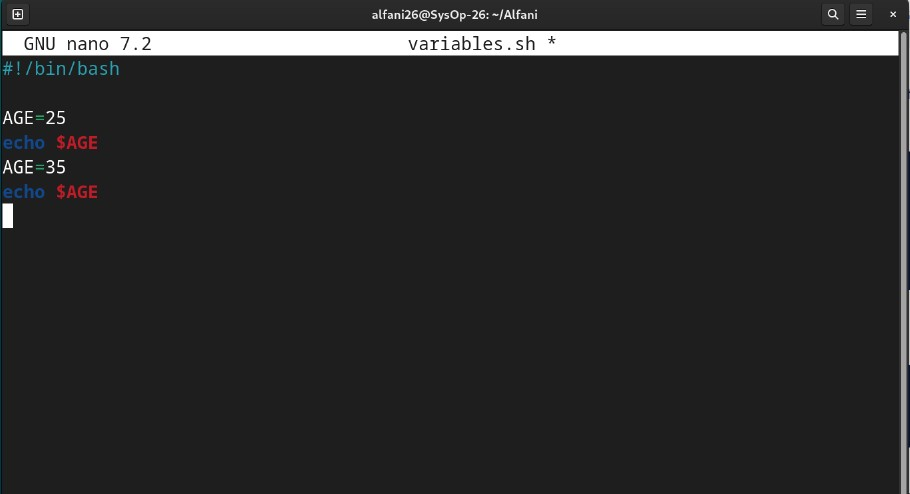
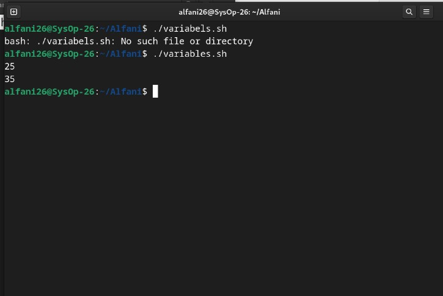

## Ale - Variable 1
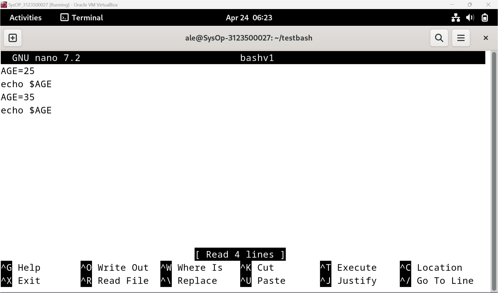
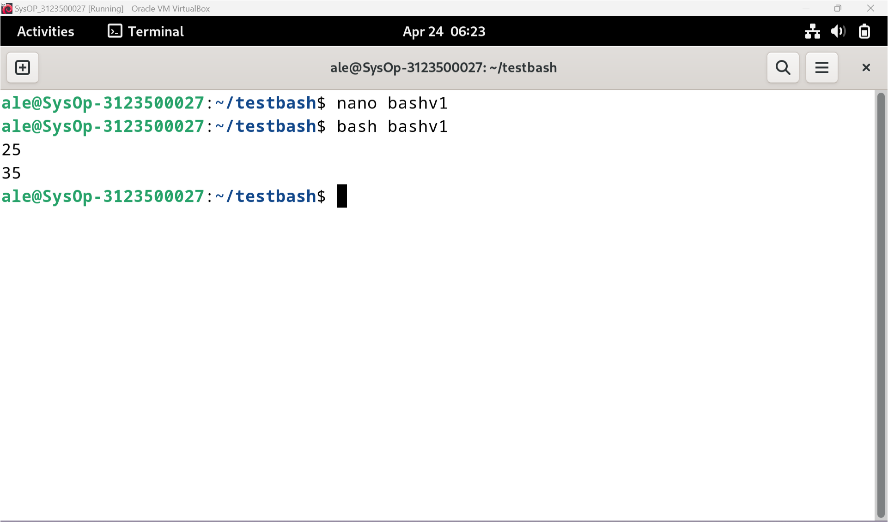

## Kanisius - Variable 1

Bagaimana Anda membuat variabel tidak dapat diperbarui?

Itu readonlykata kunci mencegah variabel diperbarui, secara efektif mengubahnya menjadi a constant. 

```bash
AGE=25
echo $AGE
readonly AGE
AGE=35
echo $AGE
```

AGE adalah sebuah batasan, menetapkan nilai baru menimbulkan kesalahan, dan pesan kesalahannya adalah AGE: is read-only.

Output: 

```bash
25
 line 6: AGE: is read-only
```

Percobaan 2:
- [Alfani - Variable 2](#Alfani---Variable-2)
- [Ale - Variable 2](#Ale---Variable-2)
- [Kanisius - Variable 2](K#anisius---Variable-2)

## Alfani - Variable 2
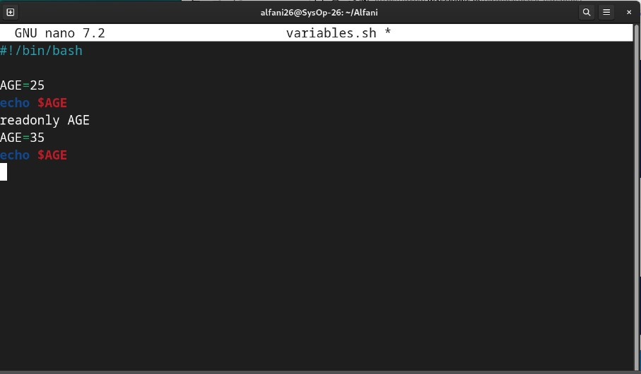
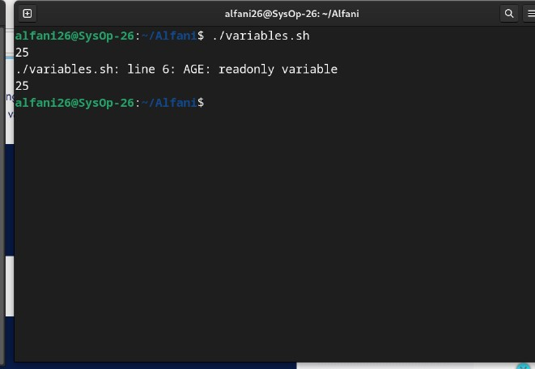

## Ale - Variable 2
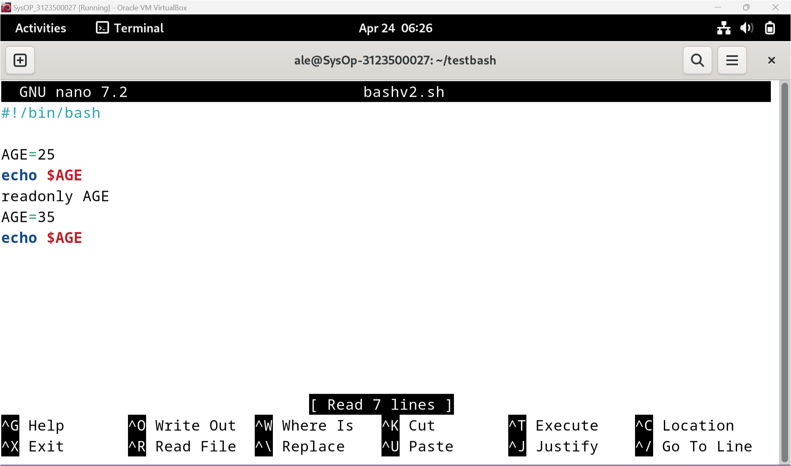
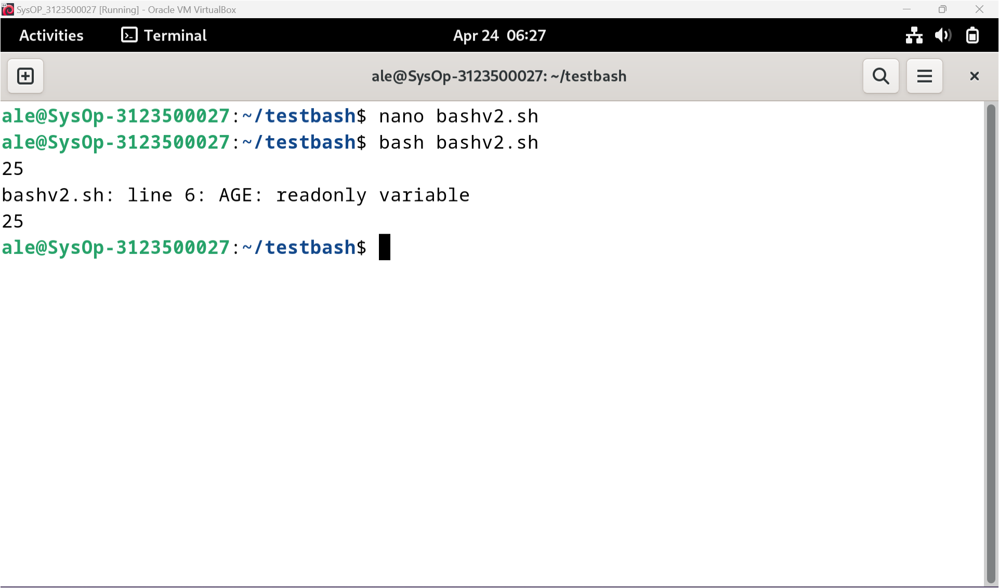

## Kanisius - Variable 2

<h3>Variabel unset Bash</h3>

Itu ```unset``` kata kunci membantu menghilangkan nilai dari variabel yang ditentukan. Variabel tetap dapat diakses tetapi mencetak nilai kosong.

```bash
AGE=25
echo $AGE
unset AGE
echo "empty":$AGE
```

Output:

```bash
25
empty:
```
Percobaan 3:
- [Alfani - Variable 3](#Alfani---Variable-3)
- [Ale - Variable 3](#Ale---Variable-3)
- [Kanisius - Variable 3](#Kanisius---Variable-3)

## Alfani - Variable 3
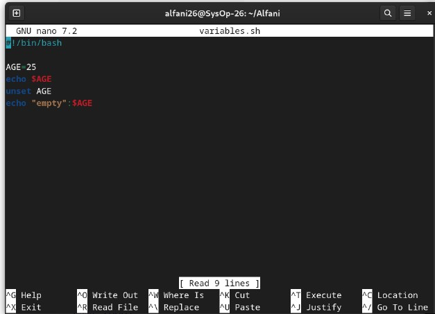
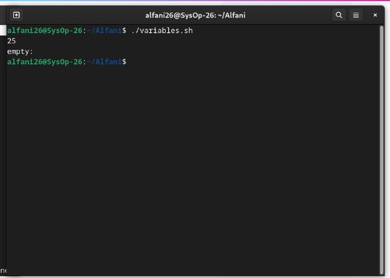

## Ale - Variable 3
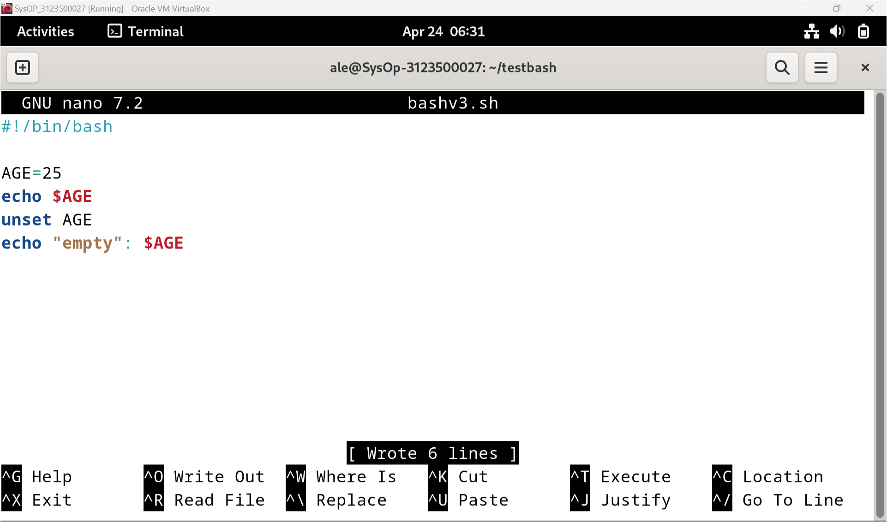
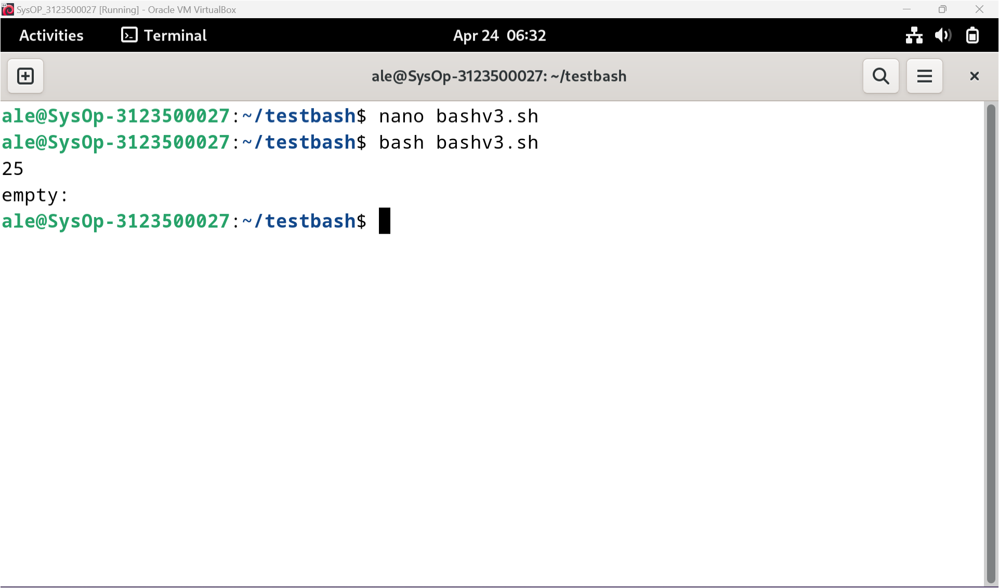

## Kanisius - Variable 3


Kode di atas,
- pertama-tama setel variabel AGE ke 25, cetak nilainya,
- lalu batalkan penggunaannya ```unset``` AGE.
- Selanjutnya, Bash mencetak “empty” diikuti dengan nilai AGE, yang sekarang muncul sebagai ruang kosong. 

<h3>Lingkup Variabel</h3>
Setiap variabel yang dideklarasikan harus memiliki ruang lingkup, yang menentukan di mana variabel tersebut dapat digunakan dalam program.

Misalnya, jika suatu variabel dideklarasikan di dalam suatu fungsi, maka variabel tersebut hanya tersedia di dalam fungsi tersebut dan tidak dapat diakses di luar fungsi tersebut.

Cakupan variabel di Bash dapat didefinisikan dengan dua cara:
- Variabel global.
- Variabel lokal. 

<h3>Variabel Global Bash</h3>
Variabel yang dideklarasikan dalam skrip shell disebut sebagai variabel global.

Variabel global dapat diakses dalam suatu fungsi atau blok bersarang apa pun dari file skrip shell.

Variabel default yang dideklarasikan dalam file skrip disebut variabel global.

```bash
setAge() {
    echo "Inside Function Age: $AGE"
}
AGE=40
setAge
echo "Script Age: $AGE"
```

Output:

```bash
Inside Function Age: 40
Script Age: 40
```

Percobaan 4:
- [Alfani - Variable 4](#Alfani---Variable-4)
- [Ale - Variable 4](#Ale---Variable-4)
- [Kanisius - Variable 4](#Kanisius---Variable-4)

## Alfani - Variable 4
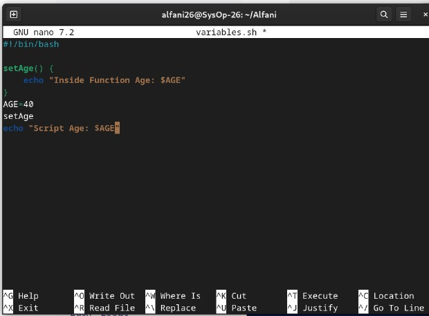
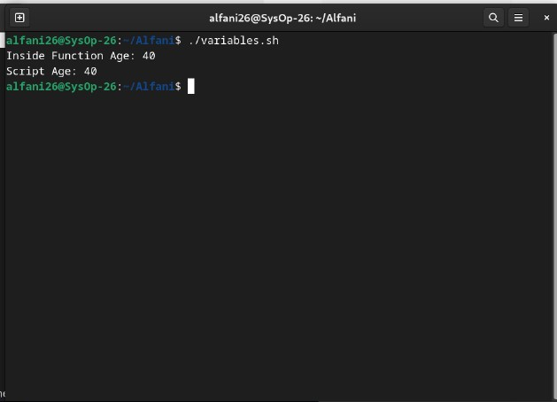

## Ale - Variable 4
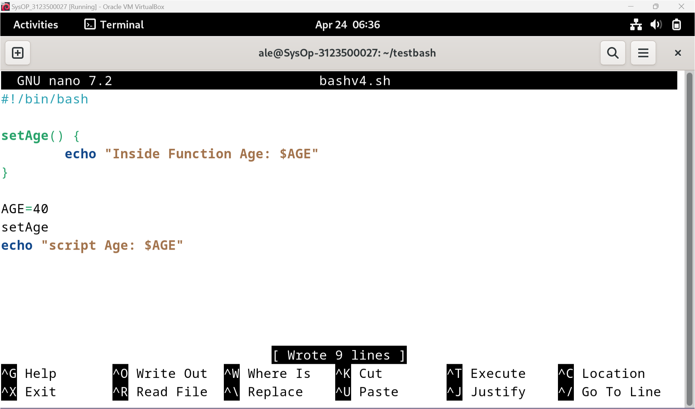
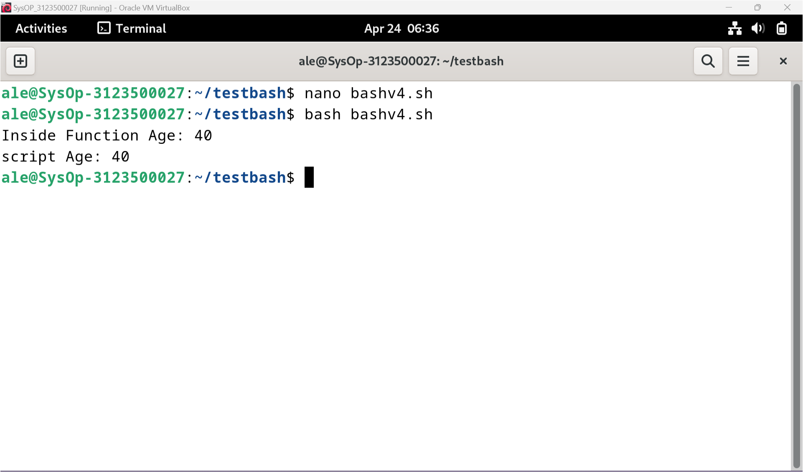

## Kanisius - Variable 4

<h3>Bash variabel Lokal</h3>
Variabel lokal dideklarasikan di dalam blok kode atau fungsi. Cakupan variabel-variabel ini hanya terlihat di dalam blok tempat variabel-variabel tersebut dideklarasikan.

Sintaks: 

```
local variablename=variablevalue
```

Dalam sintaks ini, variabel dideklarasikan dan ditugaskan dengan ```local``` kata kunci.

```bash
setAge() {
    local AGE=35
    echo "Local Variable Age: $AGE"
}
AGE=40
setAge
echo "Global Age: $AGE"
```

Output:

```bash
Local Variable Age: 25
Global Age: 40
```

Percobaan 5:
- [Alfani - Variable 5](#Alfani---Variable-5)
- [Ale - Variable 5](#Ale---Variable-5)
- [Kanisius - Variable 5](#Kanisius---Variable-5)

## Alfani - Variable 5
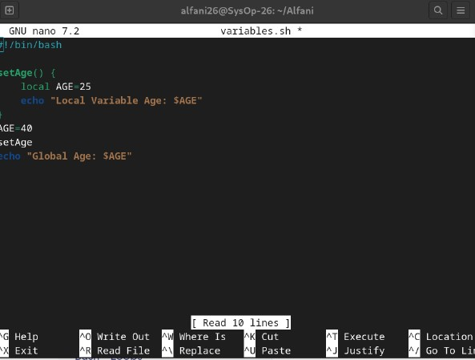
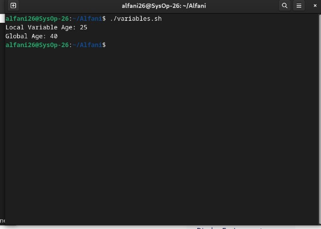

## Ale - Variable 5
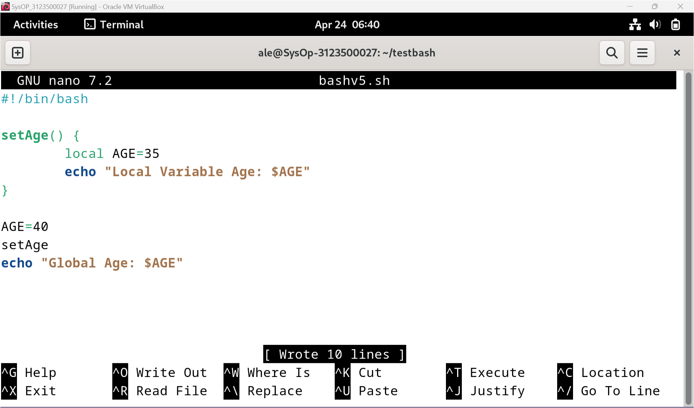


## Kanisius - Variable 5

Variabel lokal dideklarasikan di dalam suatu fungsi dan hanya terlihat di dalam fungsi tersebut. Variabel yang dideklarasikan di luar fungsi disebut variabel global dan tersedia untuk semua fungsi.

<h3>Pengetikan variabel</h3>
Skrip Bash bukan bahasa yang diketik, namun Anda dapat mendeklarasikan variabel dengan tipe data menggunakan perintah deklarasi Berdasarkan jenis variabelnya, memungkinkan jenis datanya.

```bash
declare options variablename=value
```

variabel dideklarasikan dan diberi nilai.</br>
Opsi berisi opsi untuk membuat tipe variabel</br>
Array: Untuk membuat variabel array</br>
mendeklarasikan -a variabel= </br>

| Variable | Tipe Sintaks | Keterangan |
|---|---|---|
| Array |	mendeklarasikan variabel -a |	mendeklarasikan variabel array terindeks yang menyimpan string |
| Associated Array | mendeklarasikan variabel -A |	Array yang terkait |
| Integer |	mendeklarasikan variabel -i |	nilai numerik untuk disimpan dalam variabel |
| Readonly | mendeklarasikan variabel -r | variabel readonly, tidak dapat diubah atau unset | 
| Export | mendeklarasikan variabel -x | ekspor variabel dan digunakan oleh semua proses anak |

<h3>Tampilkan variabel Lingkungan di Bash</h3>
Di Bash, ada dua jenis perintah untuk mencetak variabel lingkungan.
- Perintah ```printenv```
- Perintah ```env```

Kedua perintah ini mencantumkan semua variabel lingkungan terminal.

<h3>Konvensi penamaan variabel</h3>
- Variabel dibaca dengan mengawalinya dengan simbol ```$```.
- Nama variabel terdiri dari huruf, angka, atau garis bawah.
- Variabel peka huruf besar-kecil; misalnya, test dan Test dianggap sebagai dua variabel berbeda dalam skrip.
- Meskipun nama variabel biasanya ditulis dalam HURUF BESAR, Anda dapat membuatnya menggunakan huruf UPPER atau LOWER jika diperlukan. Dan variabel Lingkungan dan Shell keduanya dalam huruf besar.
- Nama variabel tidak boleh mengandung spasi
- Nama-nama biasanya harus camelCase. Contoh firstName

<h3>Variabel shell</h3>
Variabel shell adalah variabel yang diatur oleh shell, bukan oleh pengguna. Ini diperlukan oleh shell agar dapat bekerja dengan lancar 

| Variabel | Keterangan |
|---|---|
PWD | Direktori kerja saat ini
Set-Location | Ubah direktori kerja ke direktori baru
Rename-Item | Ganti nama file
IFS | Pemisah Bidang Internal secara default adalah spasi, diatur oleh Shell, Digunakan untuk pemisahan string
PATH | Berisi jalur perintah yang dipisahkan titik koma, Dikonfigurasi untuk mencari perintah
UID | Mencetak nomor Identifikasi Pengguna
Home |	Direktori beranda pengguna saat ini 

## Bash - Loop File
Terkadang, Anda ingin membaca konten file dengan pemrograman bash.
<h3>Bagaimana cara membaca file demi baris di bash Shell?</h3>
- menggunakan perulangan while

```bash
#!/bin/bash
while IFS= read -r line; do
   echo "$line"
done <filename.txt
```

Percobaan:
- [Alfani - Loop File](#Alfani---Loop-File)
- [Ale - Loop File](#Ale---Loop-File)
- [Kanisius - Loop File](#Kanisius---Loop-File)

## Alfani - Loop File

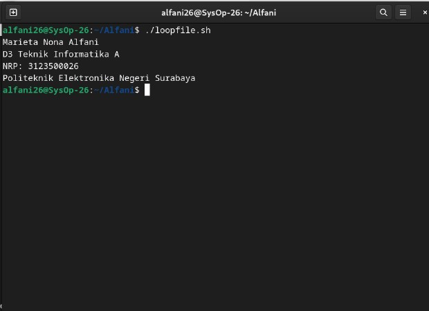

## Ale - Loop File
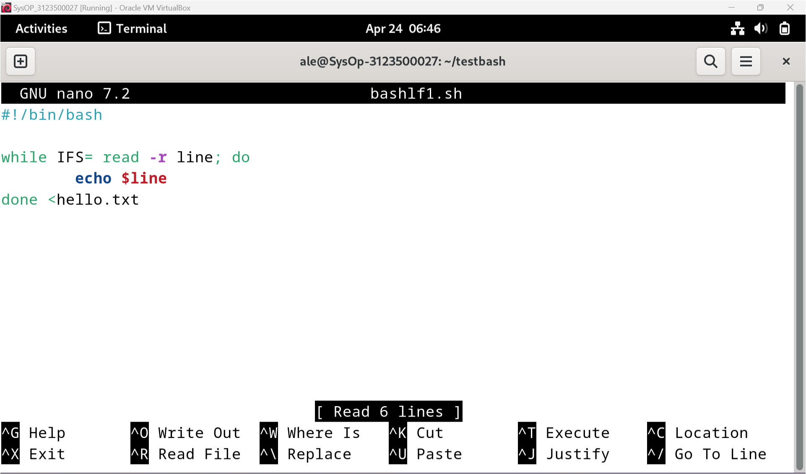
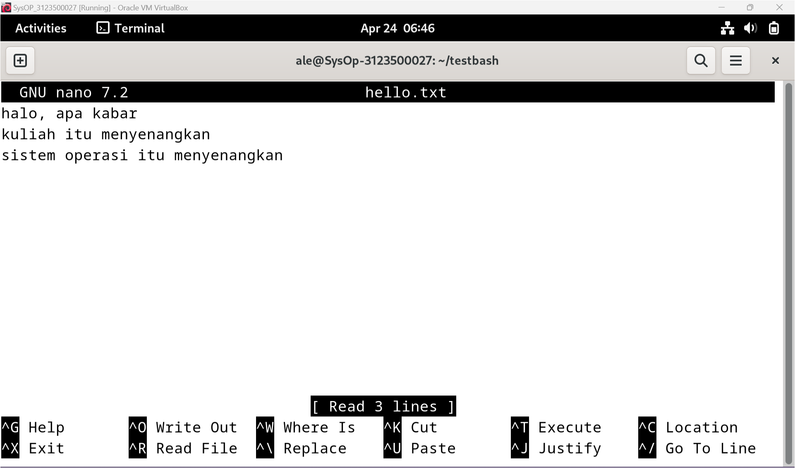
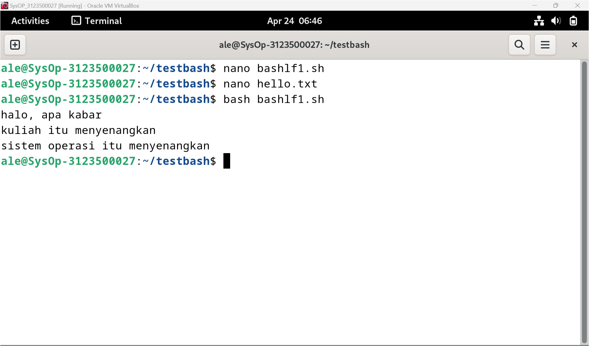

## Kanisius - Loop File


## Bash - Comments
```Comments``` adalah pernyataan kode yang berisi teks yang dapat dibaca pengguna yang dilewati shell selama eksekusi. Setiap bahasa pemrograman menyertakan fitur komentar, yang memberikan deskripsi baris kode atau pernyataan.

Komentar sebaris dalam kode membantu pengembang dalam mengedit dan memahami kode dengan lebih baik.

Bahasa skrip bash memungkinkan Anda menggunakan jenis komentar berikut.
- Komentar tunggal
- Komentar multi-baris 

Komentar berguna bagi manusia, kode ditulis untuk scripting.

<h3>Komentar satu baris di bash shell</h3>
Komentar satu baris dalam skrip shell dilambangkan dengan # simbol di awal setiap baris.

Komentar ini mencakup string yang memberikan informasi tentang baris kode terkait dalam skrip shell.

Penting untuk menempatkan komentar satu baris pada baris terpisah untuk kejelasan.

Untuk komentar sebaris, gunakan simbol # di awal komentar. Komentar satu baris selalu dimulai dengan # simbol.

Sintaks:

```bash
# Single-line comments
```

Ruang kosong setelah # simbol tidak akan muncul di output. Berikut ini adalah contoh komentar satu baris dalam skrip shell. 

```bash
# Single-line comments.
AGE=45
echo "Age:$AGE" ## printing age inline comment
```

Percobaan 1:
- [Alfani - Comments 1](#Alfani---Comments-1)
- [Ale - Comments 1](#Ale---Comments-1)
- [Kanisius - Comments 1](#Kanisius---Comments-1)

## Alfani - Comments 1
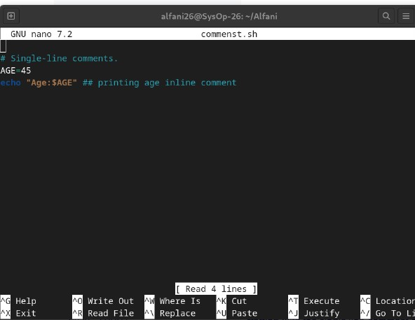
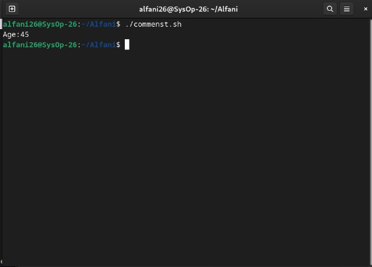

## Ale - Comments 1
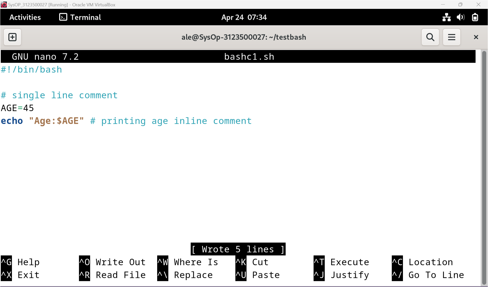


## Kanisius - Comments 1


<h3>Komentar multi-Baris dalam skrip shell</h3>
Komentar multi-baris melibatkan penggunaan lebih dari satu baris untuk komentar.

Cara pertama untuk membuat komentar multi-baris adalah dengan memanfaatkan komentar satu baris yang setiap barisnya dimulai dengan simbol komentar satu baris.

Sintaks: 

```bash
# Line1 comments
# Line1 comments
# Line1 comments
```

Cara kedua untuk membuat komentar multi-baris adalah dengan mengapit beberapa baris di dalam (```:```) Dan (```'```).

Sintaks ini melibatkan:

- Komentar dimulai dengan titik dua (```:```) diikuti dengan ```'```.
- Ini diikuti oleh beberapa baris komentar.
- Komentar diakhiri dengan ```'```.

Berikut sintaksnya: 

```bash
: '
multiline comments example1
multiline comments example2
multiline comments example3
'
```

Berikut adalah contoh Komentar Multi-Baris:
```bash
: '
multiline comments example1
multiline comments example2
multiline comments example3
'
echo "testing multi-line comments"
```

Percobaan 2:
- [Alfani - Comments 2](#Alfani---Comments-2)
- [Ale - Comments 2](#Ale---Comments-2)
- [Kanisius - Comments 2](#Kanisius---Comments-2)

## Alfani - Comments 2
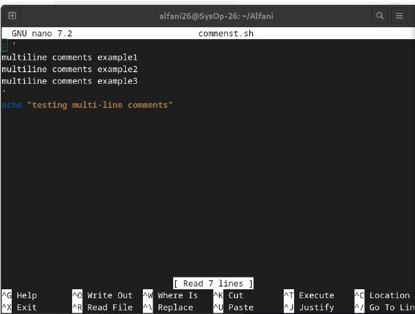
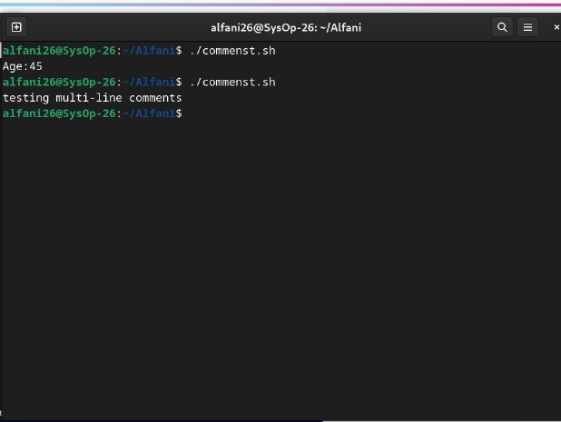

## Ale - Comments 2
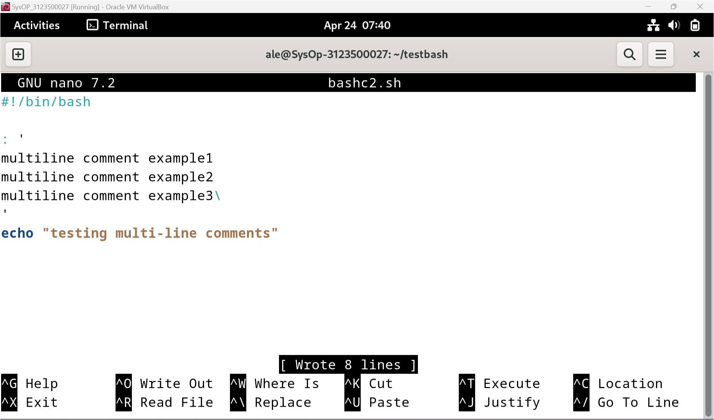
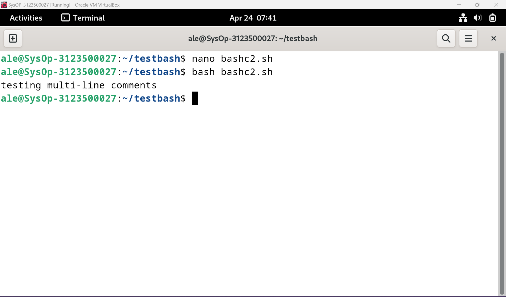

## Kanisius - Comments 2


Hal ini berguna untuk memasukkan lebih banyak teks yang mencakup beberapa baris, juga melayani tujuan dokumentasi. 

## Bash - Array
Array di shell adalah variabel yang menyimpan lebih dari satu nilai.

Misalkan, Anda memiliki daftar nomor 1 2 3.. 10 dan ingin menyimpan nomor-nomor ini di Shell Script.

Tanpa array, Anda harus mendeklarasikan sebagai berikut:

```bash
let number1=1
let number1=1
...
...
let number10=10
```

Iterasinya sulit dan jika kita ingin menyimpan 100 angka, itu sangat sulit.

Jadi, Anda bisa menggunakan array yang merujuk ke satu variabel dan menyimpannya.

<h3>Bagaimana cara mendeklarasikan dan membuat array?</h3>

Ada dua jenis array yang bisa kita buat:
- indexed array: elemen array disimpan dengan indeks mulai dari nol.
- associated array: array disimpan dengan pasangan nilai kunci.

<h3>pendeklerasian sebuah array</h3>
Untuk membuat array, kita perlu mendeklarasikan sebuah array. 

```bash
declare -a array; # indexed array
declare -A array; # associative array
```

ebuah array dideklarasikan dengan kata kunci ```declare``` dengan opsi ```-a``` atau ```-A```.

contoh indexed array Dalam hal ini, nilai Array disimpan dengan indeks=0 dan seterusnya. ini dibuat dengan opsi ```declare``` Dan ```-a```.

```bash
declare -a array
array=(one two three)
```

Array ini adalah penyimpanan dengan indeks=0, ditambah 1 sebagai berikut.

```bash
array[0]=one
array[1]=two
array[2]=three
```

contoh associated array Dalam hal ini, nilai Array disimpan dengan kunci. ini dibuat dengan opsi ```declare``` Dan ```-A```.

```bash
declare -A array
array=(one two three)
```

Dalam array ini terdapat penyimpanan dengan indeks=0, ditambah 1 sebagai berikut:

```bash
array[key1]=one
array[key2]=two
array[key3]=three
```

Contoh pemberian nilai kedalam array:

```bash
array=(1,2,3,4)
```

jika ingin memberikan nilai tanpa mendeklarasikan array:
```bash
arrayvariable[index]=value
```

Artinya, itu arrayvariable dideklarasikan dan diberi indeks array dengan nilai. 

Array diindeks nol berdasarkan nol pada panjang array -1 indeks=0 - mengembalikan elemen pertama indeks=-1 mengembalikan elemen terakhir. 

Array dapat berisi angka, string, dan campurannya.

<h3>Mengakses nilai array</h3>
Array berisi indeks untuk mendapatkan elemen. Elemen array dapat diakses menggunakan sintaks di bawah ini.

```bash
${array_name[index]}
```

<h3>mendeklarasikan array angka dan pengulangan</h3>
Array dapat berisi angka Contoh ini berisi array angka dan loop for untuk dicetak.

```bash
nums=(1 3 12)
for i in "${nums[@]}"
do
  echo "$i"
done
```

Output:

```bash
1
3
12
```

Percobaan 1:
- [Alfani - Array 1](#Alfani---Array-1)
- [Ale - Array 1](#Ale---Array-1)
- [Kanisius - Array 1](#Kanisius---Array-1)

## Alfani - Array 1
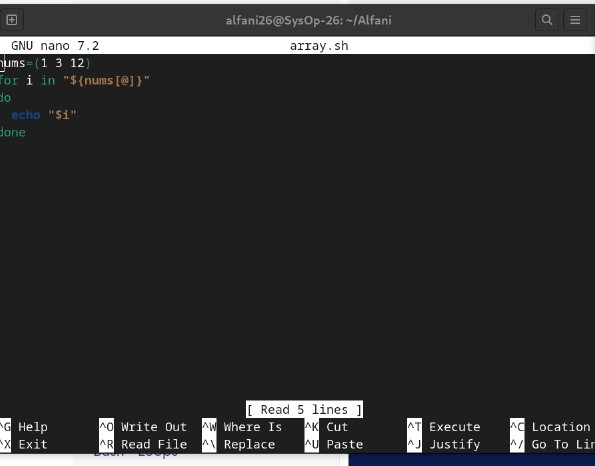
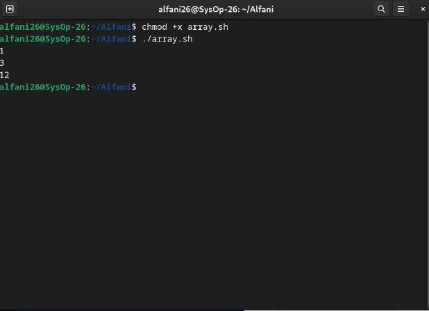

## Ale - Array 1
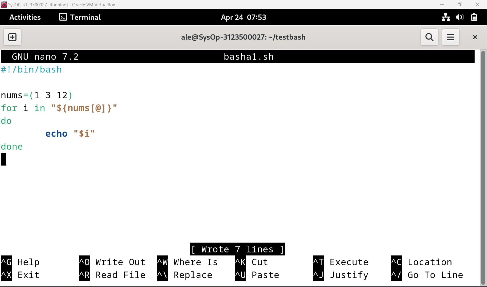
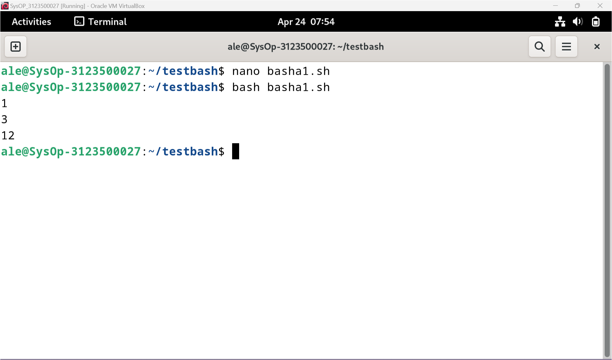

## Kanisius - Array 1


<h3>mendeklarasikan Array string dan pengulangan</h3>
Array dapat berisi angka Contoh ini berisi array angka dan loop for untuk dicetak.

```bash
numbers=("element1" "element2" "element3")
for i in "${numbers[@]}"
do
  echo "$i"
done
```

Output:

``` bash
element1
element2
element3
```

Percobaan 2:
- [Alfani - Array 2](#Alfani---Array-2)
- [Ale - Array 2](#Ale---Array-2)
- [Kanisius - Array 2](#Kanisius---Array-2)

## Alfani - Array 2
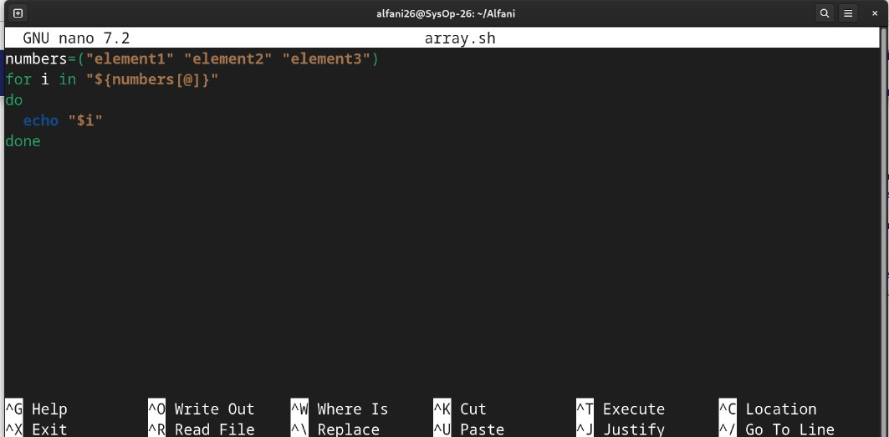
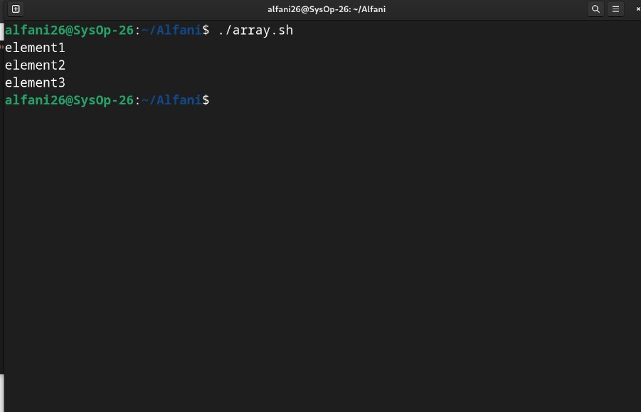

## Ale - Array 2
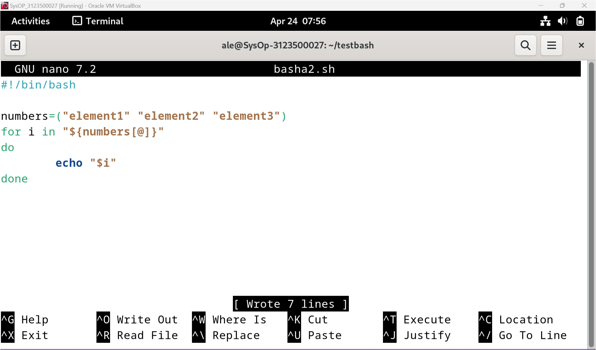
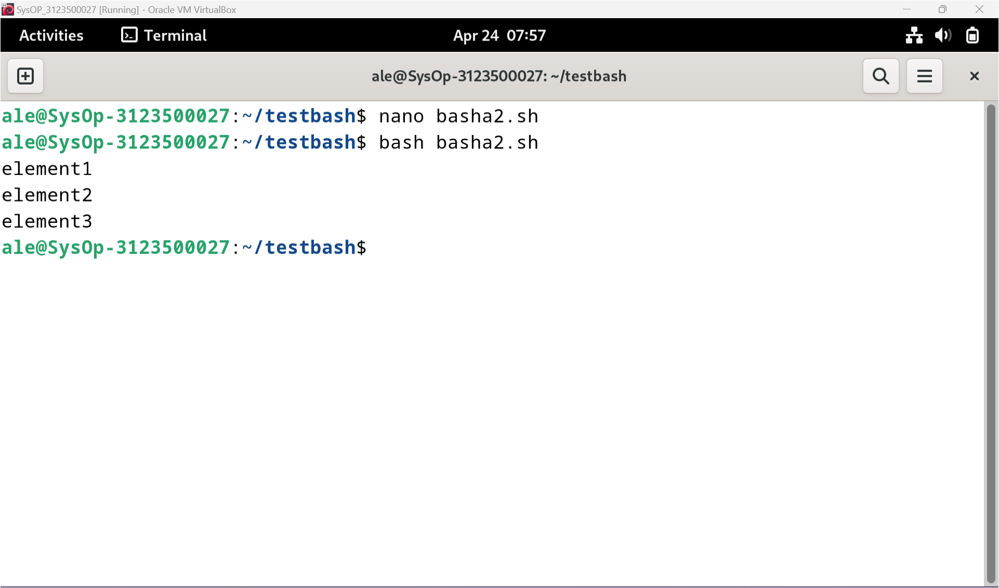

## Kanisius - Array 2


<h3>Mengakses elemen pertama dalam array</h3>
Dalam elemen Array, indeks elemen Pertama adalah nol, dan array[0] mengembalikan elemen pertama.

```bash
numbers=("element1" "element2" "element3")

echo ${numbers[0]}
echo ${numbers}
```

Output:

```bash
element1
element1
```

Percobaan 3:
- [Alfani - Array 3](#Alfani---Array-3)
- [Ale - Array 3](#Ale---Array-3)
- [Kanisius - Array 3](#Kanisius---Array-3)

## Alfani - Array 3
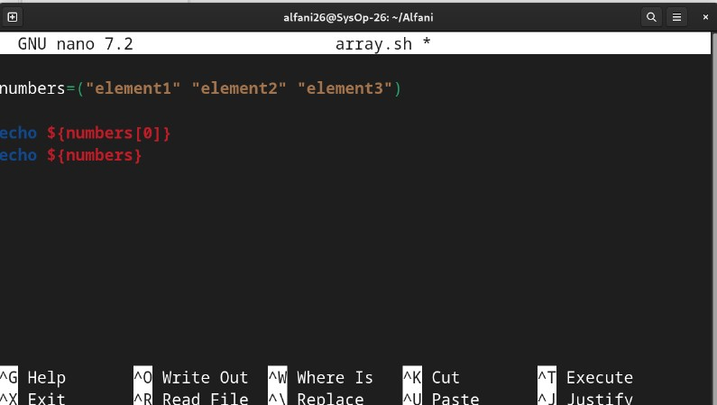
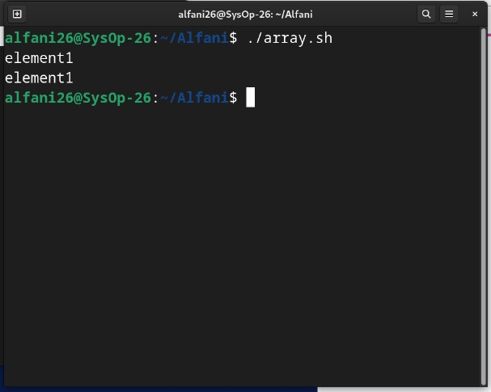

## Ale - Array 3
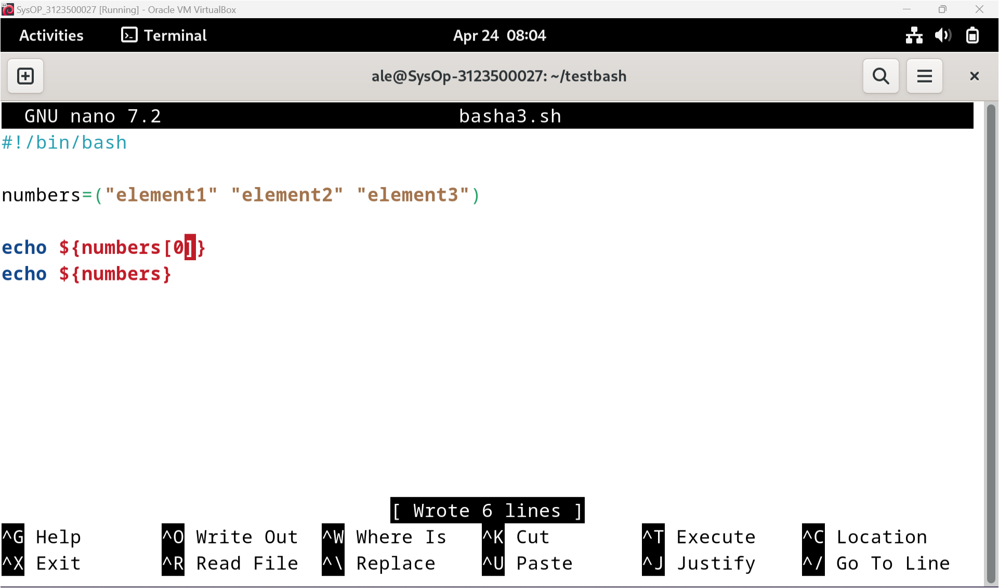
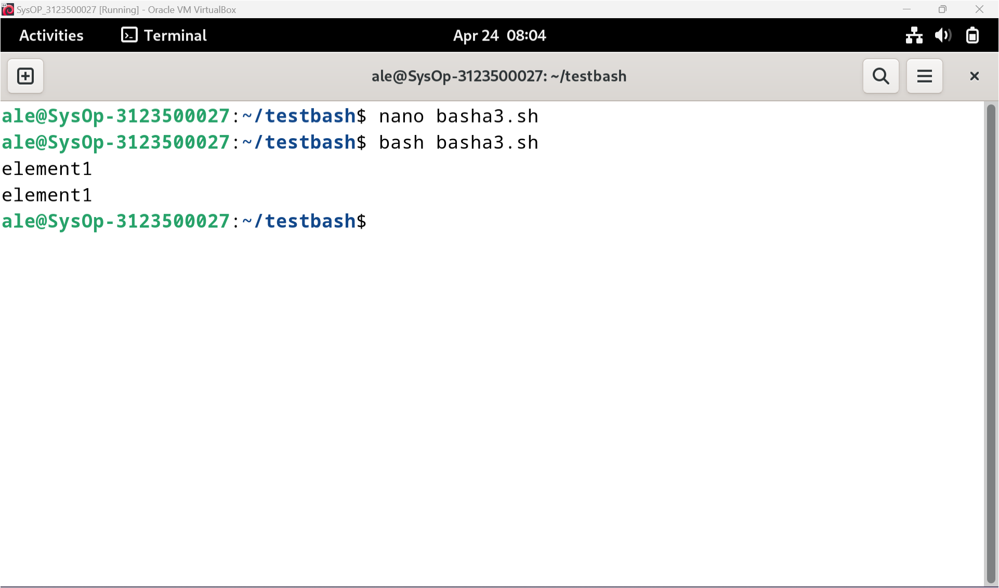

## Kanisius - Array 3


<h3>Mengambil elemen terakhir dari sebuah array</h3>
Dalam skrip bash, Anda dapat menggunakan indeks=-1 untuk mendapatkan elemen array terakhir.

```bash
numbers=("element1" "element2" "element3")
echo ${numbers[-1]}
```

Percobaan 4:
- [Alfani - Array 4](#Alfani---Array-4)
- [Ale - Array 4](#Ale---Array-4)
- [Kanisius - Array 4](#Kanisius---Array-4)

## Alfani - Array 4
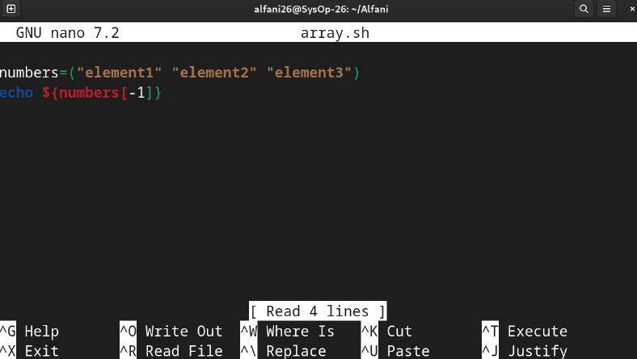
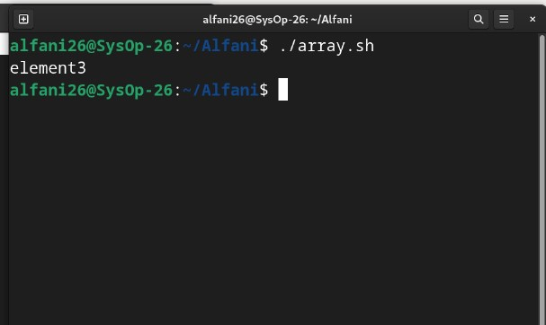

## Ale - Array 4
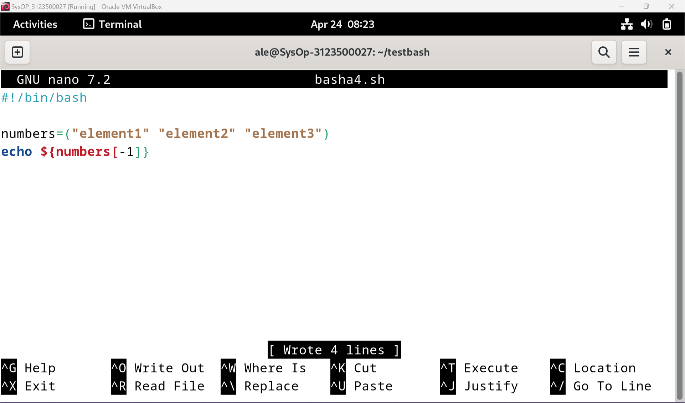
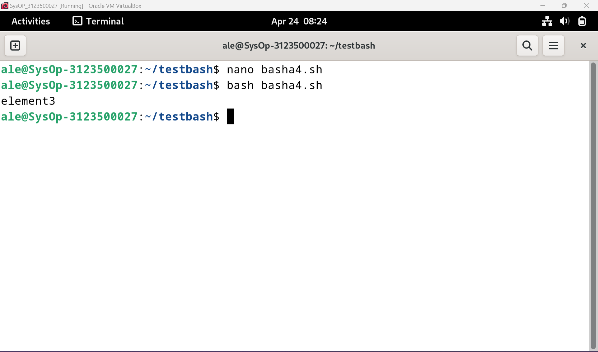

## Kanisius - Array 4

<h3>iterasi atau pengulangan elemen array</h3>
For loop digunakan untuk mengulangi elemen. 

Berikut adalah contoh contoh loop array untuk mencetak semua elemen:

```bash
numbers=("element1" "element2" "element3")

for i in "${numbers[@]}"
do
  echo "$i"
done
```

Output:

```bash
element1
element2
element3
```

Percobaan 5:
- [Alfani - Array 5](#Alfani---Array-5)
- [Ale - Array 5](#Ale---Array-5)
- [Kanisius - Array 5](#Kanisius---Array-5)

## Alfani - Array 5
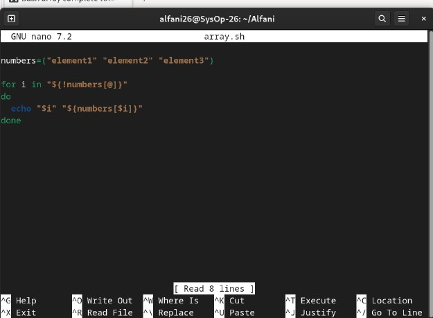
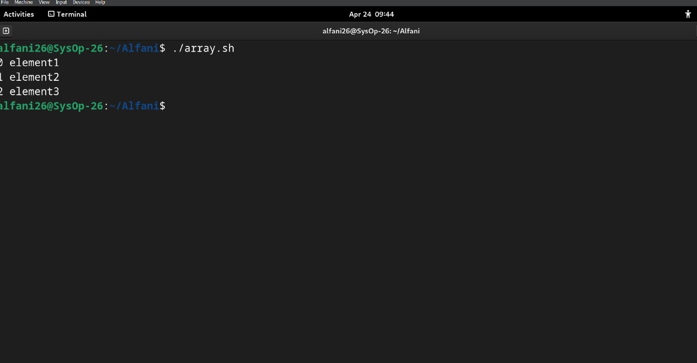

## Ale - Array 5
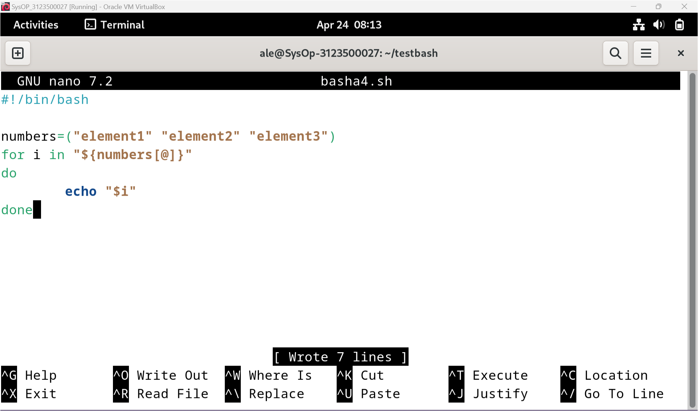


## Kanisius - Array 5

<h3>mencetak semua elemen array</h3>
Gunakan [@] atau [*] untuk mencetak semua elemen array.

```bash
arr=("element1" "element2" "element3") //
echo ${arr[@]} #element1 element2 element3
echo ${arr[*]}  #element1 element2 element3
```

Percobaan 6:
- [Alfani - Array 6](#Alfani---Array-6)
- [Ale - Array 6](#Ale---Array-6)
- [Kanisius - Array 6](#Kanisius---Array-6)

## Alfani - Array 6
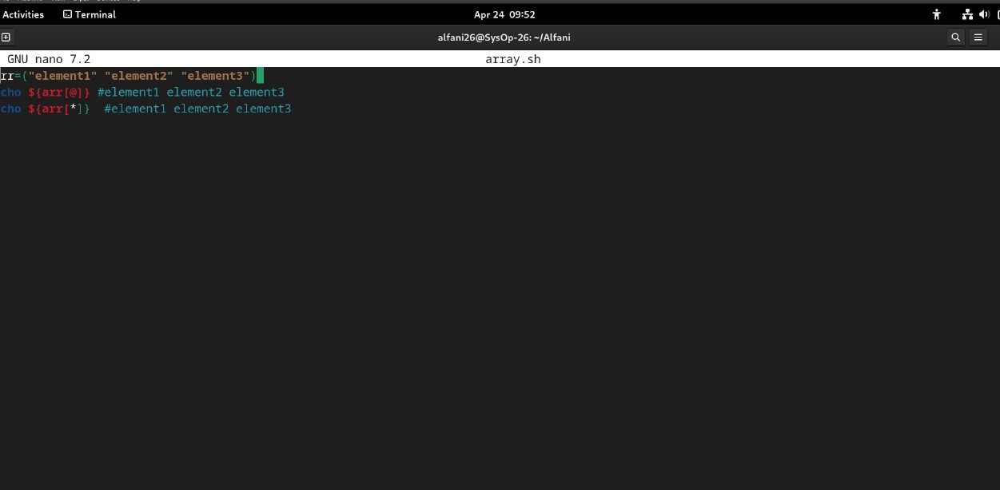


## Ale - Array 6


## Kanisius - Array 6

<h3>Menghapus elemen dari array</h3>

Anda dapat menghapus elemen dari array menggunakan ```unset``` untuk indeks tertentu. 

```bash
numbers=("element1" "element2" "element3")
echo ${numbers[*]}
unset numbers[-1]
echo ${numbers[*]}
```

Percobaan 7:
- [Alfani - Array 7](#Alfani---Array-7)
- [Ale - Array 7](#Ale---Array-7)
- [Kanisius - Array 7](#Kanisius---Array-7)

## Alfani - Array 7


## Ale - Array 7


## Kanisius - Array 7

<h3>Menambahkan elemen ke array</h3>
Anda dapat menambahkan elemen di posisi indeks mana pun menggunakan sintaks di bawah ini:

```bash
array[index]=value
```

Contoh penambahan elemen awal dan akhir serta tengah:

```bash
numbers=("element1" "element2" "element3")
echo ${numbers[*]}

 numbers[0]="element0"
echo ${numbers[*]}
 numbers[5]="element5"
echo ${numbers[*]}
 numbers[6]="element6"
echo ${numbers[*]}
```

Output:

```bash
element1 element2 element3
element0 element2 element3
element0 element2 element3 element5
element0 element2 element3 element5 element6
```

Percobaan 8:
- [Alfani - Array 8](#Alfani---Array-8)
- [Ale - Array 8](#Ale---Array-8)
- [Kanisius - Array 8](#Kanisius---Array-8)

## Alfani - Array 8


## Ale - Array 8


## Kanisius - Array 8


<h3>Panjang sebuah array</h3>
Dalam hal ini, Temukan jumlah semua elemen dalam array.

Skrip shell menyediakan # 

```bash
arr=("element1" "element2" "element3")
echo ${#arr[@]} # returns 3
echo ${#arr[*]} # returns 3
```

Percobaan 9:
- [Alfani - Array 9](#Alfani---Array-9)
- [Ale - Array 9](#Ale---Array-9)
- [Kanisius - Array 9](#Kanisius---Array-9)

## Alfani - Array 9


## Ale - Array 9


## Kanisius - Array 9

Contoh Array cheat sheet

Example | Description
---|---
declare -a array | Mendeklarasikan indexed array
declare -A array | Mendeklarasikan associated array
declare -a array=() | Mendeklarasikan array yang diindeks dengan array kosong
array=() | buat array kosong dengan menyatakan valid
array=(1 6 3) | Inisialisasi array dengan angka
array=(one two three)	| Inisialisasi array dengan string
array=(one two 1)	| Inisialisasi array dengan data campuran
${array[0]}	| Mengambil elemen pertama
${array[1]}	| Menagmbil elemen kedua
${array[-1]} | Mengambil elemen akhir
${array[@]} | Mengambil semua elemen
${array[*]}	| Mengambil semua elemen
${!array[!]} | Mengambil semua indeks
${#array[!]} | Menampilkan panjang array
array[0]=12 | Tambahkan elemen ke array di posisi pertama.yaitu indeks=0
array[-1]=22 | Tambahkan elemen ke array di posisi terakhir.
array+=(11) | Menambahkan nilai ke dalam sebuah array
${array[@]:k:i} | Mengambil elemen indeks=1 dimulai dari indeks=k

## Bash - Expansion
perintah dimasukkan ke OS untuk membuat panggilan sistem dan melakukan tindakan. perintah masukan pengguna di terminal untuk melakukan operasi seperti ls, cd, mkdir dll. 

Cara lain, Beberapa perintah dapat ditempatkan dalam satu file, juru bahasa bash membaca perintah dan menjalankannya

Cara menulis skrip shell di bash
- Pilih Editor atau editor teks
- Buat file dengan ekstensi .sh atau .bash
- Tulis perintah dalam file
- Simpan file sebagai hello.sh

```bash
#!/bin/bash
echo "Hello World"
```
Ubah izin untuk mengeksekusi file

```bash
chmod +x hello.sh
```

Percobaan 1:
- [Alfani - Expansion 1](#Alfani---Expansion-1)
- [Ale - Expansion 1](#Ale---Expansion-1)
- [Kanisius - Expansion 1](#Kanisius---Expansion-1)

## Alfani - Expansion 1


## Ale - Expansion 1


## Kanisius - Expansion 1


## Bash - Conditional Expression
Ekspresi kondisional dievaluasi pada waktu eksekusi skrip, berdasarkan hasil, Ini mengeksekusi blok perintah yang spesifik.

Ada berbagai jenis ekspresi kondisional di Bash:
- Operator Perbandingan String
- Operator Perbandingan Numerik
- Operator File
- Operator Logis 

<h3>Operator File</h3>
Bash menyediakan operator logika pada FIle dan direktori untuk menguji ekspresi kondisional. Ini memungkinkan Anda untuk memeriksa berbagai operasi seperti keberadaan, dan izin, ukuran. Ini digunakan ekspresi kondisional dalam pernyataan kondisional seperti if else dan case. 

sintaks:

```bash
if [[ conditiona_expressions]]; then
# code to handle
fi
```

conditiona_expressions berisi opsi, dan jalur file, yang selalu mengembalikan nilai benar atau salah.

berikut adalah opsi yang disediakan:

Operator | Keterangan
---|---
-e file	| Mengembalikan nilai benar jika file yang diberikan ada, file dapat berupa file atau direktori normal
-f file |	Mengembalikan nilai benar jika file yang diberikan ada dan file (bukan direktori)
-d file	| Mengembalikan nilai benar jika file adalah direktori
-r file	| Mengembalikan nilai benar jika file ada dan memiliki izin yang dapat dibaca
-w file	| Mengembalikan nilai benar jika file ada dan memiliki izin yang dapat ditulis
-x file	| Mengembalikan nilai benar jika file ada dan memiliki izin yang dapat dieksekusi
-s file	| Mengembalikan nilai benar jika file ada dan ukurannya tidak kosong
-G file	| Mengembalikan nilai benar jika file ada dan dimiliki oleh ID Grup yang cocok
-O file	| Mengembalikan nilai benar jika file ada dan dimiliki oleh ID pengguna yang cocok
-N file	| Mengembalikan nilai benar jika file ada dan diubah berdasarkan tanggal baca terakhir
-L file	| Mengembalikan nilai benar jika file ada dan merupakan Tautan simbolis
file1 -ot file2	| Mengembalikan nilai benar jika file1 lebih tua dari file2 atau file2 ada, file1 tidak ada
file1 -ne file2	| Mengembalikan nilai benar jika file1 lebih baru dari file2, file1 ada, file2 tidak ada
file1 -ef file2	| Mengembalikan nilai benar jika file1 dan file2 menunjuk ke perangkat dan inode yang sama 

## Bash - Case Statements
Case Statements mirip dengan switch case dalam bahasa pemrograman lain.

Ini digunakan untuk membandingkan masukan yang diberikan dengan a beberapa pola, dan perintah di dalam pola yang cocok dijalankan.

Sintaks:

```bash
case expression in

pattern1)
  ## Commands
  ;;
pattern1)
  ## Commands
  ;;
*)
  ## Default case to execute if none of the pattern is matched
  ;;
```

- expression adalah variabel atau ekspresi yang valid untuk dievaluasi.
- Ini berisi pola-pola yang didefinisikan di dalam kasus yang dievaluasi dengan membandingkan ekspresi, mencocokkan kasus yang ditemukan, lalu mengeksekusi perintah di dalamnya.
- kasus bawaan (```*)```) untuk dieksekusi jika tidak ada pola yang cocok.
- Setiap blok pola diakhiri dengan ```;;```.
- ```case``` adalah kata awal dan ```esac``` adalah sebuah kata yang mengakhiri pernyataan kasus.

Contoh dari Case Statements:

```bash
name="john1"

case $name in
    "john")
        echo "John."
        ;;
    "others" | "others2")
        echo "Other names."
        ;;

    *)
        echo "Default Name."
        ;;
esac
```

Percobaan 1:
- [Alfani - Case Statements 1](#Alfani---Case-Statements-1)
- [Ale - Case Statements 1](#Ale---Case-Statements-1)
- [Kanisius - Case Statements 1](#Kanisius---Case-Statements-1)

## Alfani - Case Statements 1


## Ale - Case Statements 1


## Kanisius - Case Statements 1


## Bash - Special Characters
Karakter khusus di bash dievaluasi dengan arti khusus dalam interpretasi suatu perintah. Karakter-karakter ini memiliki instruksi khusus, penggunaan karakter ini memiliki arti berbeda dalam konteks berbeda.

<h3>Blankspace (" “)</h3>
Ini juga disebut spasi putih, berisi tab, spasi, kembali, baris baru. Ini memberitahu penerjemah bash untuk memisahkan perintah dan konten. Ini adalah pembatas untuk memisahkan perintah dan string.

Contoh:
```bash
echo "Hello World"
```

Percobaan 1:
- [Alfani - Special Characters 1](#Alfani---Special-Characters-1)
- [Ale - Special Characters 1](#Ale---Special-Characters-1)
- [Kanisius - Special Characters 1](#Kanisius---Special-Characters-1)

## Alfani - Special Characters 1


## Ale - Special Characters 1


## Kanisius - Special Characters 1

<h3>Expansion ($)</h3>
simbol tanda dolar digunakan untuk berbagai jenis ekspansi perluasan parameter ( $variable, ${variable}), Substitusi ( $(expression)), ekspresi artema ( $((expression))).

<h3>Ambersand (&)</h3>

Menambahkan ```&``` di akhir perintah memungkinkan Anda menjalankan perintah di latar belakang. 

```bash
command &
```

Misalnya, Untuk menjalankan perintah yes di latar belakang, gunakan perintah di bawah ini:
```bash
yes &
```

Percobaan 2:
- [Alfani - Special Characters 2](#Alfani---Special-Characters-2)
- [Ale - Special Characters 2](#Ale---Special-Characters-2)
- [Kanisius - Special Characters 2](#Kanisius---Special-Characters-2)

## Alfani - Special Characters 2


## Ale - Special Characters 2


## Kanisius - Special Characters 2


<h3>Pipe (|) </h3>
ni digunakan untuk meneruskan keluaran dari satu perintah ke masukan ke perintah lain dari kiri ke kanan. Hal ini memungkinkan untuk membentuk rantai perintah 

Sintaksnya adalah ```command1 | command2```

Contoh : ```echo "hello" | wc``` mengembalikan jumlah karakter.

Percobaan 3:
- [Alfani - Special Characters 3](#Alfani---Special-Characters-3)
- [Ale - Special Characters 3](#Ale---Special-Characters-3)
- [Kanisius - Special Characters 3](#Kanisius---Special-Characters-3)

## Alfani - Special Characters 3


## Ale - Special Characters 3


## Kanisius - Special Characters 3


<h3>Semicolon (;)</h3>

Ini digunakan untuk memisahkan beberapa perintah menggunakan ```;``` dalam satu baris. ```;``` adalah pemisah perintah untuk mendefinisikan beberapa perintah dalam satu baris.
Sintaks: 

```bash
command1; command2;command3
```

Contoh: ```cd ../operatingsystem/;ls;```

Percobaan 4:
- [Alfani - Special Characters 4](#Alfani---Special-Characters-4)
- [Ale - Special Characters 4](#Ale---Special-Characters-4)
- [Kanisius - Special Characters 4](#Kanisius---Special-Characters-4)

## Alfani - Special Characters 4


## Ale - Special Characters 4


## Kanisius - Special Characters 4


<h3>Single quotes</h3>

Kutipan tunggal (') digunakan untuk mendefinisikan string tanpa arti khusus. Artinya semua variabel dan ekspansi tidak diinterpretasikan dan mencetak string literal yang sama.

contoh:
```bash
name="Eric"

echo "Hi, $name"  # Hi, Eric
echo 'Hello, $name'  # Hi $name
```

echo pertama, variabel nama diperluas dan diinterpretasikan sebagai string dan dicetak.

echo kedua, menggunakan tanda kutip tunggal, dan variabel nama tidak diperluas dan dicetak sebagai string literal.

Percobaan 5:
- [Alfani - Special Characters 5](#Alfani---Special-Characters-5)
- [Ale - Special Characters 5](#Ale---Special-Characters-5)
- [Kanisius - Special Characters 5](#Kanisius---Special-Characters-5)

## Alfani - Special Characters 5


## Ale - Special Characters 5


## Kanisius - Special Characters 5


<h3>Double quotes</h3>
Tanda kutip ganda (") digunakan untuk mendefinisikan string literal dengan arti khusus.

jika string berisi variabel dan sintaks expansion, Ini diinterprestasikan dan diperluaskan, dengan nilai yang dievaluasi saat runtime.

Jika string tidak ingin memperluas variabel mereka, maka Anda dapat melewatkan karakter \ sebelum simbol $ dollar.

Contoh:
```bash
name="Eric"

echo "Hi, $name"  # Hi, Eric
echo "Hi, \$name"  # Hi, $name
```
echo pertama, variabel nama diperluas dan diinterpretasikan sebagai string dan dicetak.

echo kedua, karakter escape dengan awalan $ \, dicetak sebagai string literal.

Percobaan 6:
- [Alfani - Special Characters 6](#Alfani---Special-Characters-6)
- [Ale - Special Characters 6](#Ale---Special-Characters-6)
- [Kanisius - Special Characters 6](#Kanisius---Special-Characters-6)

## Alfani - Special Characters 6


## Ale - Special Characters 6


## Kanisius - Special Characters 6


<h3>Backslash Character (\)</h3>
Karakter backslash digunakan untuk menghindari karakter-karakter dalam string. Ini digunakan dalam string yang dikutip oleh tanda kutip ganda.

```bash
echo escape $$ example # escape 3225 example
echo escape \$$ example # escape $$ example
```
Percobaan 7:
- [Alfani - Special Characters 7](#Alfani---Special-Characters-7)
- [Ale - Special Characters 7](#Ale---Special-Characters-7)
- [Kanisius - Special Characters 7](#Kanisius---Special-Characters-7)

## Alfani - Special Characters 7


## Ale - Special Characters 7


## Kanisius - Special Characters 7


<h3>Comment (#)</h3>
Simbol komentar digunakan untuk mengomentari sebaris kode. Baris komentar selalu dimulai dengan #.

komentar akan diabaikan oleh penerjemah bash.
```bash
# Line comment
echo "comment example" # Inline comment
```

Percobaan 8:
- [Alfani - Special Characters 8](#Alfani---Special-Characters-8)
- [Ale - Special Characters 8](#Ale---Special-Characters-8)
- [Kanisius - Special Characters 8](#Kanisius---Special-Characters-8)

## Alfani - Special Characters 8


## Ale - Special Characters 8


## Kanisius - Special Characters 8


<h3>Question mark (?)</h3>
tanda tanya mempunyai arti yang berbeda dalam konteksnya.
- Dalam konteks ekspresi reguler
- Di dalam 

periksa status keluar dari eksekusi perintah terakhir. 

<h3>Dot (.)</h3>
Titik dalam bash berguna untuk mengeksekusi file. Ketika Anda menggunakan perintah ini untuk mengeksekusi skrip, shell akan membaca dan mengeksekusi perintah dari file skrip yang ditentukan seolah-olah perintah tersebut diketik langsung ke dalam sesi shell saat ini.

## Bash - if elif else
Skrip Bash menyediakan ekspresi kondisional untuk mengeksekusi kode berbeda berdasarkan kondisi yang ditentukan.

<h3>Pernyataan kondisional Bash Shell</h3>
Terkadang, Anda mungkin perlu mengeksekusi beragam blok kode bergantung pada berbagai keputusan berdasarkan kondisi tertentu.

Skrip Bash memfasilitasi hal ini melalui pernyataan kondisional.
```bash
  if condition; then
     # true code
  elif another_condition; then
     # condition is false, and another_condition is true
  else
     # none of the above conditions are true
  fi
```

- Pernyataan ```if``` digunakan untuk mengeksekusi blok kode jika suatu kondisi benar, dengan sintaksis if then fi.
- Pernyataan ```else``` digunakan untuk mengeksekusi kode jika suatu kondisi salah, mengikuti sintaksisnya if then else fi.
- Pernyataan ```if..elif..else``` ini berguna ketika Anda perlu mengeksekusi kode jika tidak ada kondisi sebelumnya yang benar.

Catatan:
- Kondisi adalah ekspresi yang mengevaluasi true atau false dalam skrip shell.
- Spasi diperlukan sebelum dan sesudah [ and ].
- Diperlukan titik koma sebelum itu.
- if, else, then, elif, fi adalah kata-kata khusus di Bash.
- Kondisi adalah ekspresi dengan perintah:
  - Perintah yang berisi sintaks tanda kurung tunggal, contoh sintaks [expression] dan digunakan untuk operasi string file.
  - Sintaks kurung ganda, contohnya adalah [[expression]], yang digunakan untuk menggabungkan beberapa kondisi dan menangani pola regex.
  - Tanda kurung ganda, contoh sintaksnya adalah ((expression)), digunakan untuk operasi aritmatika.
 
<h3>Pernyataan kondisional if</h3>

Pernyataan ```if``` di Bash digunakan untuk mengeksekusi blok kode ketika kondisi tertentu terpenuhi true. 

```bash
if [ condition ]; then
   # Execute code block if the condition is true
fi
```

Dalam sintaks di atas:
- Mengganti [ condition ] dengan ekspresi kondisional.
- Blok kode dalam pernyataan if dieksekusi hanya jika kondisi yang ditentukan bernilai benar.
- Setiap ```if``` pernyataan harus diakhiri dengan ```fi```. 

Contoh:

```bash
age=10
if [ $age -lt 50 ]; then
   echo "$age is less than 50"
fi
```

Output:

```bash
10 is less than 50
```

Percobaan 1:
- [Alfani - If elif else 1](#Alfani---If-elif-else-1)
- [Ale - If elif else 1](#Ale---If-elif-else-1)
- [Kanisius - If elif else 1](#Kanisius---If-elif-else-1)

## Alfani - If elif else 1


## Ale - If elif else 1


## Kanisius - If elif else 1

<h3>Pernyataan Kondisional If-Else</h3>

Pernyataan ```if-else``` kondisional di Bash memungkinkan Anda mengeksekusi blok kode yang berbeda tergantung pada kondisinya true atau false.

```bash
if [ condition ]; then
   # Execute code block if the condition is true
else
   # Execute code block if the condition is false
fi
```

Dalam sintaks di atas:
- Mengganti [ condition ] dengan ekspresi untuk menguji.
- Blok kode di dalam ```if``` pernyataan dijalankan jika kondisi yang ditentukan terpenuhi true.
- Blok kode di dalam elsepernyataan dijalankan jika kondisinya adalah false.
- Setiap pernyataan if-else harus diakhiri dengan fi.

contoh:

```bash
#!/bin/sh
age=25
if [[ $age -gt 60 ]]; then
     echo "Senior Citizen"
else
     echo "Not Senior Citizen"
fi
```
Dalam contoh ini, jika usianya lebih dari 60 tahun, maka akan dihasilkan “Warga Negara Lanjut Usia”; jika tidak, akan ditampilkan “Bukan Warga Negara Lanjut Usia”. 

Percobaan 2:
- [Alfani - If elif else 2](#Alfani---If-elif-else-2)
- [Ale - If elif else 2](#Ale---If-elif-else-2)
- [Kanisius - If elif else 2](#Kanisius---If-elif-else-2)

## Alfani - If elif else 2


## Ale - If elif else 2


## Kanisius - If elif else 2

<h3>Pernyataan If..Elif..Else</h3>

Menggunakan ```if..elif..else``` pernyataan kondisional di Bash untuk mengeksekusi blok kode yang berbeda berdasarkan beberapa kondisi. 

```bash
if [ condition1 ]; then
	# Execute code if condition1 is true
elif [ condition2 ]; then
	# Execute code if condition1 is false and condition2 is true
else
	# Execute code if both condition1 and condition2 are false
fi
```

- Blok kode di dalam pernyataan ```if``` yang pertama dieksekusi jika ```condition1``` adalah true.
- Blok kode di dalam pernyataan ```elif``` yang pertama dieksekusi jika ```condition1``` adalah false Dan ```condition2``` benar.
- pernyataan ```else``` blok dieksekusi jika keduanya ```condition1``` Dan ```condition2``` salah.
- Setiap if..elif..elsepernyataan harus diakhiri dengan fi.

Contoh:

```bash
age=25
if [[ $age -gt 60 ]]; then
    echo "Senior Citizen"
elif [[ $age -lt 14 ]]; then
    echo "Child"
else
    echo "Adult"
fi
```

Dalam contoh ini, skrip memeriksa apakah usia lebih besar dari 60, kurang dari 14, atau tidak termasuk dalam kategori apa pun, dan menampilkan pesan yang sesuai. 

Percobaan 3:
- [Alfani - If elif else 3](#Alfani---If-elif-else-3)
- [Ale - If elif else 3](#Ale---If-elif-else-3)
- [Kanisius - If elif else 3](#Kanisius---If-elif-else-3)

## Alfani - If elif else 3


## Ale - If elif else 3


## Kanisius - If elif else 3

## Bash - Loop
Loop digunakan untuk mengeksekusi blok kode beberapa kali.

Misalkan Anda ingin menjalankan perintah berulang kali atau mencetak array, for loop digunakan di Bash

Skrip Bash menyediakan berbagai jenis loop
- for loop
- for index loop
- while loop
- until loop

<h3>For loop</h3>
for loop digunakan untuk mengeksekusi kode beberapa kali berdasarkan:

```
for element in [list]
do
 ## Code block
done
```

Contoh ini mengulangi daftar dan mencetak ke konsol:

```bash
for element in 1 2 3 4 5
do
  echo $element
done
```

Percobaan 1:
- [Alfani - Loop 1](#Alfani---Loop-1)
- [Ale - Loop 1](#Ale---Loop-1)
- [Kanisius - Loop 1](#Kanisius---Loop-1)

## Alfani - Loop 1


## Ale - Loop 1


## Kanisius - Loop 1

<h3>for index loop</h3>
untuk loop indeks mirip dengan bahasa C untuk loop indeks Itu mengeksekusi kode beberapa kali berdasarkan kondisi benar, Ini dimulai dengan nilai awal dan iterasi berisi nilai yang akan bertambah 1.

```bash
for (( assignment; condition; iteration )); do
  # code block
done
```

Contoh:

```bash
for ((i=0;i<5;i++));do
 echo $i
done
```

Ini mencetak angka dari 0 hingga 5 

Percobaan 2:
- [Alfani - Loop 2](#Alfani---Loop-2)
- [Ale - Loop 2](#Ale---Loop-2)
- [Kanisius - Loop 2](#Kanisius---Loop-2)

## Alfani - Loop 2


## Ale - Loop 2


## Kanisius - Loop 2

<h3>while loop</h3>

```while``` loop di Bash memungkinkan eksekusi kode berulang selama kondisi yang ditentukan true. Jika kondisinya menjadi false, loop keluar.

Struktur dasar perulangan while adalah sebagai berikut:

```bash
while [ condition ]; do
  # code block
done
```

Contoh:

```bash
i=0
while [[ i -lt 100 ]]; do
  echo "$i"
  i=$((i+1))
done
```

while loop mengeksekusi kode selama kondisi yang ditentukan ( [[ i -lt 100 ]]) adalah benar.

Blok kode menambah nilai sebesar 1 dan mencetak nilainya.

jika kondisi salah, loop keluar. 

Percobaan 3:
- [Alfani - Loop 3](#Alfani---Loop-3)
- [Ale - Loop 3](#Ale---Loop-3)
- [Kanisius - Loop 3](#Kanisius---Loop-3)

## Alfani - Loop 3


## Ale - Loop 3


## Kanisius - Loop 3

<h3>until loop</h3>
```until``` merupakan kata kunci di Bash digunakan untuk mengeksekusi kode berulang kali hingga kondisi tertentu tercapai true, pada titik mana perulangan keluar.

Struktur dasar dari perulangan sampai adalah sebagai berikut:
```bash
until [ condition ]; do
  # code block
done
```

kata kunci ```until``` digunakan di Bash dan diakhiri dengan done. 

contoh:

```bash
i=0
until [[ i -eq 100 ]];
do
 echo "$i"
 i=$((i+1))
done
```

Dalam contoh, blok kode dijalankan selama [[ i -eq 100 ]]adalah salah. Ini menambah nilai sebesar 1 dan mencetak nilainya. output mencetak angka dari 0 hingga 99 angka 

Percobaan 4:
- [Alfani - Loop 4](#Alfani---Loop-4)
- [Ale - Loop 4](#Ale---Loop-4)
- [Kanisius - Loop 4](#Kanisius---Loop-4)

## Alfani - Loop 4


## Ale - Loop 4


## Kanisius - Loop 4

## Bash - Append String A
expression atau expresi adalah istilah yang digunakan dalam matematika untuk menunjukkan suatu operasi. Ini berisi operan dan operator untuk melakukan operasi matematika. ```a<b``` adalah sebuah ekspresi. Ini mungkin berisi operator biner atau unary.

Di bash, ekspresi dibuat menggunakan (())tanda kurung dengan operan dan operator sebagai argumen. ((a )) adalah ekspresi bash.

Sintaksnya adalah:

```bash
((expression))
```

contoh:

```bash
result=$((12 + 11))
echo "$result"
```

Percobaan 1:
- [Alfani - Append String A 1](#Alfani---Append-String-A-1)
- [Ale - Append String A 1](#Ale---Append-String-A-1)
- [Kanisius - Append String A 1](#Kanisius---Append-String-A-1)

## Alfani - Append String A 1


## Ale - Append String A 1


## Kanisius - Append String A 1

<h3>Bash Athematic expressions</h3>
Ekspresi artema dibuat menggunakan operator di bawah ini:
- Operator Artmatik
- Operator Perbandingan 

Operator perbandingan digunakan untuk mengecek satu sama lain dengan membandingkan nilai Operator ( <, <=, >, >=, ==, !=) 

contoh:

```bash
a=10
b=2
if ((a > b)); then
    echo "a is greater than b"
fi
```

Percobaan 2:
- [Alfani - Append String A 2](#Alfani---Append-String-A-2)
- [Ale - Append String A 2](#Ale---Append-String-A-2)
- [Kanisius - Append String A 2](#Kanisius---Append-String-A-2)

## Alfani - Append String A 2


## Ale - Append String A 2


## Kanisius - Append String A 2

<h3>Expansion Bash Athematic</h3>

```Expansion``` sama dengan ekspresi, Ini menghitung nilai ekspresi dan hasilnya diganti dengan nilai. Itu selalu diawali dengan tanda dolar. 

sintaks:

```bash
$((expression))
```

Misalnya menghitung rata-rata dua angka, cetak hasilnya. Di sini digunakan sintaks ekspansi, Ini mengevaluasi ekspresi dan hasilnya diganti dengan output ekspresi. 

contoh:

```bash
first=12
second=2
echo "The average is $(((first+second)/2))".
```

Percobaan 3:
- [Alfani - Append String A 3](#Alfani---Append-String-A-3)
- [Ale - Append String A 3](#Ale---Append-String-A-3)
- [Kanisius - Append String A 3](#Kanisius---Append-String-A-3)

## Alfani - Append String A 3


## Ale - Append String A 3


## Kanisius - Append String A 3


## Bash - Functions
Function adalah kode yang dapat digunakan kembali dan dikelompokkan dalam satu nama.

<h3>Bagaimana mendeklarasikan suatu Fungsi dan memanggilnya?</h3>
Definisi fungsi berisi beberapa baris kode yang akan dieksekusi.

Fungsi berisi nama fungsi yang diapit {}.

Itu dapat dideklarasikan dengan dua cara:

```bash
function function_name {
# Commands or valid bash code
# multiple lines
}
```

atau

```bash
function function_name() {
  # Commands or valid bash code
  # multiple lines
}
```

<h3>Cara meneruskan parameter ke suatu fungsi</h3>

```bash
function_name "parameter1" "parameter2" "parameter3".. "parametern"
```

Parameter dapat diakses menggunakan $1 $2 $3.. $n 

```bash
function function_name() {
# $1 represents first paramter
# $2 represents second paramter

# $n represents nth paramter
}
```

## Bash - Append String B

<h3>Penambahan variabel sederhana</h3>
deklarasikan dua variabel string dalam skrip Bash, yang dapat dicetak ke konsol menggunakan echo dengan mengapit variabel dalam tanda kutip ganda.

```bash
string1="Hello, "
string2='Welcome to w3schools.'
echo "$string1 $string2 "
```

atau

```bash
echo $string1 $string2
```

Output:

```bash
Hello, Welcome to w3schools.
```

Percobaan 1:
- [Alfani - Append String B 1](#Alfani---Append-String-B-1)
- [Ale - Append String B 1](#Ale---Append-String-B-1)
- [Kanisius - Append String B 1](#Kanisius---Append-String-B-1)

## Alfani - Append String B 1


## Ale - Append String B 1


## Kanisius - Append String B 1

Pendekatan ini memiliki pro dan kontra
- Sederhana dan mudah untuk menambahkan string.
- Jika Anda menambahkan beberapa variabel, keterbacaannya akan berkurang.
- Memahami sintaksisnya mungkin awalnya sulit bagi pengguna Bash baru.

<h3>Gunakan Operator Aritmatika Singkatan</h3>
Operator aritmatika singkatan ( += ) biasanya digunakan dalam aritmatika untuk menambahkan nilai ke variabel. Ini juga dapat digunakan untuk string untuk menambahkan string ke variabel.

Misalnya.
- a+=1 setara dengan a=a+1 dalam hal angka.
- str+="test" akan menjadi str=str+"test" dalam hal string. 

Contoh:

```bash
nums="One Two"
nums+=" three"
echo "$nums"
```
Percobaan 2:
- [Alfani - Append String B 2](#Alfani---Append-String-B-2)
- [Ale - Append String B 2](#Ale---Append-String-B-2)
- [Kanisius - Append String B 2](#Kanisius---Append-String-B-2)

## Alfani - Append String B 2


## Ale - Append String B 2


## Kanisius - Append String B 2

Catatan:
- Mudah untuk menambahkan string dan mudah dibaca, karena operator aritmatika ada di setiap bahasa.
- Tidak disarankan dan tidak efisien untuk string yang lebih besar.

<h3>Gunakan perintah printf</h3>

```printf``` digunakan untuk memformat string dengan berbagai opsi pemformatan yang kompleks. Kita bisa menggunakan perintah ```printf```  untuk menggabungkan string. Formatnya adalah ```%s%s```,yang menambahkan dua variabel string. 

contoh:

```bash
str1="Hello, "
str2='Welcome to w3schools.'
output=$(printf "%s%s" "$str1" "$str2")

echo $output
```

Percobaan 3:
- [Alfani - Append String B 3](#Alfani---Append-String-B-3)
- [Ale - Append String B 3](#Ale---Append-String-B-3)
- [Kanisius - Append String B 3](#Kanisius---Append-String-B-3)

## Alfani - Append String B 3


## Ale - Append String B 3


## Kanisius - Append String B 3

<h3>Menggunakan here string</h3>

```Here string``` sadalah sintaks khusus untuk meneruskan string ke perintah dalam skrip Bash. Mereka digunakan untuk meneruskan string input tanpa menggunakan sumber lain, seperti file. Ini memungkinkan meneruskan string ke perintah Bash apa pun dari file atau baris perintah.

Sintaks:

```bash
command <<< string
```

perintah: perintah yang valid ```<<<```: adalah ```here string operator```

string adalah string masukan

Contoh:

```bash
first="first "
second" second"
output="$first$(<<<" $second")"
echo $output
```

Percobaan 4:
- [Alfani - Append String B 4](#Alfani---Append-String-B-4)
- [Ale - Append String B 4](#Ale---Append-String-B-4)
- [Kanisius - Append String B 4](#Kanisius---Append-String-B-4)

## Alfani - Append String B 4


## Ale - Append String B 4


## Kanisius - Append String B 4

Catatan:
- Cara lain untuk menambahkan string dengan sederhana.
- Pendekatan ini berguna untuk meneruskan string ke perintah dari file atau baris perintah saja, meskipun berfungsi untuk menambahkan string, namun kurang mudah dibaca.

## Bash - Operators
Operator adalah simbol dalam pemrograman yang melakukan operasi pada operan

Sintaks:

```bash
operand1 operator operand2
```

Ada dua jenis operator.
- Operator Biner: Ini beroperasi pada dua operan seperti penjumlahan, pengurangan, perkalian, pembagian, dan modulus
- operator unary: Ini beroperasi pada operan tunggal seperti kenaikan dan penurunan 

<h3>Operator Aritmatika Bash</h3>
Operator aritmatika di Bash menyediakan operasi aritmatika seperti operator penjumlahan, pembagian, pengurangan, dan perkalian pembagian. 

Operator | Judul | Keterangan | Contoh
---|---|---|---
`+` | Penambahan | penambahan dua atau lebih operan | p+q=50
`-` | Pengurangan | pengurangan dua atau lebih operan | qp=10
`*` | Perkalian | perkalian dua atau lebih operan | p*q=600
`/` | Membagi | hasil bagi setelah pembagian nilai | q/p=1,5
`%` | Modulus | Kembalikan sisanya setelah pembagian nilai | q%p=10
`-expr` | Minus Unary | kebalikan dari suatu ekspresi | -(10-7) adalah -3
`~/` | pembagain Int | mengembalikan nilai int pembagian | (10~/7) adalah 1
`++` | Increment | Tambahkan nilainya sebesar 1 | ++p=21
`--` | Decrement | Kurangi nilainya sebesar 1 | --q=29

<h3>Penugasan Operator</h3>
Operator penugasan digunakan untuk menetapkan nilai ke suatu variabel. Operasi dasarnya sama dengan (=) 

Operasi | Simbol | Keterangan | Hasil
---|---|---|---
Tambahkan Tugas | += | Penambahan dan penugasan ke variabel | ((p += 3)) adalah 23
Kurangi Tugas | -= | Kurangi dan tugaskan ke variabel | ((p -= 3)) adalah 17
Perkalian Tugas | *= | Perkalian dan penugasan ke variabel | ((p *= 2)) adalah 40
Penugasan Divisi | /= | Penambahan dan penugasan ke variabel | ((p /= 5)) adalah 4 

<h3>Bitwise Operator</h3>

Operasi | Simbol | Keterangan | Hasil
---|---|---|---
DAN | &	| Bitwise AND dari dua operan | $op1 & $op2 adalah 0
DAN | Setara | &= | Bitwise DAN Sama dengan dua operan | $op1 & $op2 adalah 0
OR | \| | Bitwise OR dari dua operan | $op1 \| $op2 is 7
XOR | ^ | XOR bitwise dari dua operan | $op1 ^ $op2 adalah 7
Left Shift | <<	| Pergeseran Kiri Bitwise dari dua operan | $op1 & $op2 adalah 0
Left Shift eql | <<= | Pergeseran Kiri Bitwise Sama dengan dua operan | $op1 \| $op2 is 7
XOR | ^ | XOR bitwise dari dua operan | $op1 ^ $op2 adalah 7
XOR | ^= | Bitwise XOR Sama dengan dua operan | $op1 ^ $op2 adalah 7 

<h3>Operator logika</h3>
Operator ini digunakan untuk melakukan operasi logika pada variabel/ekspresi/data.

Operasi | Simbol | Keterangan | Hasil
---|---|---|---
Logical DAN | && | Kembalikan nilai benar (status keluar = 0) jika kedua operan benar, jika tidak, kembalikan salah (status keluar bukan nol) | $op1 &&& $op2 adalah 0
Logical OR | \|\| | Logis OR dari dua operan | $op1 & $op2 adalah 0
Logical NOT | \! | Balikkan nilai bersyarat | $op1 s 7

Operator Perbandingan String

Operasi | Keterangan
---|---
-z String | mengembalikan nilai true jika string kosong, jika tidak false
-n String | mengembalikan nilai true, Jika string tidak kosong
str1=str2 | mengembalikan nilai true, jika str1 dan str2 sama
str1!=str2 | mengembalikan nilai true, jika str1 dan str2 tidak sama
str1>str2 | mengembalikan nilai true, jika str1 mengurutkan sebelum str2
str1<str2 | mengembalikan nilai true, jika str1 mengurutkan setelah str2

<h3>Operator Perbandingan Numerik</h3>
Berikut ini adalah operator Perbandingan. 

menggunakan operator -eq di if fi pernyataan kondisional:

```bash
first=13
second=15

if [ "$first" -eq "$second" ]; then
  echo "Two numbers are equal";
fi
```

Percobaan 1:
- [Alfani - Operators 1](#Alfani---Operators-1)
- [Ale - Operators 1](#Ale---Operators-1)
- [Kanisius - Operators 1](#Kanisius---Operators-1)

## Alfani - Operators 1


## Ale - Operators 1


## Kanisius - Operators 1

| Operasi | Nama | Deskripsi |
---|---|---
| -eq | sama | Periksa apakah dua variabel sama | 
| -ne | Tidak sama | Periksa apakah dua variabel tidak sama |
| -lt | Kurang dari | Periksa apakah variabel pertama lebih kecil dari variabel kedua |
| -le | Kurang dari sama | Periksa variabel pertama kurang dari sama dengan variabel kedua |
| -gt | lebih besar dari | Periksa apakah variabel pertama lebih besar dari variabel kedua |
| -ge | lebih besar dari sama | Periksa apakah variabel pertama lebih besar dari sama dengan variabel kedua | 

Contoh:

```bash
p=11
q=5

if [ "$p" -ne "$q" ]; then
  echo "Two numbers are not equal";
fi
```

Percobaan 2:
- [Alfani - Operators 2](#Alfani---Operators-2)
- [Ale - Operators 2](#Ale---Operators-2)
- [Kanisius - Operators 2](#Kanisius---Operators-2)

## Alfani - Operators 2


## Ale - Operators 2


## Kanisius - Operators 2

<h3>Operator lain</h3>

Operasi | Keterangan
---|---
-v variable | Mengembalikan nilai benar jika suatu variabel menetapkan nilai, berarti nilai ditetapkan
-o optname | Mengembalikan nilai benar jika nama optname shell diaktifkan
-R variable | Mengembalikan nilai benar jika suatu variabel menetapkan nilai, dan itu adalah referensi bernama 

## Bash - Numbers Comparison
Angka dapat berupa integer atau angka floating.

<h3>Cara Memeriksa apakah dua angka sama atau tidak di Bash</h3>

Program ini mengambil nilai masukan dan memeriksa apakah dua nilai sama atau tidak. 

```bash
first=13
second=15
if (( first == second )); then
  echo "Two numbers are equal";
fi
```

Percobaan 1:
- [Alfani - Numbers Comparison 1](#Alfani---Numbers-Comparison-1)
- [Ale - Numbers Comparison 1](#Ale---Numbers-Comparison-1)
- [Kanisius - Numbers Comparison 1](#Kanisius---Numbers-Comparison-1)

## Alfani - Numbers Comparison 1


## Ale - Numbers Comparison 1


## Kanisius - Numbers Comparison 1

Beberapa skrip shell tidak mendukung (()), gunakan [[]] dengan operator Perbandingan

Berikut ini adalah operator Perbandingan:
- -eq: setara
  	Periksa apakah dua variabel sama 
- -ne: Tidak sama
        Periksa apakah dua variabel tidak sama 
- -lt: Kurang dari
        Periksa apakah variabel pertama lebih kecil dari variabel 	kedua 
- -le: Kurang dari sama
        Periksa apakah variabel pertama kurang dari sama dengan 	variabel kedua 
- -gt: Lebih besar dari
  	Periksa apakah variabel pertama lebih besar dari variabel 	kedua 
- -ge: Lebih besar dari atau sama dengan
        Bandingkan Periksa apakah variabel pertama lebih besar dari 	sama dengan variabel kedua 

menggunakan operator -eq di if fi pernyataan kondisional:

```bash
first=13
second=15

if [ "$first" -eq "$second" ]; then
  echo "Two numbers are equal";
fi
```

Percobaan 2:
- [Alfani - Numbers Comparison 2](#Alfani---Numbers-Comparison-2)
- [Ale - Numbers Comparison 2](#Ale---Numbers-Comparison-2)
- [Kanisius - Numbers Comparison 2](#Kanisius---Numbers-Comparison-2)

## Alfani - Numbers Comparison 2


## Ale - Numbers Comparison 2


## Kanisius - Numbers Comparison 2

dengan operator ternary:

```bash
first=13
second=15

echo $(( first == second ?  "equal": "not equal" ))
```

Analisa: Percobaan 3 ini tidak bisa dilakukan, dikarenakan bash tidak mendukung operator ternary (```?```). maka output yang dikeluarkan akan error.

Percobaan 3:
- [Alfani - Numbers Comparison 3](#Alfani---Numbers-Comparison-3)
- [Ale - Numbers Comparison 3](#Ale---Numbers-Comparison-3)
- [Kanisius - Numbers Comparison 3](#Kanisius---Numbers-Comparison-3)

## Alfani - Numbers Comparison 3


## Ale - Numbers Comparison 3


## Kanisius - Numbers Comparison 3


## Bash - Check Directory

<h3>Skrip Bash Periksa apakah direktori tersebut ada</h3>

Dalam contoh di bawah ini, ```if``` blok digunakan untuk menguji ekspresi kondisional untuk keberadaan direktori

<h3>Periksa apakah Direktori Ada dan Cetak Pesan </h3>
Ekspresi kondisional menggunakan -dopsi untuk memeriksa apakah direktori tersebut ada. 

<h3>periksa direktori yang ada dan cetak pesannya</h3>

Ekspresi kondisional berisi ```-d```opsi dan jalur direktori. ```-d``` opsi yang memeriksa apakah direktori ada atau tidak. 

Contoh:

```bash
FOLDER=test

if [ -d "$FOLDER" ]; then
    echo "Directory Exists"
fi
```

Percobaan 1:
- [Alfani - Check Directory 1](#Alfani---Check-Directory-1)
- [Ale - Check Directory 1](#Ale---Check-Directory-1)
- [Kanisius - Check Directory 1](#Kanisius---Check-Directory-1)

## Alfani - Check Directory 1


## Ale - Check Directory 1


## Kanisius - Check Directory 1

Harap dicatat bahwa tambahkan spasi setelahnya ```[``` dan sebelumnya ```-d```.

<h3>Bagaimana cara mkdir hanya jika direktori belum ada?</h3>
Dalam contoh ini, menggunakan blok kondisional if-else.
- Diperiksa apakah direktori tersebut ada menggunakan -d.
- else blok akan memiliki kode untuk tidak ada dan membuat direktori menggunakan jalur direktori.

Contoh:

```bash
FOLDER=test

if [ -d "$FOLDER" ]; then
    echo "Directory Exists"
else
    echo "Directory Exists"
    mkdir "$FOLDER"
fi
```

Percobaan 2:
- [Alfani - Check Directory 2](#Alfani---Check-Directory-2)
- [Ale - Check Directory 2](#Ale---Check-Directory-2)
- [Kanisius - Check Directory 2](#Kanisius---Check-Directory-2)

## Alfani - Check Directory 2


## Ale - Check Directory 2


## Kanisius - Check Directory 2

<h3>Periksa keberadaan direktori menggunakan sintaks ternary</h3>
Alternatifnya, ekspresi kondisional ternary digunakan sebagai pengganti ekspresi kondisional if.

Berikut adalah contoh ekspresi kondisional:

```bash
FOLDER=test
[ -d "$folder" ] && echo "folder exists" || echo "folder not exist"
```

Percobaan 3:
- [Alfani - Check Directory 3](#Alfani---Check-Directory-3)
- [Ale - Check Directory 3](#Ale---Check-Directory-3)
- [Kanisius - Check Directory 3](#Kanisius---Check-Directory-3)

## Alfani - Check Directory 3


## Ale - Check Directory 3


## Kanisius - Check Directory 3

<h3>Periksa apakah ada beberapa direktori</h3>
jika ingin memeriksa apakah ada beberapa direktori, Kita harus menggunakan pernyataan kondisional if dengan operator logika AND(&&). 

Contoh:

```bash
FOLDER1=test1
FOLDER2=test2

if [ -d "$FOLDER1" ] && [ -d "$FOLDER2" ] then
   echo "Folder1 and Folder2 exist"
fi
```

Percobaan 4:
- [Alfani - Check Directory 4](#Alfani---Check-Directory-4)
- [Ale - Check Directory 4](#Ale---Check-Directory-4)
- [Kanisius - Check Directory 4](#Kanisius---Check-Directory-4)

## Alfani - Check Directory 4


## Ale - Check Directory 4


## Kanisius - Check Directory 4

<h3> Periksa apakah direktori ada dan dapat ditulis serta dieksekusi</h3>

Dalam contoh ini, Kode memeriksa hal-hal di bawah ini
- foldernya ada atau tidak
- jika ada, Folder tersebut memiliki izin untuk menulis dan dieksekusi.
- Terakhir, Cetak pesan string 

Contoh:

```bash
FOLDER=test

if [ -d "$FOLDER" -a -w -x "$FOLDER" ]
then
    echo "Directory exists, writable and executable"
fi
```

Percobaan 5:
- [Alfani - Check Directory 5](#Alfani---Check-Directory-5)
- [Ale - Check Directory 5](#Ale---Check-Directory-5)
- [Kanisius - Check Directory 5](#Kanisius---Check-Directory-5)

## Alfani - Check Directory 5


## Ale - Check Directory 5


## Kanisius - Check Directory 5

<h3>Periksa file atau direktori yang ada</h3>

Jika ingin memeriksa apakah file atau direktori tersebut ada. Opsi ```-e``` memeriksa file atau direktori untuk jalur yang diberikan ada atau tidak.

Contoh:

```bash
FILE_DIRECTORY=test
if [ -e "$FILE_DIRECTORY" ]
then
    echo "file or directory of test exists."
fi
```

Percobaan 6:
- [Alfani - Check Directory 6](#Alfani---Check-Directory-6)
- [Ale - Check Directory 6](#Ale---Check-Directory-6)
- [Kanisius - Check Directory 6](#Kanisius---Check-Directory-6)

## Alfani - Check Directory 6


## Ale - Check Directory 6


## Kanisius - Check Directory 6

## Bash - File Name

<h3>Ekstrak nama file dengan ekstensi</h3>

Untuk mendapatkan nama file beserta ekstensinya, yaitu perintah ```basename``` dapat digunakan untuk menghapus direktori dan hanya mengembalikan ```filename``` untuk jalur tertentu, apakah itu  ```variable``` atau ```string```.

Misalnya, jika jalannya ```/home/john/run.sh```, nama file yang dikembalikan adalah ```run.sh```. Proses ini melibatkan pengambilan jalur lengkap dan hanya mengekstraksinya filenamedengan menghilangkan jalurnya. Hasilnya ```filename``` kemudian disimpan dalam variabel dan dicetak ke konsol.

nama dasar digunakan untuk menghapus direktori dan mengembalikan nama file untuk jalur yang diberikan. jalurnya adalah variabel atau string. Misalnya, jalannya adalah ```/home/john/run.sh```, dan nama file yang dikembalikan adalah ```run.sh``` Dalam hal ini, jalur lengkap diberikan dan mengembalikan nama file dengan menghapus jalur. 

Nama file disimpan ke variabel dan dicetak ke konsol:

```bash
file_path="/home/john/run.sh"
filename=$(basename "$file_path")
echo $filename
```

Output:

```bash
run.sh
```

Percobaan 1:
- [Alfani - File Name 1](#Alfani---File-Name-1)
- [Ale - File Name 1](#Ale---File-Name-1)
- [Kanisius - File Name 1](#Kanisius---File-Name-1)

## Alfani - File Name 1


## Ale - File Name 1


	
## Kanisius - File Name 1

<h3>Ekstrak nama file tanpa ekstensi</h3>

Untuk mendapatkan nama file saja tanpa ekstensi, Anda dapat menggunakan sintaks file ```${filename%.*}```.

Misalnya, pertimbangkan jalannya ```/home/john/run.sh``` nama file yang dihasilkan adalah ```run.sh```.

Awalnya, itu perintah ```basename``` digunakan untuk menghilangkan direktori dan menghasilkan nama file untuk jalur yang ditentukan dan mengembalikan variabel, dan variabel ini kemudian digunakan bersama dengan sintaks ekspresi untuk menghapus ekstensi dari nama file.

Ekspresi ini secara efektif menghapus ekstensi dari nama file. 

```bash
filepath="/home/john/run.sh"
filename=$(basename "$filepath")
echo $filename
echo "File Name: ${filename%.*}"
```

Output:

```bash
File Name: run
```

Percobaan 2:
- [Alfani - File Name 2](#Alfani---File-Name-2)
- [Ale - File Name 2](#Ale---File-Name-2)
- [Kanisius - File Name 2](#Kanisius---File-Name-2)

## Alfani - File Name 2


## Ale - File Name 2


## Kanisius - File Name 2

<h3>Ekstrak ekstensi untuk jalur file</h3>

Untuk mengisolasi ekstensi file dari jalur file yang diberikan, ```${filename##*.}``` dapat dimanfaatkan. Ekspresi ini hanya mengembalikan ekstensi file.

Misalnya, pertimbangkan jalannya ```/home/john/run.sh``` ekstensi yang dihasilkan adalah sh.

Awalnya, itu perintah ```basename```  digunakan untuk menghapus jalur direktori dan mengembalikan nama file untuk jalur yang ditentukan, dan nama file ini kemudian digunakan bersama dengan sintaks ekspresi untuk mengembalikan ekstensi saja. 

```bash
filepath="/home/john/run.sh"
filename=$(basename "$filepath")
echo $filename
echo "File Extension: ${filename##*.}"
```

Output:

```bash
File Extension:sh
```

Percobaan 3:
- [Alfani - File Name 3](#Alfani---File-Name-3)
- [Ale - File Name 3](#Ale---File-Name-3)
- [Kanisius - File Name 3](#Kanisius---File-Name-3)

## Alfani - File Name 3


## Ale - File Name 3


## Kanisius - File Name 3


Berikut adalah contoh komprehensif yang menunjukkan cara mendapatkan nama file dengan atau tanpa ekstensi file. Setelah menjalankan skrip di bawah ini, skrip tersebut akan dicetak
- file dengan ekstensi,
- hanya nama file tanpa ekstensi,
- dan ekstensinya saja.

Contoh:

```bash
filepath="/home/username/run.sh"
filename=$(basename "$filepath")
echo "File :$filename"
echo "File Name: ${filename%.*}"
echo "File Extension: ${filename##*.}"
```

Output:

```bash
File:run.sh
File Name:run
File Extension:sh
```

Percobaan 4:
- [Alfani - File Name 4](#Alfani---File-Name-4)
- [Ale - File Name 4](#Ale---File-Name-4)
- [Kanisius - File Name 4](#Kanisius---File-Name-4)

## Alfani - File Name 4


## Ale - File Name 4


	
## Kanisius - File Name 4


## Bash - Split String

<h3>Memisahkan string menggunakan perintah awk dalam skrip bash shell</h3>

perintah ```awk```, utilitas Linux yang kompatibel dengan semua distribusi bash dan shell, digunakan untuk membagi string berdasarkan yang ditentukan ```delimiter```.

Input diberikan menggunakan simbol pipa (|), dan contoh di bawah ini menunjukkan pemisahan string yang mengandung titik dua (:)

```bash
str="abc:def:ghi"
echo "$str" | awk -F':' '{print $1,$2,$3}'
```

Output:

```
abc def ghi
```

Percobaan 1:
- [Alfani - Split String 1](#Alfani---Split-String-1)
- [Ale - Split String 1](#Ale---Split-String-1)
- [Kanisius - Split String 1](#Kanisius---Split-String-1)

## Alfani - Split String 1


## Ale - Split String 1


	
## Kanisius - Split String 1

<h3>Pemisahan menggunakan variabel IFS</h3>

Di sini, string masukan terdiri dari elemen yang dipisahkan oleh ```hyphens```. Variabel cangkang ```IFS```(Internal Field Separator)  diatur ke tanda hubung, dan string diiterasi menggunakan for loop.

Setiap elemen dicetak setelah tanda hubung dihilangkan.

```
input="one-two-three"
IFS='-' array=($input)
for element in "${array[@]}";
do
 echo $element;
 done
```

Output:

```
one
two
three
```

Percobaan 2:
- [Alfani - Split String 2](#Alfani---Split-String-2)
- [Ale - Split String 2](#Ale---Split-String-2)
- [Kanisius - Split String 2](#Kanisius---Split-String-2)

## Alfani - Split String 2


## Ale - Split String 2


	
## Kanisius - Split String 2

<h3>Menggunakan ekspansi Parameter dan loop</h3>
Perluasan parameter digunakan untuk mengubah nilai variabel berdasarkan opsi yang ditentukan. Dalam hal ini, variabel string diubah menjadi array. Array kemudian diiterasi menggunakan sintaks for loop, mencetak setiap elemen ke konsol: 

```
msg="Welcome to my site."

array=($msg)


for item in "${array[@]}"; do
    echo "$item"
done
```

Percobaan 3:
- [Alfani - Split String 3](#Alfani---Split-String-3)
- [Ale - Split String 3](#Ale---Split-String-3)
- [Kanisius - Split String 3](#Kanisius---Split-String-3)

## Alfani - Split String 3


## Ale - Split String 3


	
## Kanisius - Split String 3

# Bash - String Length
Panjang string ditentukan oleh jumlah karakter yang dikandungnya, dan umumnya mudah untuk memastikan panjangnya untuk teks normal.

Postingan kali ini akan membahas berbagai metode untuk menghitung jumlah karakter dalam sebuah string dengan pengkodean UTF.

Menggunakan Sintaks ${#variable} 

Metode pertama melibatkan pemanfaatan ${#variable}sintaks untuk mendapatkan panjang variabel string.

Dalam hal ini, jumlah karakter dalam variabel string:

```bash
msg="Hello World."
count=${#msg}

echo $count # 12
```

Output:

```bash
12
```
Percobaan 1:
- [Alfani - String Length 1](#Alfani---String-Length-1)
- [Ale - String Length 1](#Ale---String-Length-1)
- [Kanisius - String Length 1](#Kanisius---String-Length-1)

## Alfani - String Length 1


## Ale - String Length 1


	
## Kanisius - String Length 1


Menggunakan Perintah wc -m 

Metode kedua melibatkan penggunaan wc -mperintah, baik secara langsung dengan string atau melalui variabel. 

```
echo -n 'Hello World.' | wc -m; # 12

result=`echo -n $msg | wc -m`
echo $result # 12

result1=`echo  $msg | wc -m`
echo $result1 # 12
```

Dalam contoh ini, echo -n "string" digunakan untuk mencetak string tanpa baris baru ( -n option). Itu |operator pipa mengarahkan output dari perintah sisi kiri ke perintah sisi kanan, dan wc -mmenghitung jumlah karakter dalam sebuah string. 

Output:

```
12
12
12
```

Percobaan 2:
- [Alfani - String Length 2](#Alfani---String-Length-2)
- [Ale - String Length 2](#Ale---String-Length-2)
- [Kanisius - String Length 2](#Kanisius---String-Length-2)

## Alfani - String Length 2


## Ale - String Length 2


	
## Kanisius - String Length 2


Menggunakan expr Memerintah Metode lain melibatkan penggunaan expr perintah untuk mencari panjang string.

```

msg="Hello World."

count=$(expr length "$msg")

echo $count # 12
```

Percobaan 3:
- [Alfani - String Length 3](#Alfani---String-Length-3)
- [Ale - String Length 3](#Ale---String-Length-3)
- [Kanisius - String Length 3](#Kanisius---String-Length-3)

## Alfani - String Length 3


## Ale - String Length 3


	
## Kanisius - String Length 3

Di Sini, ${} mewakili substitusi ekspresi, menggantikan nilai ekspresi ke dalam string. expr mengeksekusi expressions, Dan lengtha dalah argumen yang diteruskan expruntuk menemukan panjang string.

$(expr length "$msg") mengembalikan jumlah karakter dalam string, ditetapkan ke variabel, nilai variabel dicetak ke konsol
- menggunakan perintah awk Awkmenyediakan cara lain untuk menghitung panjang string menggunakan ekspresi.

```
msg="Hello World."
count=${#msg}

echo $count # 12

count=$(echo -n "$msg" | awk '{print length}')
echo $count # 12
```

Percobaan 4:
- [Alfani - String Length 4](#Alfani---String-Length-4)
- [Ale - String Length 4](#Ale---String-Length-4)
- [Kanisius - String Length 4](#Kanisius---String-Length-4)

## Alfani - String Length 4


## Ale - String Length 4


	
## Kanisius - String Length 4


Pada kasus ini, echo -n "$variable" mengeluarkan string tanpa baris baru, dan hasilnya disalurkan ke awkmenggunakan pipa (\|) simbol. Itu awk '{print length}'perintah menghitung dan mencetak panjang baris input.

Dengan menggabungkan metode di atas dalam sebuah ekspresi ${}, Anda bisa mendapatkan panjang string.

# Bash - bashrc
File .bashrc adalah file skrip bash yang dijalankan dalam kasus berikut
- menggunakan eksekusi skrip bash
- bash shell dibuka dan dimulai secara interaktif 

File ini disembunyikan secara default karena file dimulai dengan . disembunyikan.

<h3>Di mana file bashrc di Linux?</h3>

File .bashrc adalah skrip yang dijalankan saat pengguna login. File ini terletak di direktori home pengguna.

Ini berisi variabel lingkungan dan preferensi pengguna yang akan dikonfigurasi dalam file ini.
Bagaimana cara melihat file .bashrc?

<h3>Bagaimana cara melihat file .bashrc?</h3>

Anda dapat menggunakan editor Vi atau Nano untuk melihat file bashrc.

Berikut ini adalah sebuah perintah

```
nano ~/.bashrc
nano ~/.bashrc
```

<h3>Di mana file bashrc berada?</h3>
file bashrc terletak di dua tempat
- direktori home pengguna
- Direktori sistem 

Dalam kasus direktori home pengguna, file ini disembunyikan secara default. Lokasinya adalah ~/.bashrcdi mana ~ adalah pengguna saat ini yang login di direktori home.

Dalam hal direktori Sistem, file ini terletak di /etc/bash.bashrc. 

```
source ~/.bashrc
```
atau untuk lebih pendek

```
. ~/.bashrc
```

atau untuk menjalankan

```
exec bash
```

perintah exec mengatur ulang sesi saat ini, dan memulai lagi. 

## Bash - Ternary Operator

Pemrograman Bash tidak memiliki dukungan untuk sintaks operator ternary.

Operator ternary ditulis dalam bahasa Java
```
expression?value1:value2
```

Sintaksnya mirip dengan ekspresi kondisional if dan else. jika ekspresi benar, nilai1 dikembalikan, jika tidak, nilai2 dikembalikan.

<h3>Cara menggunakan Operator ternary di Bash</h3>

Ada beberapa cara kita dapat menulis sintaksis sebagai pengganti sintaksis operator ternary.
Cara pertama, gunakan if-else dengan sintaks ekspresi.
```
AGE=25
if [ "$AGE" -eq 25 ]; then result="true"; else result="false"; fi
echo "$result" ;
```

Percobaan 1:
- [Alfani - Ternary Operator 1](#Alfani---Ternary-Operator-1)
- [Ale - Ternary Operator 1](#Ale---Ternary-Operator-1)
- [Kanisius - Ternary Operator 1](#Kanisius---Ternary-Operator-1)

## Alfani - Ternary Operator 1


## Ale - Ternary Operator 1


	
## Kanisius - Ternary Operator 1


Cara kedua, gunakan ekspresi aritmatika menggunakan && dan \|\| Sintaksnya adalah:

```
[expression1] && Expression2|| Expression3
```

jika ekspresi1 benar, Ekspresi2 dievaluasi, jika tidak, Ekspresi3 dievaluasi
Berikut adalah contoh programnya

```
[ $AGE == 25 ] && result="true" || result="false"
echo "$result" ;
```

Percobaan 2:
- [Alfani - Ternary Operator 2](#Alfani---Ternary-Operator-2)
- [Ale - Ternary Operator 2](#Ale---Ternary-Operator-2)
- [Kanisius - Ternary Operator 2](#Kanisius---Ternary-Operator-2)

## Alfani - Ternary Operator 2


## Ale - Ternary Operator 2


	
## Kanisius - Ternary Operator 2


Ada cara lain untuk menetapkan variabel, bukan ekspresi.
dengan menggunakan mari kita dapat menetapkan variabel berdasarkan hasil ekspresi kondisi

```
first=10
second=true
third=false
let result="(first==10)?second:third"

echo $result # true
```

Percobaan 3:
- [Alfani - Ternary Operator 3](#Alfani---Ternary-Operator-3)
- [Ale - Ternary Operator 3](#Ale---Ternary-Operator-3)
- [Kanisius - Ternary Operator 3](#Kanisius---Ternary-Operator-3)

## Alfani - Ternary Operator 3


## Ale - Ternary Operator 3


	
## Kanisius - Ternary Operator 3

## Bash - Lowercase
Tutorial ini menjelaskan cara mengonversi string menjadi huruf kecil dalam skrip Bash.

Misalnya, jika string inputnya adalah “Selamat Datang Halo Dunia”, outputnya akan menjadi “selamat datang di dunia”. menggunakan perintah tr. 

Perintah tr, kependekan dari translator, adalah perintah Unix yang digunakan untuk mengonversi karakter dari satu format ke format lainnya.

Sintaksnya adalah sebagai berikut:

```
tr input_format output_format
```

Berikut skrip bash shell yang digunakan truntuk mengonversi string menjadi huruf kecil:

```
message="Hello World, Welcome."
echo "$message" | tr '[:upper:]' '[:lower:]'
```

Output:

```
hello world, welcome.
```

Percobaan 1:
- [Alfani - Lowercase 1](#Alfani---Lowercase-1)
- [Ale - Lowercase 1](#Ale---Lowercase-1)
- [Kanisius - Lowercase 1](#Kanisius---Lowercase-1)

## Alfani - Lowercase 1


## Ale - Lowercase 1


	
## Kanisius - Lowercase 1


Sebagai alternatif, Anda dapat menggunakan.

```
message="Hello World, Welcome."
echo "$message" | tr 'A-Z' 'a-z'
```

Percobaan 2:
- [Alfani - Lowercase 2](#Alfani---Lowercase-2)
- [Ale - Lowercase 2](#Ale---Lowercase-2)
- [Kanisius - Lowercase 2](#Kanisius---Lowercase-2)

## Alfani - Lowercase 2


## Ale - Lowercase 2


	
## Kanisius - Lowercase 2


Catatan: tr berfungsi dengan ASCIIdan tidak mendukung UTF karakter.
- menggunakan perintah awk
Untuk mengubah string menjadi huruf kecil menggunakan awkperintah, tolower fungsinya digabungkan dengan awk.

Hasilnya kemudian diteruskan ke perintah echo menggunakan operator pipa:

```
message="Hello World, Welcome"
echo "$message" | awk '{print tolower($0)}'
```

Percobaan 3:
- [Alfani - Lowercase 3](#Alfani---Lowercase-3)
- [Ale - Lowercase 3](#Ale---Lowercase-3)
- [Kanisius - Lowercase 3](#Kanisius---Lowercase-3)

## Alfani - Lowercase 3


## Ale - Lowercase 3


	
## Kanisius - Lowercase 3


Metode ini paling baik untuk karakter ASCII dan UTF.
- Gunakan Perl di Bash Script Printing lcdengan Perlmengubah string menjadi huruf kecil.
lc adalah alias untuk huruf kecil.

```
echo "$message" | perl -ne 'print lc'
```

Percobaan 4:
- [Alfani - Lowercase 4](#Alfani---Lowercase-4)
- [Ale - Lowercase 4](#Ale---Lowercase-4)
- [Kanisius - Lowercase 4](#Kanisius---Lowercase-4)

## Alfani - Lowercase 4


## Ale - Lowercase 4


	
## Kanisius - Lowercase 4

- gunakan ekspansi Parameter Bash 4.0 memperkenalkan utilitas manipulasi string bawaan. Untuk mengonversi string menjadi huruf kecil, cukup tambahkan dua commaske string. Ini juga disebut sintaks perluasan parameter.
Sintaksnya adalah ${variable[options]}.
Misalnya,

```
message="Hello World, Welcome"
echo "${message,,}"
echo "${message}"
```

Percobaan 5:
- [Alfani - Lowercase 5](#Alfani---Lowercase-5)
- [Ale - Lowercase 5](#Ale---Lowercase-5)
- [Kanisius - Lowercase 5](#Kanisius---Lowercase-5)

## Alfani - Lowercase 5


## Ale - Lowercase 5


	
## Kanisius - Lowercase 5


```
msg="Hello World."
result="${msg,,}"
echo $result # hello world.
```

Percobaan 6:
- [Alfani - Lowercase 6](#Alfani---Lowercase-6)
- [Ale - Lowercase 6](#Ale---Lowercase-6)
- [Kanisius - Lowercase 6](#Kanisius---Lowercase-6)

## Alfani - Lowercase 6


## Ale - Lowercase 6


	
## Kanisius - Lowercase 6


Di sini, ${msg,,} gunakan ,,opsi untuk mengonversi variabel menjadi huruf kecil.

## Bash - Uppercase

Tutorial ini memandu Anda melalui proses mengonversi string ke uppercaseskrip bash dan shell.

String huruf besar mengacu pada string yang berisi semua huruf dalam huruf besar.

Misalnya, jika string inputnya adalah “Hello World Welcome”, outputnya akan menjadi “HELLO WORLD WELCOME”.

Bergantung pada jenis dan versi bash, ada beberapa metode untuk mengonversi string menjadi huruf besar.
- menggunakan perintah tr
- 
Perintah tersebut tr, yang dikenal sebagai translator, adalah perintah Unix yang digunakan untuk mengonversi karakter dari satu format ke format lainnya.

Sintaksnya adalah sebagai berikut:
```
tr input_format output_format
```

Berikut skrip shell untuk mengonversi ke huruf besar.
```
message="This is a lowercase string converted to uppercase"
echo "$message" | tr '[:lower:]' '[:upper:]'
```

Output:
```
THIS IS A LOWERCASE STRING CONVERTED TO UPPERCASE
```

Percobaan 1:
- [Alfani - Uppercase 1](#Alfani---Uppercase-1)
- [Ale - Uppercase 1](#Ale---Uppercase-1)
- [Kanisius - Uppercase 1](#Kanisius---Uppercase-1)

## Alfani - Uppercase 1


## Ale - Uppercase 1


	
## Kanisius - Uppercase 1


Cara lain untuk mengganti kode di atas
```
message="This is a lowercase string converted to uppercase"
echo "$message" | tr 'a-z' 'A-Z'
```

Percobaan 2:
- [Alfani - Uppercase 2](#Alfani---Uppercase-2)
- [Ale - Uppercase 2](#Ale---Uppercase-2)
- [Kanisius - Uppercase 2](#Kanisius---Uppercase-2)

## Alfani - Uppercase 2


## Ale - Uppercase 2


	
## Kanisius - Uppercase 2


Catatan: tr berfungsi dengan ASCII dan tidak mendukung UTF karakter.
- menggunakan perintah awk
Untuk mengubah string menjadi huruf besar menggunakan awk perintah, toupper fungsinya digabungkan dengan awk. Hasilnya kemudian diteruskan ke perintah echo menggunakan operator pipa:
```
message="It is a lowercase string converted to uppercase."
echo "$message" | awk '{print toupper($0)}'
```

Percobaan 3:
- [Alfani - Uppercase 3](#Alfani---Uppercase-3)
- [Ale - Uppercase 3](#Ale---Uppercase-3)
- [Kanisius - Uppercase 3](#Kanisius---Uppercase-3)

## Alfani - Uppercase 3


## Ale - Uppercase 3


	
## Kanisius - Uppercase 3


Yang terbaik adalah bekerja dengan ASCIIdan UTFkarakter.
- dalam versi bash 4.0 bash 4.0menyediakan utilitas manipulasi string bawaan. Menambahkan dua tanda sirkumfleks (^) ke sebuah string akan membuat string menjadi string huruf besar.

```
message="This is a lowercase string converted to uppercase"
echo "${message^^}"
echo "${message}"
```

Percobaan 4:
- [Alfani - Uppercase 4](#Alfani---Uppercase-4)
- [Ale - Uppercase 4](#Ale---Uppercase-4)
- [Kanisius - Uppercase 4](#Kanisius---Uppercase-4)

## Alfani - Uppercase 4


## Ale - Uppercase 4


	
## Kanisius - Uppercase 4


- menggunakan Perl dalam skrip bash
print uc perintah di Perl mengubah string menjadi huruf besar
```
echo "$message" | perl -ne 'print uc'
```

Percobaan 5:
- [Alfani - Uppercase 5](#Alfani---Uppercase-5)
- [Ale - Uppercase 5](#Ale---Uppercase-5)
- [Kanisius - Uppercase 5](#Kanisius---Uppercase-5)

## Alfani - Uppercase 5

## Ale - Uppercase 5


	
## Kanisius - Uppercase 5

- Gunakan sintaks perluasan parameter Bash 4.0 menyediakan utilitas manipulasi string bawaan. Menambahkan dua tanda sirkumfleks (^) ke sebuah string menjadikannya string huruf besar, juga disebut sintaks perluasan parameter.

Sintaksnya adalah${variable[options]}

variabel untuk dimodifikasi berdasarkan opsi. Opsi bersifat opsional yang berisi perluasan parameter
```
#!/bin/bash

# Input string
message="hello, world!"

# Convert to uppercase
result="${message^^}"

# Display the result
echo "Original: $message"
echo "Uppercase: $result"
```

Percobaan 6:
- [Alfani - Uppercase 6](#Alfani---Uppercase-6)
- [Ale - Uppercase 6](#Ale---Uppercase-6)
- [Kanisius - Uppercase 6](#Kanisius---Uppercase-6)

## Alfani - Uppercase 6

## Ale - Uppercase 6


	
## Kanisius - Uppercase 6


Sintaks perluasan parameter mengubah string menjadi huruf besar. ${message^^}berisi ^^ opsi untuk mengubah string pesan variabel menjadi huruf besar.
Fitur ini tersedia di Bash versi 4.0 ke atas.

## Bash - Substring
Dalam tutorial ini, skrip Bash dirancang untuk menentukan apakah suatu string berisi substring tertentu.

Ada beberapa cara untuk melakukan pemeriksaan ini, masing-masing diuraikan di bawah ini untuk kejelasan.

<h3>Menggunakan Operator Perbandingan untuk Memeriksa Substring ada atau tidak</h3>

- Tentukan variabel string yang berisi teks.
- Gunakan pernyataan if untuk membandingkan string dengan substring yang diinginkan menggunakan operator kesetaraan ( ==) dan wildcard (*).
- Terakhir, cetak string jika substring ditemukan.

```
mainstring='Welcome to w3schools'
if [[ $mainstring == *"w3schools"* ]]; then
  echo "w3schools exists in the main string"
fi
```

Percobaan 1:
- [Alfani - Substring 1](#Alfani---Substring-1)
- [Ale - Substring 1](#Ale---Substring-1)
- [Kanisius - Substring 1](#Kanisius---Substring-1)

## Alfani - Substring 1


## Ale - Substring 1


	
## Kanisius - Substring 1


<h3>Gunakan Ekspresi Reguler untuk Menemukan Substring</h3>

Operator =~memfasilitasi pencarian substring dalam string tertentu, digunakan dalam blok if.
Contoh kode:
```
mainstring='Welcome to w3schools'
if [[ $mainstring =~ "w3schools" ]]; then
  echo "w3schools exists in the main string"
fi
```

Percobaan 2:
- [Alfani - Substring 2](#Alfani---Substring-2)
- [Ale - Substring 2](#Ale---Substring-2)
- [Kanisius - Substring 2](#Kanisius---Substring-2)

## Alfani - Substring 2


## Ale - Substring 2


	
## Kanisius - Substring 2


### Gunakan perintah grep
Perintah grep digunakan untuk mencari string tertentu, disalurkan ke string utama untuk perbandingan.
```
mainstring='Welcome to w3schools'

if echo "$mainstring" | grep -q "w3schools"; then
  echo "w3schools exists in the main string"
fi
```

Percobaan 3:
- [Alfani - Substring 3](#Alfani---Substring-3)
- [Ale - Substring 3](#Ale---Substring-3)
- [Kanisius - Substring 3](#Kanisius---Substring-3)

## Alfani - Substring 3


## Ale - Substring 3


	
## Kanisius - Substring 3


Metode ini menawarkan pendekatan berbeda untuk memeriksa apakah suatu string berisi substring tertentu, sehingga memberikan fleksibilitas untuk kasus penggunaan yang berbeda.

## Bash - variable set

Tutorial ini tentang memeriksa variabel dalam pemrograman skrip bash shell
- Periksa variabel disetel atau tidak
- variabel kosong atau tidak kosong
- Periksa variabel apakah string kosong atau tidak
Berikut beberapa contoh penggunaan variabel untuk variabel price
 
Deklarasi variabel|Keterangan
---|---
price;|variabel tidak dideklarasikan dan tidak disetel
price=;|variabel dideklarasikan dan tidak disetel
price=3000|variabel dideklarasikan, ditetapkan, dan tidak disetel
Price=(3000)|variabel dideklarasikan, ditetapkan, dan tidak disetel
unset price;|variabel tidak dideklarasikan dan tidak disetel

### Bagaimana cara memeriksa apakah suatu variabel diatur dalam skrip bash?
Misalnya variabelnya di set artinya,
- Itu dideklarasikan dan ditetapkan dengan kosong atau tidak kosong.
Dalam contoh di bawah ini,
- variable1 dideklarasikan tetapi kosong
- variable2 tidak dideklarasikan dan tidak disetel.

```
#!/bin/bash
variable1=""
if [[  ${variable1+x}  ]]
then
  echo 'variable1 is set'
else
  echo 'variable1 is not set'
fi

if [[  ${variable2+x}  ]]
then
  echo 'variable2 is set'
else
  echo 'variable2 is not set'
fi
```

Output:
```
variable1 is set
variable2 is not set
```

Percobaan 1:
- [Alfani - Variable set 1](#Alfani---Variable-set-1)
- [Ale - Variable set 1](#Ale---Variable-set-1)
- [Kanisius - Variable set 1](#Kanisius---Variable-set-1)

## Alfani - Variable set 1


## Ale - Variable set 1


	
## Kanisius - Variable set 1


Cara lain untuk memeriksa suatu variabel adalah dengan menyetel menggunakan -v opsi
```
variable1=""
if [ ! -v $variable1 ]
then
    echo "variable1 is set"
else
    echo "variable1 is unset"

fi
```

Output:
```
variable1 is unset
```

Percobaan 2:
- [Alfani - Variable set 2](#Alfani---Variable-set-2)
- [Ale - Variable set 2](#Ale---Variable-set-2)
- [Kanisius - Variable set 2](#Kanisius---Variable-set-2)

## Alfani - Variable set 2


## Ale - Variable set 2


	
## Kanisius - Variable set 2

### Bagaimana cara memeriksa apakah variabel tidak disetel di skrip bash?
Misalnya variabelnya tidak disetel artinya
- Itu tidak ada dan tidak diumumkan.

Dalam contoh di bawah ini,
- variable1 dideklarasikan tetapi kosong
- variable2 tidak dideklarasikan dan tidak disetel.

```
#!/bin/bash
variable1=""
if [[ ! ${variable1+x}  ]]
then
  echo 'variable1 is not set'
else
  echo 'variable1 is set'
fi

if [[ ! ${variable2+x}  ]]
then
  echo 'variable2 is not set or unset'
else
  echo 'variable2 is  set'
fi
```

Output:
```
variable1 is set
variable2 is not set or unset
```

Percobaan 3:
- [Alfani - Variable set 3](#Alfani---Variable-set-3)
- [Ale - Variable set 3](#Ale---Variable-set-3)
- [Kanisius - Variable set 3](#Kanisius---Variable-set-3)

## Alfani - Variable set 3


## Ale - Variable set 3


	
## Kanisius - Variable set 3

### Cara mengecek variabel kosong atau tidak kosong
Tutorial ini memeriksa pemeriksaan variabel dibandingkan dengan spasi dan membungkus ekspresi ini di dalam [[]].

```
variable1=""
if [[ $variable1 = "" ]]
then
  echo 'variable1 is empty'
else
  echo 'variable1 is not empty'
fi
```

Percobaan 4:
- [Alfani - Variable set 4](#Alfani---Variable-set-4)
- [Ale - Variable set 4](#Ale---Variable-set-4)
- [Kanisius - Variable set 4](#Kanisius---Variable-set-4)

## Alfani - Variable set 4


## Ale - Variable set 4


	
## Kanisius - Variable set 4


Hal yang sama juga dapat ditulis menggunakan variabel dalam tanda kutip ganda yang dibungkus dalam tanda kurung tunggal [].
```
variable1=""
if [ "$variable1" = "" ]
    then
    echo "variable1 is empty"
else
  echo 'variable1 is not empty'
fi
```

Output:
```
variable1 is empty
```

Percobaan 5:
- [Alfani - Variable set 5](#Alfani---Variable-set-5)
- [Ale - Variable set 5](#Ale---Variable-set-5)
- [Kanisius - Variable set 5](#Kanisius---Variable-set-5)

## Alfani - Variable set 5


## Ale - Variable set 5


	
## Kanisius - Variable set 5

Mari kita periksa juga untuk tidak mengosongkan menggunakan ! operator.
 
Berikut adalah kode untuk example checks if a variable is non-empty.
cara pertama,
```
variable1=""
if [[ ! $variable1 = "" ]]
then
  echo 'variable1 is empty'
else
  echo 'variable1 is not empty'
fi
```

Percobaan 6:
- [Alfani - Variable set 6](#Alfani---Variable-set-6)
- [Ale - Variable set 6](#Ale---Variable-set-6)
- [Kanisius - Variable set 6](#Kanisius---Variable-set-6)

## Alfani - Variable set 6


## Ale - Variable set 6


	
## Kanisius - Variable set 6


Cara lain,
```
variable1=""
if [ ! "$variable1" = "" ]
then
  echo 'variable1 is empty'
else
  echo 'variable1 is not empty'
fi
```

Percobaan 7:
- [Alfani - Variable set 7](#Alfani---Variable-set-7)
- [Ale - Variable set 7](#Ale---Variable-set-7)
- [Kanisius - Variable set 7](#Kanisius---Variable-set-7)

## Alfani - Variable set 7


## Ale - Variable set 7


	
## Kanisius - Variable set 7


Opsi penggunaan -z lainnya untuk memeriksa variabel disetel dan kosong atau tidak kosong menggunakan kode di bawah ini:
```
variable2=""
variable3="test"

if [ -z "$variable2" ]
then
    echo "variable2 is set and empty"
else
    echo "variable2 is set and nonempty"
fi

if [ -z "$variable3" ]
then
    echo "variable3 is set and empty"
else
    echo "variable3 is set and non-empty"
fi
```

Output:
```
variable2 is set and empty
variable3 is set and non-empty
```

Percobaan 8:
- [Alfani - Variable set 8](#Alfani---Variable-set-8)
- [Ale - Variable set 8](#Ale---Variable-set-8)
- [Kanisius - Variable set 8](#Kanisius---Variable-set-8)

## Alfani - Variable set 8


## Ale - Variable set 8


	
## Kanisius - Variable set 8

## Bash - Iterate Nos
Tutorial ini membahas berbagai cara untuk mengulangi rentang angka yang disimpan dalam variabel dan mencetaknya ke konsol.

### Menghasilkan serangkaian angka dalam skrip bash
- menggunakan alat seq seq menghasilkan urutan angka.

```
number=4
for k in $(seq 1 $number); do echo $k; done
```
Output:
```
1
2
3
4
```

Percobaan 1:
- [Alfani - Iterate Nos 1](#Alfani---Iterate-Nos-1)
- [Ale - Iterate Nos 1](#Ale---Iterate-Nos-1)
- [Kanisius - Iterate Nos 1](#Kanisius---Iterate-Nos-1)

## Alfani - Iterate Nos 1


## Ale - Iterate Nos 1


	
## Kanisius - Iterate Nos 1

- menggunakan for loop
```
number=5
for ((k=1;k<=number;k++)); do
    echo $k
done
```

Output:
```
1
2
3
4
5
```

Percobaan 2:
- [Alfani - Iterate Nos 2](#Alfani---Iterate-Nos-2)
- [Ale - Iterate Nos 2](#Ale---Iterate-Nos-2)
- [Kanisius - Iterate Nos 2](#Kanisius---Iterate-Nos-2)

## Alfani - Iterate Nos 2


## Ale - Iterate Nos 2


	
## Kanisius - Iterate Nos 2


- while loop
```
number=5
k=1 ;
while [[ $k -le $number ]] ; do
    echo $k
    ((k = k + 1))
done
```

Percobaan 3:
- [Alfani - Iterate Nos 3](#Alfani---Iterate-Nos-3)
- [Ale - Iterate Nos 3](#Ale---Iterate-Nos-3)
- [Kanisius - Iterate Nos 3](#Kanisius---Iterate-Nos-3)

## Alfani - Iterate Nos 3


## Ale - Iterate Nos 3


	
## Kanisius - Iterate Nos 3


## Kesimpulan
Dengan menggunakan bahasa bash, Kita dapat menulis skrip bash untuk menjalankan beberapa perintah secara bersamaan dan mengotomatiskan proses yang tidak dapat dilakukan pada foreground baris perintah.

## Referensi
Sumber 1: https://www.w3schools.io/terminal/bash-tutorials/
