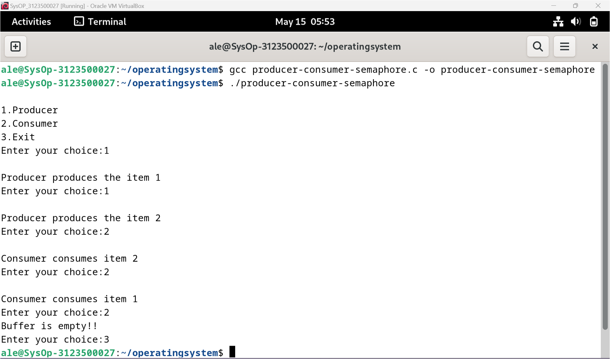
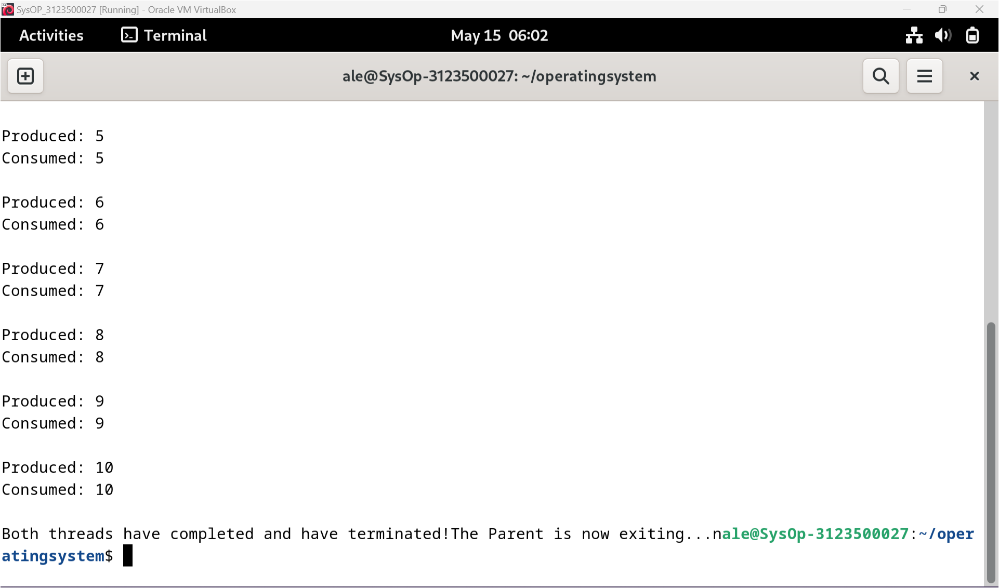
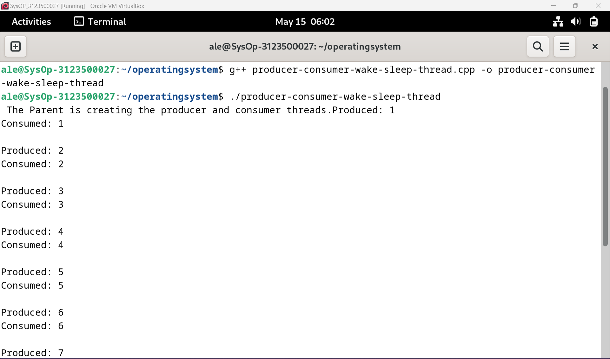

<div align="center">
  <h1 style="text-align: center;font-weight: bold">PRAKTIKUM 9<br>SISTEM OPERASI</h1>
  <h4 style="text-align: center;">Dosen Pengampu : Dr. Ferry Astika Saputra, S.T., M.Sc.</h4>
</div>
<br />
<div align="center">
  
  <h3 style="text-align: center;">Disusun Oleh : </h3>
  <p style="text-align: center;">
    <strong>Marieta Nona Alfani (312350026) </strong><br>
    <strong>Ale Perdana Putra Darmawan (3123500027) </strong><br>
    <strong>Kanisius Keru Okok Dinggon(3123500028)</strong>
  </p>
<h3 style="text-align: center;line-height: 1.5">Politeknik Elektronika Negeri Surabaya<br>Departemen Teknik Informatika Dan Komputer<br>Program Studi Teknik Informatika<br>2023/2024</h3>
  <hr><hr>
</div>

## Daftar Isi
- [Daftar Isi](#daftar-isi)
- [Dasar Teori](#dasar-teori)
  - [Masalah Produsen-Konsumen](#masalah-produsen-konsumen)
  - [Masalah Sebenarnya](#masalah-sebenarnya)
  - [Solusi Produsen-Konsumen](#solusi-produsen-konsumen)
- [Tugas](#tugas)
- [Kesimpulan](#kesimpulan)
- [Referensi](#referensi)

## Dasar Teori

### Masalah Produsen-Konsumen

Masalah produsen-konsumen adalah contoh masalah sinkronisasi multi-proses. Masalahnya menggambarkan dua proses, produsen dan konsumen yang berbagi buffer berukuran tetap dan menggunakannya sebagai antrian.
Tugas produser adalah menghasilkan data, memasukkannya ke dalam buffer, dan memulai lagi.
Pada saat yang sama, konsumen mengkonsumsi data yaitu, menghapusnya dari buffer, satu persatu. 

### Masalah Sebenarnya

Mengingat buffer umum berukuran tetap, tugasnya adalah memastikan bahwa produsen tidak dapat menambahkan data ke dalam buffer ketika buffer sudah penuh dan konsumen tidak dapat menghapus data dari buffer yang kosong. Mengakses buffer memori tidak boleh diperbolehkan bagi produsen dan konsumen pada saat yang bersamaan. 

### Solusi Produsen-Konsumen

Produser harus tidur atau membuang data jika buffernya penuh. Kali berikutnya konsumen menghapus item dari buffer, ia memberitahukan produsen, yang mulai mengisi buffer lagi. Dengan cara yang sama, konsumen dapat tertidur jika buffernya kosong. Saat berikutnya produsen mentransfer data ke buffer, konsumen yang sedang tidur akan dibangunkan.

## Tugas
Menganalisa jalannya program producer-consumer-semaphore.c dan producer-consumer-wake-sleep-thread.cpp

- producer-consumer-semaphore.c
```c
#include<stdio.h>
#include<stdlib.h>

// variabel global
int mutex = 1, full = 0, empty = 3, x = 0;

int main()
{
    int n;
    // deklarasi fungsi
    void producer();
    void consumer();
    int wait(int);
    int signal(int);

    // menampilkan menu
    printf("\n1.Producer\n2.Consumer\n3.Exit");
    while (1)
    {
        printf("\nEnter your choice:");
        scanf("%d", &n);
        switch (n)
        {
            case 1:
                // cek apakah buffer masil belum penuh dan mutex tersedia
                if ((mutex == 1) && (empty!= 0))
                    producer();
                else
                    printf("Buffer is full!!");
                break;
            case 2:
                // cek apakah buffer masil belum penuh dan mutex tersedia
                if ((mutex == 1) && (full!= 0))
                    consumer();
                else
                    printf("Buffer is empty!!");
                break;
            case 3:
                exit(0);
                break;
        }
    }

    return 0;
}

// fungsi wait, dikremen semaphore
int wait(int s)
{
    return (--s);
}

// fungsi signal, inkremen semaphore
int signal(int s)
{
    return (++s);
}

// fungsi produser
void producer()
{
    // pengambilan mutex
    mutex = wait(mutex);
    // inkremen semaphore penuh
    full = signal(full);
    // dikremen semaphore kosong
    empty = wait(empty);
    // memproduksi barang
    x++;
    printf("\nProducer produces the item %d", x);
    // pelepasan mutex
    mutex = signal(mutex);
}

// Consumer function
void consumer()
{
    // pengambilan mutex
    mutex = wait(mutex);
    // dikremen semaphore penuh
    full = wait(full);
    // inkremen semaphore kosong
    empty = signal(empty);
    // mengkonsumsi barang
    printf("\nConsumer consumes item %d", x);
    x--;
    // pelepasan mutex
    mutex = signal(mutex);
}
```

Output:<br>


Analisa jalannya program:
- Program dimulai dengan mendeklarasikan empat variabel global: mutex, full, empty, dan x. mutex digunakan untuk menyinkronkan akses ke buffer, full dan empty adalah semafor untuk melacak status buffer, dan x adalah penghitung untuk item yang diproduksi/dikonsumsi.
- Fungsi utama menampilkan menu dengan tiga pilihan: Produsen, Konsumen, dan Keluar.
- Program memasuki loop tak terbatas, menunggu input pilihan pengguna.
- Berdasarkan pilihan pengguna, program memanggil fungsi produsen atau konsumen.

Fungsi Produsen:
1. Mendapatkan mutex dengan menguranginya menggunakan fungsi wait.
2. Meningkatkan semafor penuh dengan menggunakan fungsi signal.
3. Mengurangi semafor kosong dengan menggunakan fungsi wait.
4. Memproduksi sebuah item dengan menambahkan nilai x.
5. Melepaskan mutex dengan menambahkannya menggunakan fungsi signal.

Fungsi Konsumen:
1. Mendapatkan mutex dengan menguranginya menggunakan fungsi wait.
2. Mengurangi semafor penuh dengan menggunakan fungsi wait.
3. Meningkatkan semafor kosong dengan menggunakan fungsi signal.
4. Mengkonsumsi sebuah item dengan mengurangi nilai x.
5. Melepaskan mutex dengan menambahkannya menggunakan fungsi signal.
6. Program mengulangi langkah 3-6 sampai pengguna memilih untuk keluar.

- producer-consumer-wake-sleep-thread.cpp
```c
#include <iostream>
#include <cstdlib>
#include <pthread.h>
using namespace std;

// fungsi prototype
void* Produce(void* arg);
void* Consume(void* arg);

// variabel global
// variabel mutex dan kondisi
pthread_mutex_t mutex;
pthread_cond_t cond;

// kondisi flag
bool condition = false;

// jumlah barang yang diproduksi
int count = 0;

// jumlah banyaknya barang yang diproduksi
const int NUM_TO_PRODUCE = 10;

int main()
{
    // deklarasi variabel
    pthread_t producerThread;
    pthread_t consumerThread;

    // inisialisasi variabel mutex dan kondisi
    pthread_mutex_init(&mutex, NULL);
    pthread_cond_init(&cond, NULL);

    cerr<<" The Parent is creating the producer and consumer threads.";

    // pembuatan thread produser
    if(pthread_create(&producerThread, NULL, Produce, NULL) < 0)
    {
        cerr<<"pthread_create";
        exit(1);
    }

    // pembuatan thread konsumer
    if(pthread_create(&consumerThread, NULL, Consume, NULL) < 0)
    {
        cerr<<"pthread_create";
        exit(1);
    }

    // menunggu thread selesai
    if(pthread_join(producerThread, NULL) < 0)
    {
        cerr<<"pthread_join";
        exit(1);
    }

    if(pthread_join(consumerThread, NULL) < 0)
    {
        cerr<<"pthread_join";
        exit(1);
    }

    cerr<<"Both threads have completed and have terminated!"
        <<"The Parent is now exiting...n";

    return 0;
}

void* Produce(void* arg)
{
    // memproduksi barang sampai dengan kondisi loop
    while(count < NUM_TO_PRODUCE)
    {
        // penguncian mutex untuk melindungi dari variabel kondisi
        if(pthread_mutex_lock(&mutex) < 0)
        {
            cerr<<"pthread_mutex_lock";
            exit(1);
        }

        // produser sudah memproduksi tetapi barang belum ada 
        // yang di konsumsi, maka kita tidur (wait) sampai konsumer 
        // membangunkan kitawe have produced something that has not been
        while(condition)
        {
            // tidur (wait) dengan variabel kondisi 
            // sampai konsumer membangunkan produser
            if(pthread_cond_wait(&cond, &mutex) < 0)
            {
                cerr<<"pthread_cond_wait";
                exit(1);
            }
        }

        // memproduksi barang
        cerr<<"Produced: "<<++count<<endl;

        // kondisi jika sudah memproduksi
        condition = true;

        // membangunkan konsumer yang tidur
        if(pthread_cond_signal(&cond) < 0)
        {
            cerr<<"pthread_cond_signal";
            exit(1);
        }

        // pelepasan pencuncian mutex
        if(pthread_mutex_unlock(&mutex) < 0)
        {
            cerr<<"pthread_mutex_unlock";
            exit(1);
        }
    }
    return 0;
}

void* Consume(void* arg)
{
    // mengkonsumsi sampai dengan kondisi loop
    while(count < NUM_TO_PRODUCE)
    {
        // penguncian mutex untuk melindungi dari variabel
if(pthread_mutex_lock(&mutex) < 0)
        {
            cerr<<"pthread_mutex_lock";
            exit(1);
        }

        // kondisi jika tidak ada barang yang dikonsumsi, maka tidur
        while(!condition)
        {
            // tidur (wait) sampai produser membangunkan konsumer
            if(pthread_cond_wait(&cond, &mutex) < 0)
            {
                cerr<<"pthread_cond_wait";
                exit(1);
            }
        }

        cerr<<"Consumed: "<<count<<endl<<endl;

        // mengkonsumsi barang
        condition = false;

        // membangunkan produser yang tidur
        if(pthread_cond_signal(&cond) < 0)
        {
            cerr<<"pthread_cond_signal";
            exit(1);
        }

        // melepaskan kunci mutex
        if(pthread_mutex_unlock(&mutex) < 0)
        {
            cerr<<"pthread_mutex_unlock";
            exit(1);
        }
    }
    return 0;
}
```

Output:<br>



Analisa jalannya program:
- Fungsi utama menginisialisasi mutex dan variabel kondisi, membuat thread produsen dan konsumen, dan menunggu hingga mereka selesai.
- Fungsi Produce menghasilkan item sampai kondisi loop terpenuhi:
a. Mengunci mutex untuk melindungi variabel kondisi.
b. Memeriksa apakah ada sesuatu yang bisa dikonsumsi.
c. Jika tidak ada yang bisa dikonsumsi, menunggu pada variabel kondisi sampai konsumen membangunkannya.
d. Setelah menghasilkan sebuah item, mengatur flag kondisi menjadi true, membangunkan konsumen, dan melepaskan kunci mutex.
Fungsi Consume mengonsumsi item sampai kondisi loop terpenuhi:
a. Mengunci mutex untuk melindungi variabel kondisi.
b. Memeriksa apakah ada sesuatu yang bisa dikonsumsi.
c. Jika tidak ada yang bisa dikonsumsi, menunggu pada variabel kondisi sampai produsen membangunkannya.
d. Setelah mengonsumsi sebuah item, mengatur flag kondisi menjadi false, membangunkan produsen, dan melepaskan kunci mutex.
- Fungsi pthread_mutex_lock mengunci mutex, dan jika gagal, mencetak pesan kesalahan dan keluar dari program.
- Fungsi pthread_mutex_unlock membuka kunci mutex, dan jika gagal, mencetak pesan kesalahan dan keluar dari program.
- Fungsi pthread_cond_wait menunggu pada variabel kondisi sampai sinyal diterima. Ini melepas kunci mutex saat menunggu dan mengunci kembali saat sinyal diterima.
- Fungsi pthread_cond_signal memberi sinyal pada variabel kondisi, membangunkan satu dari thread yang menunggu padanya.
- Fungsi pthread_create membuat thread baru, dan jika gagal, mencetak pesan kesalahan dan keluar dari program.
- Fungsi pthread_join menunggu hingga thread selesai, dan jika gagal, mencetak pesan kesalahan dan keluar dari program.
- Aliran cerr digunakan untuk mencetak pesan ke konsol. Aliran cerr tidak di-buffer, sehingga pesan dicetak segera. Manipulator endl digunakan untuk memasukkan karakter baris baru dan mengosongkan buffer keluaran.
- Fungsi exit digunakan untuk keluar dari program jika salah satu fungsi gagal. Fungsi exit mengakhiri program segera, dan tidak kembali ke pemanggil.
- Pointer NULL digunakan sebagai argumen untuk fungsi pthread_create dan pthread_join. Pointer NULL menunjukkan bahwa thread tidak memiliki data khusus thread.
- Tipe void* digunakan untuk parameter argumen dari fungsi Produce dan Consume. Tipe void* dapat mewakili jenis data apa pun, memungkinkan fungsi menerima argumen jenis apa pun. Dalam hal ini, parameter arg tidak digunakan, sehingga diatur menjadi NULL.
- Fungsi Produce dan Consume menggunakan variabel count untuk melacak jumlah item yang dihasilkan dan dikonsumsi. Variabel count diinisialisasi menjadi 0 dan diinkrementasi oleh fungsi Produce dan di-dekrementasi oleh fungsi Consume.
- Flag kondisi digunakan untuk menunjukkan apakah ada sesuatu yang bisa dikonsumsi atau tidak. Flag kondisi diinisialisasi menjadi false dan diatur menjadi true oleh fungsi Produce ketika menghasilkan sebuah item dan diatur menjadi false oleh fungsi Consume ketika mengonsumsi sebuah item.
- Konstanta NUM_TO_PRODUCE digunakan untuk menentukan jumlah item yang akan dihasilkan dan dikonsumsi. Konstanta NUM_TO_PRODUCE diatur menjadi 10 dalam contoh ini, tetapi dapat diubah menjadi nilai apa pun.
- Fungsi pthread_mutex_init menginisialisasi mutex, dan fungsi pthread_cond_init menginisialisasi variabel kondisi. Fungsi-fungsi ini harus dipanggil sebelum mutex dan variabel kondisi digunakan.
- Fungsi pthread_mutex_destroy menghancurkan mutex, dan fungsi pthread_cond_destroy menghancurkan variabel kondisi. Fungsi-fungsi ini harus dipanggil setelah mutex dan variabel kondisi tidak lagi diperlukan.

## Kesimpulan
Masalah Produser-Konsumer Ini adalah contoh masalah sinkronisasi multi-proses di mana dua proses, produser dan konsumer, berbagi buffer berukuran tetap dan menggunakannya sebagai antrian. Produser menghasilkan data dan memasukkannya ke dalam buffer, sementara konsumer mengonsumsi data tersebut.
Untuk solusi Produser harus tidur atau membuang data jika buffer penuh dan dihidupkan kembali oleh konsumer yang menghapus item dari buffer. Sebaliknya, konsumer tidur jika buffer kosong dan dihidupkan oleh produser yang memasukkan data ke buffer.

## Referensi
Sumber 1: https://github.com/ferryastika/operatingsystem
Sumber 2: https://www.geeksforgeeks.org/producer-consumer-problem-in-c/
